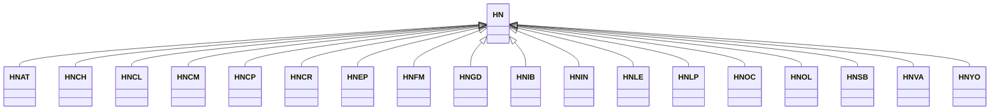

---
search:
  boost: 10.0
---

# Class: HN 


_Concept representing Country of Honduras_


<div data-search-exclude markdown="1">


URI: [loc:HN](https://w3id.org/lmodel/dpv/loc/HN)





## Inheritance
* **HN**
    * [HNAT](HNAT.md)
    * [HNCH](HNCH.md)
    * [HNCL](HNCL.md)
    * [HNCM](HNCM.md)
    * [HNCP](HNCP.md)
    * [HNCR](HNCR.md)
    * [HNEP](HNEP.md)
    * [HNFM](HNFM.md)
    * [HNGD](HNGD.md)
    * [HNIB](HNIB.md)
    * [HNIN](HNIN.md)
    * [HNLE](HNLE.md)
    * [HNLP](HNLP.md)
    * [HNOC](HNOC.md)
    * [HNOL](HNOL.md)
    * [HNSB](HNSB.md)
    * [HNVA](HNVA.md)
    * [HNYO](HNYO.md)


## Class Properties

| Property | Value |
| --- | --- |
| Class URI | [loc:HN](https://w3id.org/lmodel/dpv/loc/HN) |


## Slots

| Name | Cardinality and Range | Description | Inheritance |
| ---  | --- | --- | --- |


## In Subsets


* [LocSubset](LocSubset.md)


## Aliases


* Honduras


## Identifier and Mapping Information


### Annotations

| property | value |
| --- | --- |
| upstream_iri | https://w3id.org/dpv/loc/owl#HN |
| dpv_extension_slug | loc |


### Schema Source


* from schema: https://w3id.org/lmodel/dpv/loc


## Mappings

| Mapping Type | Mapped Value |
| ---  | ---  |
| self | loc:HN |
| native | loc:HN |
| exact | dpv_loc:HN, dpv_loc_owl:HN |


## LinkML Source

<!-- TODO: investigate https://stackoverflow.com/questions/37606292/how-to-create-tabbed-code-blocks-in-mkdocs-or-sphinx -->

### Direct

<details>
```yaml
name: HN
annotations:
  upstream_iri:
    tag: upstream_iri
    value: https://w3id.org/dpv/loc/owl#HN
  dpv_extension_slug:
    tag: dpv_extension_slug
    value: loc
description: Concept representing Country of Honduras
in_subset:
- loc_subset
from_schema: https://w3id.org/lmodel/dpv/loc
aliases:
- Honduras
exact_mappings:
- dpv_loc:HN
- dpv_loc_owl:HN
class_uri: loc:HN

```
</details>

### Induced

<details>
```yaml
name: HN
annotations:
  upstream_iri:
    tag: upstream_iri
    value: https://w3id.org/dpv/loc/owl#HN
  dpv_extension_slug:
    tag: dpv_extension_slug
    value: loc
description: Concept representing Country of Honduras
in_subset:
- loc_subset
from_schema: https://w3id.org/lmodel/dpv/loc
aliases:
- Honduras
exact_mappings:
- dpv_loc:HN
- dpv_loc_owl:HN
class_uri: loc:HN

```
</details></div>