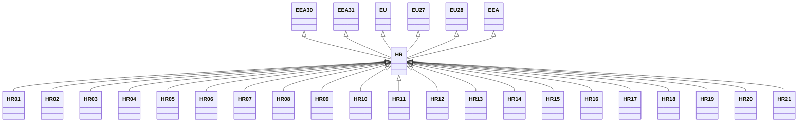

---
search:
  boost: 10.0
---

# Class: HR 


_Concept representing Country of Croatia_


<div data-search-exclude markdown="1">


URI: [loc:HR](https://w3id.org/lmodel/dpv/loc/HR)





## Inheritance
* [EEA](EEA.md)
    * **HR** [ [EEA30](EEA30.md) [EEA31](EEA31.md) [EU](EU.md) [EU27](EU27.md) [EU28](EU28.md)]
        * [HR01](HR01.md)
        * [HR02](HR02.md)
        * [HR03](HR03.md)
        * [HR04](HR04.md)
        * [HR05](HR05.md)
        * [HR06](HR06.md)
        * [HR07](HR07.md)
        * [HR08](HR08.md)
        * [HR09](HR09.md)
        * [HR10](HR10.md)
        * [HR11](HR11.md)
        * [HR12](HR12.md)
        * [HR13](HR13.md)
        * [HR14](HR14.md)
        * [HR15](HR15.md)
        * [HR16](HR16.md)
        * [HR17](HR17.md)
        * [HR18](HR18.md)
        * [HR19](HR19.md)
        * [HR20](HR20.md)
        * [HR21](HR21.md)


## Class Properties

| Property | Value |
| --- | --- |
| Class URI | [loc:HR](https://w3id.org/lmodel/dpv/loc/HR) |


## Slots

| Name | Cardinality and Range | Description | Inheritance |
| ---  | --- | --- | --- |


## In Subsets


* [LocSubset](LocSubset.md)


## Aliases


* Croatia


## Identifier and Mapping Information


### Annotations

| property | value |
| --- | --- |
| upstream_iri | https://w3id.org/dpv/loc/owl#HR |
| dpv_extension_slug | loc |


### Schema Source


* from schema: https://w3id.org/lmodel/dpv/loc


## Mappings

| Mapping Type | Mapped Value |
| ---  | ---  |
| self | loc:HR |
| native | loc:HR |
| exact | dpv_loc:HR, dpv_loc_owl:HR |


## LinkML Source

<!-- TODO: investigate https://stackoverflow.com/questions/37606292/how-to-create-tabbed-code-blocks-in-mkdocs-or-sphinx -->

### Direct

<details>
```yaml
name: HR
annotations:
  upstream_iri:
    tag: upstream_iri
    value: https://w3id.org/dpv/loc/owl#HR
  dpv_extension_slug:
    tag: dpv_extension_slug
    value: loc
description: Concept representing Country of Croatia
in_subset:
- loc_subset
from_schema: https://w3id.org/lmodel/dpv/loc
aliases:
- Croatia
exact_mappings:
- dpv_loc:HR
- dpv_loc_owl:HR
is_a: EEA
mixins:
- EEA30
- EEA31
- EU
- EU27
- EU28
class_uri: loc:HR

```
</details>

### Induced

<details>
```yaml
name: HR
annotations:
  upstream_iri:
    tag: upstream_iri
    value: https://w3id.org/dpv/loc/owl#HR
  dpv_extension_slug:
    tag: dpv_extension_slug
    value: loc
description: Concept representing Country of Croatia
in_subset:
- loc_subset
from_schema: https://w3id.org/lmodel/dpv/loc
aliases:
- Croatia
exact_mappings:
- dpv_loc:HR
- dpv_loc_owl:HR
is_a: EEA
mixins:
- EEA30
- EEA31
- EU
- EU27
- EU28
class_uri: loc:HR

```
</details></div>