---
search:
  boost: 10.0
---

# Class: HU 


_Concept representing Country of Hungary_


<div data-search-exclude markdown="1">


URI: [loc:HU](https://w3id.org/lmodel/dpv/loc/HU)

```mermaid
 classDiagram
    class HU
    click HU href "../HU/"
      EEA30 <|-- HU
        click EEA30 href "../EEA30/"
      EEA31 <|-- HU
        click EEA31 href "../EEA31/"
      EU <|-- HU
        click EU href "../EU/"
      EU27 <|-- HU
        click EU27 href "../EU27/"
      EU28 <|-- HU
        click EU28 href "../EU28/"
      EEA <|-- HU
        click EEA href "../EEA/"
      

      HU <|-- HUBA
        click HUBA href "../HUBA/"
      HU <|-- HUBC
        click HUBC href "../HUBC/"
      HU <|-- HUBE
        click HUBE href "../HUBE/"
      HU <|-- HUBK
        click HUBK href "../HUBK/"
      HU <|-- HUBU
        click HUBU href "../HUBU/"
      HU <|-- HUBZ
        click HUBZ href "../HUBZ/"
      HU <|-- HUCS
        click HUCS href "../HUCS/"
      HU <|-- HUDE
        click HUDE href "../HUDE/"
      HU <|-- HUDU
        click HUDU href "../HUDU/"
      HU <|-- HUEG
        click HUEG href "../HUEG/"
      HU <|-- HUER
        click HUER href "../HUER/"
      HU <|-- HUFE
        click HUFE href "../HUFE/"
      HU <|-- HUGS
        click HUGS href "../HUGS/"
      HU <|-- HUGY
        click HUGY href "../HUGY/"
      HU <|-- HUHB
        click HUHB href "../HUHB/"
      HU <|-- HUHE
        click HUHE href "../HUHE/"
      HU <|-- HUHV
        click HUHV href "../HUHV/"
      HU <|-- HUJN
        click HUJN href "../HUJN/"
      HU <|-- HUKE
        click HUKE href "../HUKE/"
      HU <|-- HUKM
        click HUKM href "../HUKM/"
      HU <|-- HUKV
        click HUKV href "../HUKV/"
      HU <|-- HUMI
        click HUMI href "../HUMI/"
      HU <|-- HUNK
        click HUNK href "../HUNK/"
      HU <|-- HUNO
        click HUNO href "../HUNO/"
      HU <|-- HUNY
        click HUNY href "../HUNY/"
      HU <|-- HUPE
        click HUPE href "../HUPE/"
      HU <|-- HUPS
        click HUPS href "../HUPS/"
      HU <|-- HUSD
        click HUSD href "../HUSD/"
      HU <|-- HUSF
        click HUSF href "../HUSF/"
      HU <|-- HUSH
        click HUSH href "../HUSH/"
      HU <|-- HUSK
        click HUSK href "../HUSK/"
      HU <|-- HUSN
        click HUSN href "../HUSN/"
      HU <|-- HUSO
        click HUSO href "../HUSO/"
      HU <|-- HUSS
        click HUSS href "../HUSS/"
      HU <|-- HUST
        click HUST href "../HUST/"
      HU <|-- HUSZ
        click HUSZ href "../HUSZ/"
      HU <|-- HUTB
        click HUTB href "../HUTB/"
      HU <|-- HUTO
        click HUTO href "../HUTO/"
      HU <|-- HUVA
        click HUVA href "../HUVA/"
      HU <|-- HUVE
        click HUVE href "../HUVE/"
      HU <|-- HUVM
        click HUVM href "../HUVM/"
      HU <|-- HUZA
        click HUZA href "../HUZA/"
      HU <|-- HUZE
        click HUZE href "../HUZE/"
      

      
```





## Inheritance
* [EEA](EEA.md)
    * **HU** [ [EEA30](EEA30.md) [EEA31](EEA31.md) [EU](EU.md) [EU27](EU27.md) [EU28](EU28.md)]
        * [HUBA](HUBA.md)
        * [HUBC](HUBC.md)
        * [HUBE](HUBE.md)
        * [HUBK](HUBK.md)
        * [HUBU](HUBU.md)
        * [HUBZ](HUBZ.md)
        * [HUCS](HUCS.md)
        * [HUDE](HUDE.md)
        * [HUDU](HUDU.md)
        * [HUEG](HUEG.md)
        * [HUER](HUER.md)
        * [HUFE](HUFE.md)
        * [HUGS](HUGS.md)
        * [HUGY](HUGY.md)
        * [HUHB](HUHB.md)
        * [HUHE](HUHE.md)
        * [HUHV](HUHV.md)
        * [HUJN](HUJN.md)
        * [HUKE](HUKE.md)
        * [HUKM](HUKM.md)
        * [HUKV](HUKV.md)
        * [HUMI](HUMI.md)
        * [HUNK](HUNK.md)
        * [HUNO](HUNO.md)
        * [HUNY](HUNY.md)
        * [HUPE](HUPE.md)
        * [HUPS](HUPS.md)
        * [HUSD](HUSD.md)
        * [HUSF](HUSF.md)
        * [HUSH](HUSH.md)
        * [HUSK](HUSK.md)
        * [HUSN](HUSN.md)
        * [HUSO](HUSO.md)
        * [HUSS](HUSS.md)
        * [HUST](HUST.md)
        * [HUSZ](HUSZ.md)
        * [HUTB](HUTB.md)
        * [HUTO](HUTO.md)
        * [HUVA](HUVA.md)
        * [HUVE](HUVE.md)
        * [HUVM](HUVM.md)
        * [HUZA](HUZA.md)
        * [HUZE](HUZE.md)


## Class Properties

| Property | Value |
| --- | --- |
| Class URI | [loc:HU](https://w3id.org/lmodel/dpv/loc/HU) |


## Slots

| Name | Cardinality and Range | Description | Inheritance |
| ---  | --- | --- | --- |


## In Subsets


* [LocSubset](LocSubset.md)


## Aliases


* Hungary


## Identifier and Mapping Information


### Annotations

| property | value |
| --- | --- |
| upstream_iri | https://w3id.org/dpv/loc/owl#HU |
| dpv_extension_slug | loc |


### Schema Source


* from schema: https://w3id.org/lmodel/dpv/loc


## Mappings

| Mapping Type | Mapped Value |
| ---  | ---  |
| self | loc:HU |
| native | loc:HU |
| exact | dpv_loc:HU, dpv_loc_owl:HU |


## LinkML Source

<!-- TODO: investigate https://stackoverflow.com/questions/37606292/how-to-create-tabbed-code-blocks-in-mkdocs-or-sphinx -->

### Direct

<details>
```yaml
name: HU
annotations:
  upstream_iri:
    tag: upstream_iri
    value: https://w3id.org/dpv/loc/owl#HU
  dpv_extension_slug:
    tag: dpv_extension_slug
    value: loc
description: Concept representing Country of Hungary
in_subset:
- loc_subset
from_schema: https://w3id.org/lmodel/dpv/loc
aliases:
- Hungary
exact_mappings:
- dpv_loc:HU
- dpv_loc_owl:HU
is_a: EEA
mixins:
- EEA30
- EEA31
- EU
- EU27
- EU28
class_uri: loc:HU

```
</details>

### Induced

<details>
```yaml
name: HU
annotations:
  upstream_iri:
    tag: upstream_iri
    value: https://w3id.org/dpv/loc/owl#HU
  dpv_extension_slug:
    tag: dpv_extension_slug
    value: loc
description: Concept representing Country of Hungary
in_subset:
- loc_subset
from_schema: https://w3id.org/lmodel/dpv/loc
aliases:
- Hungary
exact_mappings:
- dpv_loc:HU
- dpv_loc_owl:HU
is_a: EEA
mixins:
- EEA30
- EEA31
- EU
- EU27
- EU28
class_uri: loc:HU

```
</details></div>