---
search:
  boost: 10.0
---

# Class: ID 


_Concept representing Country of Indonesia_


<div data-search-exclude markdown="1">


URI: [loc:ID](https://w3id.org/lmodel/dpv/loc/ID)

```mermaid
 classDiagram
    class ID
    click ID href "../ID/"
      ID <|-- IDAC
        click IDAC href "../IDAC/"
      ID <|-- IDBA
        click IDBA href "../IDBA/"
      ID <|-- IDBB
        click IDBB href "../IDBB/"
      ID <|-- IDBE
        click IDBE href "../IDBE/"
      ID <|-- IDBT
        click IDBT href "../IDBT/"
      ID <|-- IDGO
        click IDGO href "../IDGO/"
      ID <|-- IDJA
        click IDJA href "../IDJA/"
      ID <|-- IDJB
        click IDJB href "../IDJB/"
      ID <|-- IDJI
        click IDJI href "../IDJI/"
      ID <|-- IDJK
        click IDJK href "../IDJK/"
      ID <|-- IDJT
        click IDJT href "../IDJT/"
      ID <|-- IDKA
        click IDKA href "../IDKA/"
      ID <|-- IDKB
        click IDKB href "../IDKB/"
      ID <|-- IDKI
        click IDKI href "../IDKI/"
      ID <|-- IDKR
        click IDKR href "../IDKR/"
      ID <|-- IDKS
        click IDKS href "../IDKS/"
      ID <|-- IDKT
        click IDKT href "../IDKT/"
      ID <|-- IDKU
        click IDKU href "../IDKU/"
      ID <|-- IDLA
        click IDLA href "../IDLA/"
      ID <|-- IDMA
        click IDMA href "../IDMA/"
      ID <|-- IDML
        click IDML href "../IDML/"
      ID <|-- IDMU
        click IDMU href "../IDMU/"
      ID <|-- IDNB
        click IDNB href "../IDNB/"
      ID <|-- IDNT
        click IDNT href "../IDNT/"
      ID <|-- IDNU
        click IDNU href "../IDNU/"
      ID <|-- IDPA
        click IDPA href "../IDPA/"
      ID <|-- IDPB
        click IDPB href "../IDPB/"
      ID <|-- IDPD
        click IDPD href "../IDPD/"
      ID <|-- IDPP
        click IDPP href "../IDPP/"
      ID <|-- IDRI
        click IDRI href "../IDRI/"
      ID <|-- IDSA
        click IDSA href "../IDSA/"
      ID <|-- IDSB
        click IDSB href "../IDSB/"
      ID <|-- IDSG
        click IDSG href "../IDSG/"
      ID <|-- IDSL
        click IDSL href "../IDSL/"
      ID <|-- IDSM
        click IDSM href "../IDSM/"
      ID <|-- IDSN
        click IDSN href "../IDSN/"
      ID <|-- IDSR
        click IDSR href "../IDSR/"
      ID <|-- IDSS
        click IDSS href "../IDSS/"
      ID <|-- IDST
        click IDST href "../IDST/"
      ID <|-- IDSU
        click IDSU href "../IDSU/"
      ID <|-- IDYO
        click IDYO href "../IDYO/"
      
      
```





## Inheritance
* **ID**
    * [IDAC](IDAC.md)
    * [IDBA](IDBA.md)
    * [IDBB](IDBB.md)
    * [IDBE](IDBE.md)
    * [IDBT](IDBT.md)
    * [IDGO](IDGO.md)
    * [IDJA](IDJA.md)
    * [IDJB](IDJB.md)
    * [IDJI](IDJI.md)
    * [IDJK](IDJK.md)
    * [IDJT](IDJT.md)
    * [IDKA](IDKA.md)
    * [IDKB](IDKB.md)
    * [IDKI](IDKI.md)
    * [IDKR](IDKR.md)
    * [IDKS](IDKS.md)
    * [IDKT](IDKT.md)
    * [IDKU](IDKU.md)
    * [IDLA](IDLA.md)
    * [IDMA](IDMA.md)
    * [IDML](IDML.md)
    * [IDMU](IDMU.md)
    * [IDNB](IDNB.md)
    * [IDNT](IDNT.md)
    * [IDNU](IDNU.md)
    * [IDPA](IDPA.md)
    * [IDPB](IDPB.md)
    * [IDPD](IDPD.md)
    * [IDPP](IDPP.md)
    * [IDRI](IDRI.md)
    * [IDSA](IDSA.md)
    * [IDSB](IDSB.md)
    * [IDSG](IDSG.md)
    * [IDSL](IDSL.md)
    * [IDSM](IDSM.md)
    * [IDSN](IDSN.md)
    * [IDSR](IDSR.md)
    * [IDSS](IDSS.md)
    * [IDST](IDST.md)
    * [IDSU](IDSU.md)
    * [IDYO](IDYO.md)


## Class Properties

| Property | Value |
| --- | --- |
| Class URI | [loc:ID](https://w3id.org/lmodel/dpv/loc/ID) |


## Slots

| Name | Cardinality and Range | Description | Inheritance |
| ---  | --- | --- | --- |


## In Subsets


* [LocSubset](LocSubset.md)


## Aliases


* Indonesia


## Identifier and Mapping Information


### Annotations

| property | value |
| --- | --- |
| upstream_iri | https://w3id.org/dpv/loc/owl#ID |
| dpv_extension_slug | loc |


### Schema Source


* from schema: https://w3id.org/lmodel/dpv/loc


## Mappings

| Mapping Type | Mapped Value |
| ---  | ---  |
| self | loc:ID |
| native | loc:ID |
| exact | dpv_loc:ID, dpv_loc_owl:ID |


## LinkML Source

<!-- TODO: investigate https://stackoverflow.com/questions/37606292/how-to-create-tabbed-code-blocks-in-mkdocs-or-sphinx -->

### Direct

<details>
```yaml
name: ID
annotations:
  upstream_iri:
    tag: upstream_iri
    value: https://w3id.org/dpv/loc/owl#ID
  dpv_extension_slug:
    tag: dpv_extension_slug
    value: loc
description: Concept representing Country of Indonesia
in_subset:
- loc_subset
from_schema: https://w3id.org/lmodel/dpv/loc
aliases:
- Indonesia
exact_mappings:
- dpv_loc:ID
- dpv_loc_owl:ID
class_uri: loc:ID

```
</details>

### Induced

<details>
```yaml
name: ID
annotations:
  upstream_iri:
    tag: upstream_iri
    value: https://w3id.org/dpv/loc/owl#ID
  dpv_extension_slug:
    tag: dpv_extension_slug
    value: loc
description: Concept representing Country of Indonesia
in_subset:
- loc_subset
from_schema: https://w3id.org/lmodel/dpv/loc
aliases:
- Indonesia
exact_mappings:
- dpv_loc:ID
- dpv_loc_owl:ID
class_uri: loc:ID

```
</details></div>