---
search:
  boost: 10.0
---

# Class: IE 


_Concept representing Country of Ireland_


<div data-search-exclude markdown="1">


URI: [loc:IE](https://w3id.org/lmodel/dpv/loc/IE)

```mermaid
 classDiagram
    class IE
    click IE href "../IE/"
      EEA30 <|-- IE
        click EEA30 href "../EEA30/"
      EEA31 <|-- IE
        click EEA31 href "../EEA31/"
      EU <|-- IE
        click EU href "../EU/"
      EU27 <|-- IE
        click EU27 href "../EU27/"
      EU28 <|-- IE
        click EU28 href "../EU28/"
      EEA <|-- IE
        click EEA href "../EEA/"
      

      IE <|-- IEC
        click IEC href "../IEC/"
      IE <|-- IECE
        click IECE href "../IECE/"
      IE <|-- IECN
        click IECN href "../IECN/"
      IE <|-- IECO
        click IECO href "../IECO/"
      IE <|-- IECW
        click IECW href "../IECW/"
      IE <|-- IED
        click IED href "../IED/"
      IE <|-- IEDL
        click IEDL href "../IEDL/"
      IE <|-- IEG
        click IEG href "../IEG/"
      IE <|-- IEKE
        click IEKE href "../IEKE/"
      IE <|-- IEKK
        click IEKK href "../IEKK/"
      IE <|-- IEKY
        click IEKY href "../IEKY/"
      IE <|-- IEL
        click IEL href "../IEL/"
      IE <|-- IELD
        click IELD href "../IELD/"
      IE <|-- IELH
        click IELH href "../IELH/"
      IE <|-- IELK
        click IELK href "../IELK/"
      IE <|-- IELM
        click IELM href "../IELM/"
      IE <|-- IELS
        click IELS href "../IELS/"
      IE <|-- IEM
        click IEM href "../IEM/"
      IE <|-- IEMH
        click IEMH href "../IEMH/"
      IE <|-- IEMN
        click IEMN href "../IEMN/"
      IE <|-- IEMO
        click IEMO href "../IEMO/"
      IE <|-- IEOY
        click IEOY href "../IEOY/"
      IE <|-- IERN
        click IERN href "../IERN/"
      IE <|-- IESO
        click IESO href "../IESO/"
      IE <|-- IETA
        click IETA href "../IETA/"
      IE <|-- IEU
        click IEU href "../IEU/"
      IE <|-- IEWD
        click IEWD href "../IEWD/"
      IE <|-- IEWH
        click IEWH href "../IEWH/"
      IE <|-- IEWW
        click IEWW href "../IEWW/"
      IE <|-- IEWX
        click IEWX href "../IEWX/"
      

      
```





## Inheritance
* [EEA](EEA.md)
    * **IE** [ [EEA30](EEA30.md) [EEA31](EEA31.md) [EU](EU.md) [EU27](EU27.md) [EU28](EU28.md)]
        * [IEC](IEC.md)
        * [IECE](IECE.md)
        * [IECN](IECN.md)
        * [IECO](IECO.md)
        * [IECW](IECW.md)
        * [IED](IED.md)
        * [IEDL](IEDL.md)
        * [IEG](IEG.md)
        * [IEKE](IEKE.md)
        * [IEKK](IEKK.md)
        * [IEKY](IEKY.md)
        * [IEL](IEL.md)
        * [IELD](IELD.md)
        * [IELH](IELH.md)
        * [IELK](IELK.md)
        * [IELM](IELM.md)
        * [IELS](IELS.md)
        * [IEM](IEM.md)
        * [IEMH](IEMH.md)
        * [IEMN](IEMN.md)
        * [IEMO](IEMO.md)
        * [IEOY](IEOY.md)
        * [IERN](IERN.md)
        * [IESO](IESO.md)
        * [IETA](IETA.md)
        * [IEU](IEU.md)
        * [IEWD](IEWD.md)
        * [IEWH](IEWH.md)
        * [IEWW](IEWW.md)
        * [IEWX](IEWX.md)


## Class Properties

| Property | Value |
| --- | --- |
| Class URI | [loc:IE](https://w3id.org/lmodel/dpv/loc/IE) |


## Slots

| Name | Cardinality and Range | Description | Inheritance |
| ---  | --- | --- | --- |


## In Subsets


* [LocSubset](LocSubset.md)


## Aliases


* Ireland


## Identifier and Mapping Information


### Annotations

| property | value |
| --- | --- |
| upstream_iri | https://w3id.org/dpv/loc/owl#IE |
| dpv_extension_slug | loc |


### Schema Source


* from schema: https://w3id.org/lmodel/dpv/loc


## Mappings

| Mapping Type | Mapped Value |
| ---  | ---  |
| self | loc:IE |
| native | loc:IE |
| exact | dpv_loc:IE, dpv_loc_owl:IE, iso3166:IE |


## LinkML Source

<!-- TODO: investigate https://stackoverflow.com/questions/37606292/how-to-create-tabbed-code-blocks-in-mkdocs-or-sphinx -->

### Direct

<details>
```yaml
name: IE
annotations:
  upstream_iri:
    tag: upstream_iri
    value: https://w3id.org/dpv/loc/owl#IE
  dpv_extension_slug:
    tag: dpv_extension_slug
    value: loc
description: Concept representing Country of Ireland
in_subset:
- loc_subset
from_schema: https://w3id.org/lmodel/dpv/loc
aliases:
- Ireland
exact_mappings:
- dpv_loc:IE
- dpv_loc_owl:IE
- iso3166:IE
is_a: EEA
mixins:
- EEA30
- EEA31
- EU
- EU27
- EU28
class_uri: loc:IE

```
</details>

### Induced

<details>
```yaml
name: IE
annotations:
  upstream_iri:
    tag: upstream_iri
    value: https://w3id.org/dpv/loc/owl#IE
  dpv_extension_slug:
    tag: dpv_extension_slug
    value: loc
description: Concept representing Country of Ireland
in_subset:
- loc_subset
from_schema: https://w3id.org/lmodel/dpv/loc
aliases:
- Ireland
exact_mappings:
- dpv_loc:IE
- dpv_loc_owl:IE
- iso3166:IE
is_a: EEA
mixins:
- EEA30
- EEA31
- EU
- EU27
- EU28
class_uri: loc:IE

```
</details></div>