---
search:
  boost: 10.0
---

# Class: IN 


_Concept representing Country of India_


<div data-search-exclude markdown="1">


URI: [loc:IN](https://w3id.org/lmodel/dpv/loc/IN)

```mermaid
 classDiagram
    class IN
    click IN href "../IN/"
      IN <|-- INAN
        click INAN href "../INAN/"
      IN <|-- INAP
        click INAP href "../INAP/"
      IN <|-- INAR
        click INAR href "../INAR/"
      IN <|-- INAS
        click INAS href "../INAS/"
      IN <|-- INBR
        click INBR href "../INBR/"
      IN <|-- INCG
        click INCG href "../INCG/"
      IN <|-- INCH
        click INCH href "../INCH/"
      IN <|-- INDD
        click INDD href "../INDD/"
      IN <|-- INDH
        click INDH href "../INDH/"
      IN <|-- INDN
        click INDN href "../INDN/"
      IN <|-- INGA
        click INGA href "../INGA/"
      IN <|-- INGJ
        click INGJ href "../INGJ/"
      IN <|-- INHP
        click INHP href "../INHP/"
      IN <|-- INHR
        click INHR href "../INHR/"
      IN <|-- INJH
        click INJH href "../INJH/"
      IN <|-- INJK
        click INJK href "../INJK/"
      IN <|-- INKA
        click INKA href "../INKA/"
      IN <|-- INKL
        click INKL href "../INKL/"
      IN <|-- INLA
        click INLA href "../INLA/"
      IN <|-- INLD
        click INLD href "../INLD/"
      IN <|-- INMH
        click INMH href "../INMH/"
      IN <|-- INML
        click INML href "../INML/"
      IN <|-- INMN
        click INMN href "../INMN/"
      IN <|-- INMP
        click INMP href "../INMP/"
      IN <|-- INMZ
        click INMZ href "../INMZ/"
      IN <|-- INNL
        click INNL href "../INNL/"
      IN <|-- INOD
        click INOD href "../INOD/"
      IN <|-- INPB
        click INPB href "../INPB/"
      IN <|-- INPY
        click INPY href "../INPY/"
      IN <|-- INRJ
        click INRJ href "../INRJ/"
      IN <|-- INSK
        click INSK href "../INSK/"
      IN <|-- INTN
        click INTN href "../INTN/"
      IN <|-- INTR
        click INTR href "../INTR/"
      IN <|-- INTS
        click INTS href "../INTS/"
      IN <|-- INUK
        click INUK href "../INUK/"
      IN <|-- INUP
        click INUP href "../INUP/"
      IN <|-- INWB
        click INWB href "../INWB/"
      
      
```





## Inheritance
* **IN**
    * [INAN](INAN.md)
    * [INAP](INAP.md)
    * [INAR](INAR.md)
    * [INAS](INAS.md)
    * [INBR](INBR.md)
    * [INCG](INCG.md)
    * [INCH](INCH.md)
    * [INDD](INDD.md)
    * [INDH](INDH.md)
    * [INDN](INDN.md)
    * [INGA](INGA.md)
    * [INGJ](INGJ.md)
    * [INHP](INHP.md)
    * [INHR](INHR.md)
    * [INJH](INJH.md)
    * [INJK](INJK.md)
    * [INKA](INKA.md)
    * [INKL](INKL.md)
    * [INLA](INLA.md)
    * [INLD](INLD.md)
    * [INMH](INMH.md)
    * [INML](INML.md)
    * [INMN](INMN.md)
    * [INMP](INMP.md)
    * [INMZ](INMZ.md)
    * [INNL](INNL.md)
    * [INOD](INOD.md)
    * [INPB](INPB.md)
    * [INPY](INPY.md)
    * [INRJ](INRJ.md)
    * [INSK](INSK.md)
    * [INTN](INTN.md)
    * [INTR](INTR.md)
    * [INTS](INTS.md)
    * [INUK](INUK.md)
    * [INUP](INUP.md)
    * [INWB](INWB.md)


## Class Properties

| Property | Value |
| --- | --- |
| Class URI | [loc:IN](https://w3id.org/lmodel/dpv/loc/IN) |


## Slots

| Name | Cardinality and Range | Description | Inheritance |
| ---  | --- | --- | --- |


## In Subsets


* [LocSubset](LocSubset.md)


## Aliases


* India


## Identifier and Mapping Information


### Annotations

| property | value |
| --- | --- |
| upstream_iri | https://w3id.org/dpv/loc/owl#IN |
| dpv_extension_slug | loc |


### Schema Source


* from schema: https://w3id.org/lmodel/dpv/loc


## Mappings

| Mapping Type | Mapped Value |
| ---  | ---  |
| self | loc:IN |
| native | loc:IN |
| exact | dpv_loc:IN, dpv_loc_owl:IN, iso3166:IN |


## LinkML Source

<!-- TODO: investigate https://stackoverflow.com/questions/37606292/how-to-create-tabbed-code-blocks-in-mkdocs-or-sphinx -->

### Direct

<details>
```yaml
name: IN
annotations:
  upstream_iri:
    tag: upstream_iri
    value: https://w3id.org/dpv/loc/owl#IN
  dpv_extension_slug:
    tag: dpv_extension_slug
    value: loc
description: Concept representing Country of India
in_subset:
- loc_subset
from_schema: https://w3id.org/lmodel/dpv/loc
aliases:
- India
exact_mappings:
- dpv_loc:IN
- dpv_loc_owl:IN
- iso3166:IN
class_uri: loc:IN

```
</details>

### Induced

<details>
```yaml
name: IN
annotations:
  upstream_iri:
    tag: upstream_iri
    value: https://w3id.org/dpv/loc/owl#IN
  dpv_extension_slug:
    tag: dpv_extension_slug
    value: loc
description: Concept representing Country of India
in_subset:
- loc_subset
from_schema: https://w3id.org/lmodel/dpv/loc
aliases:
- India
exact_mappings:
- dpv_loc:IN
- dpv_loc_owl:IN
- iso3166:IN
class_uri: loc:IN

```
</details></div>