---
search:
  boost: 10.0
---

# Class: IQ 


_Concept representing Country of Iraq_


<div data-search-exclude markdown="1">


URI: [loc:IQ](https://w3id.org/lmodel/dpv/loc/IQ)

```mermaid
 classDiagram
    class IQ
    click IQ href "../IQ/"
      IQ <|-- IQAN
        click IQAN href "../IQAN/"
      IQ <|-- IQAR
        click IQAR href "../IQAR/"
      IQ <|-- IQBA
        click IQBA href "../IQBA/"
      IQ <|-- IQBB
        click IQBB href "../IQBB/"
      IQ <|-- IQBG
        click IQBG href "../IQBG/"
      IQ <|-- IQDA
        click IQDA href "../IQDA/"
      IQ <|-- IQDI
        click IQDI href "../IQDI/"
      IQ <|-- IQDQ
        click IQDQ href "../IQDQ/"
      IQ <|-- IQHA
        click IQHA href "../IQHA/"
      IQ <|-- IQKA
        click IQKA href "../IQKA/"
      IQ <|-- IQKI
        click IQKI href "../IQKI/"
      IQ <|-- IQMA
        click IQMA href "../IQMA/"
      IQ <|-- IQMU
        click IQMU href "../IQMU/"
      IQ <|-- IQNA
        click IQNA href "../IQNA/"
      IQ <|-- IQNI
        click IQNI href "../IQNI/"
      IQ <|-- IQQA
        click IQQA href "../IQQA/"
      IQ <|-- IQSD
        click IQSD href "../IQSD/"
      IQ <|-- IQSU
        click IQSU href "../IQSU/"
      IQ <|-- IQWA
        click IQWA href "../IQWA/"
      
      
```





## Inheritance
* **IQ**
    * [IQAN](IQAN.md)
    * [IQAR](IQAR.md)
    * [IQBA](IQBA.md)
    * [IQBB](IQBB.md)
    * [IQBG](IQBG.md)
    * [IQDA](IQDA.md)
    * [IQDI](IQDI.md)
    * [IQDQ](IQDQ.md)
    * [IQHA](IQHA.md)
    * [IQKA](IQKA.md)
    * [IQKI](IQKI.md)
    * [IQMA](IQMA.md)
    * [IQMU](IQMU.md)
    * [IQNA](IQNA.md)
    * [IQNI](IQNI.md)
    * [IQQA](IQQA.md)
    * [IQSD](IQSD.md)
    * [IQSU](IQSU.md)
    * [IQWA](IQWA.md)


## Class Properties

| Property | Value |
| --- | --- |
| Class URI | [loc:IQ](https://w3id.org/lmodel/dpv/loc/IQ) |


## Slots

| Name | Cardinality and Range | Description | Inheritance |
| ---  | --- | --- | --- |


## In Subsets


* [LocSubset](LocSubset.md)


## Aliases


* Iraq


## Identifier and Mapping Information


### Annotations

| property | value |
| --- | --- |
| upstream_iri | https://w3id.org/dpv/loc/owl#IQ |
| dpv_extension_slug | loc |


### Schema Source


* from schema: https://w3id.org/lmodel/dpv/loc


## Mappings

| Mapping Type | Mapped Value |
| ---  | ---  |
| self | loc:IQ |
| native | loc:IQ |
| exact | dpv_loc:IQ, dpv_loc_owl:IQ |


## LinkML Source

<!-- TODO: investigate https://stackoverflow.com/questions/37606292/how-to-create-tabbed-code-blocks-in-mkdocs-or-sphinx -->

### Direct

<details>
```yaml
name: IQ
annotations:
  upstream_iri:
    tag: upstream_iri
    value: https://w3id.org/dpv/loc/owl#IQ
  dpv_extension_slug:
    tag: dpv_extension_slug
    value: loc
description: Concept representing Country of Iraq
in_subset:
- loc_subset
from_schema: https://w3id.org/lmodel/dpv/loc
aliases:
- Iraq
exact_mappings:
- dpv_loc:IQ
- dpv_loc_owl:IQ
class_uri: loc:IQ

```
</details>

### Induced

<details>
```yaml
name: IQ
annotations:
  upstream_iri:
    tag: upstream_iri
    value: https://w3id.org/dpv/loc/owl#IQ
  dpv_extension_slug:
    tag: dpv_extension_slug
    value: loc
description: Concept representing Country of Iraq
in_subset:
- loc_subset
from_schema: https://w3id.org/lmodel/dpv/loc
aliases:
- Iraq
exact_mappings:
- dpv_loc:IQ
- dpv_loc_owl:IQ
class_uri: loc:IQ

```
</details></div>