---
search:
  boost: 10.0
---

# Class: IR 


_Concept representing Country of Iran (Islamic Republic of)_


<div data-search-exclude markdown="1">


URI: [loc:IR](https://w3id.org/lmodel/dpv/loc/IR)

```mermaid
 classDiagram
    class IR
    click IR href "../IR/"
      IR <|-- IR00
        click IR00 href "../IR00/"
      IR <|-- IR01
        click IR01 href "../IR01/"
      IR <|-- IR02
        click IR02 href "../IR02/"
      IR <|-- IR03
        click IR03 href "../IR03/"
      IR <|-- IR04
        click IR04 href "../IR04/"
      IR <|-- IR05
        click IR05 href "../IR05/"
      IR <|-- IR06
        click IR06 href "../IR06/"
      IR <|-- IR07
        click IR07 href "../IR07/"
      IR <|-- IR08
        click IR08 href "../IR08/"
      IR <|-- IR09
        click IR09 href "../IR09/"
      IR <|-- IR10
        click IR10 href "../IR10/"
      IR <|-- IR11
        click IR11 href "../IR11/"
      IR <|-- IR12
        click IR12 href "../IR12/"
      IR <|-- IR13
        click IR13 href "../IR13/"
      IR <|-- IR14
        click IR14 href "../IR14/"
      IR <|-- IR15
        click IR15 href "../IR15/"
      IR <|-- IR16
        click IR16 href "../IR16/"
      IR <|-- IR17
        click IR17 href "../IR17/"
      IR <|-- IR18
        click IR18 href "../IR18/"
      IR <|-- IR19
        click IR19 href "../IR19/"
      IR <|-- IR20
        click IR20 href "../IR20/"
      IR <|-- IR21
        click IR21 href "../IR21/"
      IR <|-- IR22
        click IR22 href "../IR22/"
      IR <|-- IR23
        click IR23 href "../IR23/"
      IR <|-- IR24
        click IR24 href "../IR24/"
      IR <|-- IR25
        click IR25 href "../IR25/"
      IR <|-- IR26
        click IR26 href "../IR26/"
      IR <|-- IR27
        click IR27 href "../IR27/"
      IR <|-- IR28
        click IR28 href "../IR28/"
      IR <|-- IR29
        click IR29 href "../IR29/"
      IR <|-- IR30
        click IR30 href "../IR30/"
      
      
```





## Inheritance
* **IR**
    * [IR00](IR00.md)
    * [IR01](IR01.md)
    * [IR02](IR02.md)
    * [IR03](IR03.md)
    * [IR04](IR04.md)
    * [IR05](IR05.md)
    * [IR06](IR06.md)
    * [IR07](IR07.md)
    * [IR08](IR08.md)
    * [IR09](IR09.md)
    * [IR10](IR10.md)
    * [IR11](IR11.md)
    * [IR12](IR12.md)
    * [IR13](IR13.md)
    * [IR14](IR14.md)
    * [IR15](IR15.md)
    * [IR16](IR16.md)
    * [IR17](IR17.md)
    * [IR18](IR18.md)
    * [IR19](IR19.md)
    * [IR20](IR20.md)
    * [IR21](IR21.md)
    * [IR22](IR22.md)
    * [IR23](IR23.md)
    * [IR24](IR24.md)
    * [IR25](IR25.md)
    * [IR26](IR26.md)
    * [IR27](IR27.md)
    * [IR28](IR28.md)
    * [IR29](IR29.md)
    * [IR30](IR30.md)


## Class Properties

| Property | Value |
| --- | --- |
| Class URI | [loc:IR](https://w3id.org/lmodel/dpv/loc/IR) |


## Slots

| Name | Cardinality and Range | Description | Inheritance |
| ---  | --- | --- | --- |


## In Subsets


* [LocSubset](LocSubset.md)


## Aliases


* Iran (Islamic Republic of)


## Identifier and Mapping Information


### Annotations

| property | value |
| --- | --- |
| upstream_iri | https://w3id.org/dpv/loc/owl#IR |
| dpv_extension_slug | loc |


### Schema Source


* from schema: https://w3id.org/lmodel/dpv/loc


## Mappings

| Mapping Type | Mapped Value |
| ---  | ---  |
| self | loc:IR |
| native | loc:IR |
| exact | dpv_loc:IR, dpv_loc_owl:IR |


## LinkML Source

<!-- TODO: investigate https://stackoverflow.com/questions/37606292/how-to-create-tabbed-code-blocks-in-mkdocs-or-sphinx -->

### Direct

<details>
```yaml
name: IR
annotations:
  upstream_iri:
    tag: upstream_iri
    value: https://w3id.org/dpv/loc/owl#IR
  dpv_extension_slug:
    tag: dpv_extension_slug
    value: loc
description: Concept representing Country of Iran (Islamic Republic of)
in_subset:
- loc_subset
from_schema: https://w3id.org/lmodel/dpv/loc
aliases:
- Iran (Islamic Republic of)
exact_mappings:
- dpv_loc:IR
- dpv_loc_owl:IR
class_uri: loc:IR

```
</details>

### Induced

<details>
```yaml
name: IR
annotations:
  upstream_iri:
    tag: upstream_iri
    value: https://w3id.org/dpv/loc/owl#IR
  dpv_extension_slug:
    tag: dpv_extension_slug
    value: loc
description: Concept representing Country of Iran (Islamic Republic of)
in_subset:
- loc_subset
from_schema: https://w3id.org/lmodel/dpv/loc
aliases:
- Iran (Islamic Republic of)
exact_mappings:
- dpv_loc:IR
- dpv_loc_owl:IR
class_uri: loc:IR

```
</details></div>