---
search:
  boost: 10.0
---

# Class: IS 


_Concept representing Country of Iceland_


<div data-search-exclude markdown="1">


URI: [loc:IS](https://w3id.org/lmodel/dpv/loc/IS)

```mermaid
 classDiagram
    class IS
    click IS href "../IS/"
      EEA30 <|-- IS
        click EEA30 href "../EEA30/"
      EEA31 <|-- IS
        click EEA31 href "../EEA31/"
      EEA <|-- IS
        click EEA href "../EEA/"
      

      IS <|-- IS0
        click IS0 href "../IS0/"
      IS <|-- IS2
        click IS2 href "../IS2/"
      IS <|-- IS3
        click IS3 href "../IS3/"
      IS <|-- IS4
        click IS4 href "../IS4/"
      IS <|-- IS5
        click IS5 href "../IS5/"
      IS <|-- IS6
        click IS6 href "../IS6/"
      IS <|-- IS7
        click IS7 href "../IS7/"
      IS <|-- IS8
        click IS8 href "../IS8/"
      IS <|-- ISAKH
        click ISAKH href "../ISAKH/"
      IS <|-- ISAKN
        click ISAKN href "../ISAKN/"
      IS <|-- ISAKU
        click ISAKU href "../ISAKU/"
      IS <|-- ISARN
        click ISARN href "../ISARN/"
      IS <|-- ISASA
        click ISASA href "../ISASA/"
      IS <|-- ISBLA
        click ISBLA href "../ISBLA/"
      IS <|-- ISBLO
        click ISBLO href "../ISBLO/"
      IS <|-- ISBOG
        click ISBOG href "../ISBOG/"
      IS <|-- ISBOL
        click ISBOL href "../ISBOL/"
      IS <|-- ISDAB
        click ISDAB href "../ISDAB/"
      IS <|-- ISDAV
        click ISDAV href "../ISDAV/"
      IS <|-- ISDJU
        click ISDJU href "../ISDJU/"
      IS <|-- ISEOM
        click ISEOM href "../ISEOM/"
      IS <|-- ISEYF
        click ISEYF href "../ISEYF/"
      IS <|-- ISFJD
        click ISFJD href "../ISFJD/"
      IS <|-- ISFJL
        click ISFJL href "../ISFJL/"
      IS <|-- ISFLA
        click ISFLA href "../ISFLA/"
      IS <|-- ISFLD
        click ISFLD href "../ISFLD/"
      IS <|-- ISFLR
        click ISFLR href "../ISFLR/"
      IS <|-- ISGAR
        click ISGAR href "../ISGAR/"
      IS <|-- ISGRN
        click ISGRN href "../ISGRN/"
      IS <|-- ISGRU
        click ISGRU href "../ISGRU/"
      IS <|-- ISHAF
        click ISHAF href "../ISHAF/"
      IS <|-- ISHUG
        click ISHUG href "../ISHUG/"
      IS <|-- ISHUV
        click ISHUV href "../ISHUV/"
      IS <|-- ISHVE
        click ISHVE href "../ISHVE/"
      IS <|-- ISKOP
        click ISKOP href "../ISKOP/"
      IS <|-- ISMUL
        click ISMUL href "../ISMUL/"
      IS <|-- ISRGE
        click ISRGE href "../ISRGE/"
      IS <|-- ISRGY
        click ISRGY href "../ISRGY/"
      IS <|-- ISRKV
        click ISRKV href "../ISRKV/"
      IS <|-- ISSDN
        click ISSDN href "../ISSDN/"
      IS <|-- ISSDV
        click ISSDV href "../ISSDV/"
      IS <|-- ISSEL
        click ISSEL href "../ISSEL/"
      IS <|-- ISSFA
        click ISSFA href "../ISSFA/"
      IS <|-- ISSKR
        click ISSKR href "../ISSKR/"
      IS <|-- ISSOL
        click ISSOL href "../ISSOL/"
      IS <|-- ISSSS
        click ISSSS href "../ISSSS/"
      IS <|-- ISSTR
        click ISSTR href "../ISSTR/"
      IS <|-- ISSVG
        click ISSVG href "../ISSVG/"
      IS <|-- ISTJO
        click ISTJO href "../ISTJO/"
      IS <|-- ISVEM
        click ISVEM href "../ISVEM/"
      

      
```





## Inheritance
* [EEA](EEA.md)
    * **IS** [ [EEA30](EEA30.md) [EEA31](EEA31.md)]
        * [IS0](IS0.md)
        * [IS2](IS2.md)
        * [IS3](IS3.md)
        * [IS4](IS4.md)
        * [IS5](IS5.md)
        * [IS6](IS6.md)
        * [IS7](IS7.md)
        * [IS8](IS8.md)
        * [ISAKH](ISAKH.md)
        * [ISAKN](ISAKN.md)
        * [ISAKU](ISAKU.md)
        * [ISARN](ISARN.md)
        * [ISASA](ISASA.md)
        * [ISBLA](ISBLA.md)
        * [ISBLO](ISBLO.md)
        * [ISBOG](ISBOG.md)
        * [ISBOL](ISBOL.md)
        * [ISDAB](ISDAB.md)
        * [ISDAV](ISDAV.md)
        * [ISDJU](ISDJU.md)
        * [ISEOM](ISEOM.md)
        * [ISEYF](ISEYF.md)
        * [ISFJD](ISFJD.md)
        * [ISFJL](ISFJL.md)
        * [ISFLA](ISFLA.md)
        * [ISFLD](ISFLD.md)
        * [ISFLR](ISFLR.md)
        * [ISGAR](ISGAR.md)
        * [ISGRN](ISGRN.md)
        * [ISGRU](ISGRU.md)
        * [ISHAF](ISHAF.md)
        * [ISHUG](ISHUG.md)
        * [ISHUV](ISHUV.md)
        * [ISHVE](ISHVE.md)
        * [ISKOP](ISKOP.md)
        * [ISMUL](ISMUL.md)
        * [ISRGE](ISRGE.md)
        * [ISRGY](ISRGY.md)
        * [ISRKV](ISRKV.md)
        * [ISSDN](ISSDN.md)
        * [ISSDV](ISSDV.md)
        * [ISSEL](ISSEL.md)
        * [ISSFA](ISSFA.md)
        * [ISSKR](ISSKR.md)
        * [ISSOL](ISSOL.md)
        * [ISSSS](ISSSS.md)
        * [ISSTR](ISSTR.md)
        * [ISSVG](ISSVG.md)
        * [ISTJO](ISTJO.md)
        * [ISVEM](ISVEM.md)


## Class Properties

| Property | Value |
| --- | --- |
| Class URI | [loc:IS](https://w3id.org/lmodel/dpv/loc/IS) |


## Slots

| Name | Cardinality and Range | Description | Inheritance |
| ---  | --- | --- | --- |


## In Subsets


* [LocSubset](LocSubset.md)


## Aliases


* Iceland


## Identifier and Mapping Information


### Annotations

| property | value |
| --- | --- |
| upstream_iri | https://w3id.org/dpv/loc/owl#IS |
| dpv_extension_slug | loc |


### Schema Source


* from schema: https://w3id.org/lmodel/dpv/loc


## Mappings

| Mapping Type | Mapped Value |
| ---  | ---  |
| self | loc:IS |
| native | loc:IS |
| exact | dpv_loc:IS, dpv_loc_owl:IS |


## LinkML Source

<!-- TODO: investigate https://stackoverflow.com/questions/37606292/how-to-create-tabbed-code-blocks-in-mkdocs-or-sphinx -->

### Direct

<details>
```yaml
name: IS
annotations:
  upstream_iri:
    tag: upstream_iri
    value: https://w3id.org/dpv/loc/owl#IS
  dpv_extension_slug:
    tag: dpv_extension_slug
    value: loc
description: Concept representing Country of Iceland
in_subset:
- loc_subset
from_schema: https://w3id.org/lmodel/dpv/loc
aliases:
- Iceland
exact_mappings:
- dpv_loc:IS
- dpv_loc_owl:IS
is_a: EEA
mixins:
- EEA30
- EEA31
class_uri: loc:IS

```
</details>

### Induced

<details>
```yaml
name: IS
annotations:
  upstream_iri:
    tag: upstream_iri
    value: https://w3id.org/dpv/loc/owl#IS
  dpv_extension_slug:
    tag: dpv_extension_slug
    value: loc
description: Concept representing Country of Iceland
in_subset:
- loc_subset
from_schema: https://w3id.org/lmodel/dpv/loc
aliases:
- Iceland
exact_mappings:
- dpv_loc:IS
- dpv_loc_owl:IS
is_a: EEA
mixins:
- EEA30
- EEA31
class_uri: loc:IS

```
</details></div>