---
search:
  boost: 10.0
---

# Class: IT 


_Concept representing Country of Italy_


<div data-search-exclude markdown="1">


URI: [loc:IT](https://w3id.org/lmodel/dpv/loc/IT)

```mermaid
 classDiagram
    class IT
    click IT href "../IT/"
      EEA30 <|-- IT
        click EEA30 href "../EEA30/"
      EEA31 <|-- IT
        click EEA31 href "../EEA31/"
      EU <|-- IT
        click EU href "../EU/"
      EU27 <|-- IT
        click EU27 href "../EU27/"
      EU28 <|-- IT
        click EU28 href "../EU28/"
      EEA <|-- IT
        click EEA href "../EEA/"
      

      IT <|-- IT21
        click IT21 href "../IT21/"
      IT <|-- IT23
        click IT23 href "../IT23/"
      IT <|-- IT25
        click IT25 href "../IT25/"
      IT <|-- IT32
        click IT32 href "../IT32/"
      IT <|-- IT34
        click IT34 href "../IT34/"
      IT <|-- IT36
        click IT36 href "../IT36/"
      IT <|-- IT42
        click IT42 href "../IT42/"
      IT <|-- IT45
        click IT45 href "../IT45/"
      IT <|-- IT52
        click IT52 href "../IT52/"
      IT <|-- IT55
        click IT55 href "../IT55/"
      IT <|-- IT57
        click IT57 href "../IT57/"
      IT <|-- IT62
        click IT62 href "../IT62/"
      IT <|-- IT65
        click IT65 href "../IT65/"
      IT <|-- IT67
        click IT67 href "../IT67/"
      IT <|-- IT72
        click IT72 href "../IT72/"
      IT <|-- IT75
        click IT75 href "../IT75/"
      IT <|-- IT77
        click IT77 href "../IT77/"
      IT <|-- IT78
        click IT78 href "../IT78/"
      IT <|-- IT82
        click IT82 href "../IT82/"
      IT <|-- IT88
        click IT88 href "../IT88/"
      IT <|-- ITAG
        click ITAG href "../ITAG/"
      IT <|-- ITAL
        click ITAL href "../ITAL/"
      IT <|-- ITAN
        click ITAN href "../ITAN/"
      IT <|-- ITAO
        click ITAO href "../ITAO/"
      IT <|-- ITAP
        click ITAP href "../ITAP/"
      IT <|-- ITAQ
        click ITAQ href "../ITAQ/"
      IT <|-- ITAR
        click ITAR href "../ITAR/"
      IT <|-- ITAT
        click ITAT href "../ITAT/"
      IT <|-- ITAV
        click ITAV href "../ITAV/"
      IT <|-- ITBA
        click ITBA href "../ITBA/"
      IT <|-- ITBG
        click ITBG href "../ITBG/"
      IT <|-- ITBI
        click ITBI href "../ITBI/"
      IT <|-- ITBL
        click ITBL href "../ITBL/"
      IT <|-- ITBN
        click ITBN href "../ITBN/"
      IT <|-- ITBO
        click ITBO href "../ITBO/"
      IT <|-- ITBR
        click ITBR href "../ITBR/"
      IT <|-- ITBS
        click ITBS href "../ITBS/"
      IT <|-- ITBT
        click ITBT href "../ITBT/"
      IT <|-- ITBZ
        click ITBZ href "../ITBZ/"
      IT <|-- ITCA
        click ITCA href "../ITCA/"
      IT <|-- ITCB
        click ITCB href "../ITCB/"
      IT <|-- ITCE
        click ITCE href "../ITCE/"
      IT <|-- ITCH
        click ITCH href "../ITCH/"
      IT <|-- ITCI
        click ITCI href "../ITCI/"
      IT <|-- ITCL
        click ITCL href "../ITCL/"
      IT <|-- ITCN
        click ITCN href "../ITCN/"
      IT <|-- ITCO
        click ITCO href "../ITCO/"
      IT <|-- ITCR
        click ITCR href "../ITCR/"
      IT <|-- ITCS
        click ITCS href "../ITCS/"
      IT <|-- ITCT
        click ITCT href "../ITCT/"
      IT <|-- ITCZ
        click ITCZ href "../ITCZ/"
      IT <|-- ITEN
        click ITEN href "../ITEN/"
      IT <|-- ITFC
        click ITFC href "../ITFC/"
      IT <|-- ITFE
        click ITFE href "../ITFE/"
      IT <|-- ITFG
        click ITFG href "../ITFG/"
      IT <|-- ITFI
        click ITFI href "../ITFI/"
      IT <|-- ITFM
        click ITFM href "../ITFM/"
      IT <|-- ITFR
        click ITFR href "../ITFR/"
      IT <|-- ITGE
        click ITGE href "../ITGE/"
      IT <|-- ITGO
        click ITGO href "../ITGO/"
      IT <|-- ITGR
        click ITGR href "../ITGR/"
      IT <|-- ITIM
        click ITIM href "../ITIM/"
      IT <|-- ITIS
        click ITIS href "../ITIS/"
      IT <|-- ITKR
        click ITKR href "../ITKR/"
      IT <|-- ITLC
        click ITLC href "../ITLC/"
      IT <|-- ITLE
        click ITLE href "../ITLE/"
      IT <|-- ITLI
        click ITLI href "../ITLI/"
      IT <|-- ITLO
        click ITLO href "../ITLO/"
      IT <|-- ITLT
        click ITLT href "../ITLT/"
      IT <|-- ITLU
        click ITLU href "../ITLU/"
      IT <|-- ITMB
        click ITMB href "../ITMB/"
      IT <|-- ITMC
        click ITMC href "../ITMC/"
      IT <|-- ITME
        click ITME href "../ITME/"
      IT <|-- ITMI
        click ITMI href "../ITMI/"
      IT <|-- ITMN
        click ITMN href "../ITMN/"
      IT <|-- ITMO
        click ITMO href "../ITMO/"
      IT <|-- ITMS
        click ITMS href "../ITMS/"
      IT <|-- ITMT
        click ITMT href "../ITMT/"
      IT <|-- ITNA
        click ITNA href "../ITNA/"
      IT <|-- ITNO
        click ITNO href "../ITNO/"
      IT <|-- ITNU
        click ITNU href "../ITNU/"
      IT <|-- ITOG
        click ITOG href "../ITOG/"
      IT <|-- ITOR
        click ITOR href "../ITOR/"
      IT <|-- ITOT
        click ITOT href "../ITOT/"
      IT <|-- ITPA
        click ITPA href "../ITPA/"
      IT <|-- ITPC
        click ITPC href "../ITPC/"
      IT <|-- ITPD
        click ITPD href "../ITPD/"
      IT <|-- ITPE
        click ITPE href "../ITPE/"
      IT <|-- ITPG
        click ITPG href "../ITPG/"
      IT <|-- ITPI
        click ITPI href "../ITPI/"
      IT <|-- ITPN
        click ITPN href "../ITPN/"
      IT <|-- ITPO
        click ITPO href "../ITPO/"
      IT <|-- ITPR
        click ITPR href "../ITPR/"
      IT <|-- ITPT
        click ITPT href "../ITPT/"
      IT <|-- ITPU
        click ITPU href "../ITPU/"
      IT <|-- ITPV
        click ITPV href "../ITPV/"
      IT <|-- ITPZ
        click ITPZ href "../ITPZ/"
      IT <|-- ITRA
        click ITRA href "../ITRA/"
      IT <|-- ITRC
        click ITRC href "../ITRC/"
      IT <|-- ITRE
        click ITRE href "../ITRE/"
      IT <|-- ITRG
        click ITRG href "../ITRG/"
      IT <|-- ITRI
        click ITRI href "../ITRI/"
      IT <|-- ITRM
        click ITRM href "../ITRM/"
      IT <|-- ITRN
        click ITRN href "../ITRN/"
      IT <|-- ITRO
        click ITRO href "../ITRO/"
      IT <|-- ITSA
        click ITSA href "../ITSA/"
      IT <|-- ITSI
        click ITSI href "../ITSI/"
      IT <|-- ITSO
        click ITSO href "../ITSO/"
      IT <|-- ITSP
        click ITSP href "../ITSP/"
      IT <|-- ITSR
        click ITSR href "../ITSR/"
      IT <|-- ITSS
        click ITSS href "../ITSS/"
      IT <|-- ITSU
        click ITSU href "../ITSU/"
      IT <|-- ITSV
        click ITSV href "../ITSV/"
      IT <|-- ITTA
        click ITTA href "../ITTA/"
      IT <|-- ITTE
        click ITTE href "../ITTE/"
      IT <|-- ITTN
        click ITTN href "../ITTN/"
      IT <|-- ITTO
        click ITTO href "../ITTO/"
      IT <|-- ITTP
        click ITTP href "../ITTP/"
      IT <|-- ITTR
        click ITTR href "../ITTR/"
      IT <|-- ITTS
        click ITTS href "../ITTS/"
      IT <|-- ITTV
        click ITTV href "../ITTV/"
      IT <|-- ITUD
        click ITUD href "../ITUD/"
      IT <|-- ITVA
        click ITVA href "../ITVA/"
      IT <|-- ITVB
        click ITVB href "../ITVB/"
      IT <|-- ITVC
        click ITVC href "../ITVC/"
      IT <|-- ITVE
        click ITVE href "../ITVE/"
      IT <|-- ITVI
        click ITVI href "../ITVI/"
      IT <|-- ITVR
        click ITVR href "../ITVR/"
      IT <|-- ITVS
        click ITVS href "../ITVS/"
      IT <|-- ITVT
        click ITVT href "../ITVT/"
      IT <|-- ITVV
        click ITVV href "../ITVV/"
      

      
```





## Inheritance
* [EEA](EEA.md)
    * **IT** [ [EEA30](EEA30.md) [EEA31](EEA31.md) [EU](EU.md) [EU27](EU27.md) [EU28](EU28.md)]
        * [IT21](IT21.md)
        * [IT23](IT23.md)
        * [IT25](IT25.md)
        * [IT32](IT32.md)
        * [IT34](IT34.md)
        * [IT36](IT36.md)
        * [IT42](IT42.md)
        * [IT45](IT45.md)
        * [IT52](IT52.md)
        * [IT55](IT55.md)
        * [IT57](IT57.md)
        * [IT62](IT62.md)
        * [IT65](IT65.md)
        * [IT67](IT67.md)
        * [IT72](IT72.md)
        * [IT75](IT75.md)
        * [IT77](IT77.md)
        * [IT78](IT78.md)
        * [IT82](IT82.md)
        * [IT88](IT88.md)
        * [ITAG](ITAG.md)
        * [ITAL](ITAL.md)
        * [ITAN](ITAN.md)
        * [ITAO](ITAO.md)
        * [ITAP](ITAP.md)
        * [ITAQ](ITAQ.md)
        * [ITAR](ITAR.md)
        * [ITAT](ITAT.md)
        * [ITAV](ITAV.md)
        * [ITBA](ITBA.md)
        * [ITBG](ITBG.md)
        * [ITBI](ITBI.md)
        * [ITBL](ITBL.md)
        * [ITBN](ITBN.md)
        * [ITBO](ITBO.md)
        * [ITBR](ITBR.md)
        * [ITBS](ITBS.md)
        * [ITBT](ITBT.md)
        * [ITBZ](ITBZ.md)
        * [ITCA](ITCA.md)
        * [ITCB](ITCB.md)
        * [ITCE](ITCE.md)
        * [ITCH](ITCH.md)
        * [ITCI](ITCI.md)
        * [ITCL](ITCL.md)
        * [ITCN](ITCN.md)
        * [ITCO](ITCO.md)
        * [ITCR](ITCR.md)
        * [ITCS](ITCS.md)
        * [ITCT](ITCT.md)
        * [ITCZ](ITCZ.md)
        * [ITEN](ITEN.md)
        * [ITFC](ITFC.md)
        * [ITFE](ITFE.md)
        * [ITFG](ITFG.md)
        * [ITFI](ITFI.md)
        * [ITFM](ITFM.md)
        * [ITFR](ITFR.md)
        * [ITGE](ITGE.md)
        * [ITGO](ITGO.md)
        * [ITGR](ITGR.md)
        * [ITIM](ITIM.md)
        * [ITIS](ITIS.md)
        * [ITKR](ITKR.md)
        * [ITLC](ITLC.md)
        * [ITLE](ITLE.md)
        * [ITLI](ITLI.md)
        * [ITLO](ITLO.md)
        * [ITLT](ITLT.md)
        * [ITLU](ITLU.md)
        * [ITMB](ITMB.md)
        * [ITMC](ITMC.md)
        * [ITME](ITME.md)
        * [ITMI](ITMI.md)
        * [ITMN](ITMN.md)
        * [ITMO](ITMO.md)
        * [ITMS](ITMS.md)
        * [ITMT](ITMT.md)
        * [ITNA](ITNA.md)
        * [ITNO](ITNO.md)
        * [ITNU](ITNU.md)
        * [ITOG](ITOG.md)
        * [ITOR](ITOR.md)
        * [ITOT](ITOT.md)
        * [ITPA](ITPA.md)
        * [ITPC](ITPC.md)
        * [ITPD](ITPD.md)
        * [ITPE](ITPE.md)
        * [ITPG](ITPG.md)
        * [ITPI](ITPI.md)
        * [ITPN](ITPN.md)
        * [ITPO](ITPO.md)
        * [ITPR](ITPR.md)
        * [ITPT](ITPT.md)
        * [ITPU](ITPU.md)
        * [ITPV](ITPV.md)
        * [ITPZ](ITPZ.md)
        * [ITRA](ITRA.md)
        * [ITRC](ITRC.md)
        * [ITRE](ITRE.md)
        * [ITRG](ITRG.md)
        * [ITRI](ITRI.md)
        * [ITRM](ITRM.md)
        * [ITRN](ITRN.md)
        * [ITRO](ITRO.md)
        * [ITSA](ITSA.md)
        * [ITSI](ITSI.md)
        * [ITSO](ITSO.md)
        * [ITSP](ITSP.md)
        * [ITSR](ITSR.md)
        * [ITSS](ITSS.md)
        * [ITSU](ITSU.md)
        * [ITSV](ITSV.md)
        * [ITTA](ITTA.md)
        * [ITTE](ITTE.md)
        * [ITTN](ITTN.md)
        * [ITTO](ITTO.md)
        * [ITTP](ITTP.md)
        * [ITTR](ITTR.md)
        * [ITTS](ITTS.md)
        * [ITTV](ITTV.md)
        * [ITUD](ITUD.md)
        * [ITVA](ITVA.md)
        * [ITVB](ITVB.md)
        * [ITVC](ITVC.md)
        * [ITVE](ITVE.md)
        * [ITVI](ITVI.md)
        * [ITVR](ITVR.md)
        * [ITVS](ITVS.md)
        * [ITVT](ITVT.md)
        * [ITVV](ITVV.md)


## Class Properties

| Property | Value |
| --- | --- |
| Class URI | [loc:IT](https://w3id.org/lmodel/dpv/loc/IT) |


## Slots

| Name | Cardinality and Range | Description | Inheritance |
| ---  | --- | --- | --- |


## In Subsets


* [LocSubset](LocSubset.md)


## Aliases


* Italy


## Identifier and Mapping Information


### Annotations

| property | value |
| --- | --- |
| upstream_iri | https://w3id.org/dpv/loc/owl#IT |
| dpv_extension_slug | loc |


### Schema Source


* from schema: https://w3id.org/lmodel/dpv/loc


## Mappings

| Mapping Type | Mapped Value |
| ---  | ---  |
| self | loc:IT |
| native | loc:IT |
| exact | dpv_loc:IT, dpv_loc_owl:IT, iso3166:IT |


## LinkML Source

<!-- TODO: investigate https://stackoverflow.com/questions/37606292/how-to-create-tabbed-code-blocks-in-mkdocs-or-sphinx -->

### Direct

<details>
```yaml
name: IT
annotations:
  upstream_iri:
    tag: upstream_iri
    value: https://w3id.org/dpv/loc/owl#IT
  dpv_extension_slug:
    tag: dpv_extension_slug
    value: loc
description: Concept representing Country of Italy
in_subset:
- loc_subset
from_schema: https://w3id.org/lmodel/dpv/loc
aliases:
- Italy
exact_mappings:
- dpv_loc:IT
- dpv_loc_owl:IT
- iso3166:IT
is_a: EEA
mixins:
- EEA30
- EEA31
- EU
- EU27
- EU28
class_uri: loc:IT

```
</details>

### Induced

<details>
```yaml
name: IT
annotations:
  upstream_iri:
    tag: upstream_iri
    value: https://w3id.org/dpv/loc/owl#IT
  dpv_extension_slug:
    tag: dpv_extension_slug
    value: loc
description: Concept representing Country of Italy
in_subset:
- loc_subset
from_schema: https://w3id.org/lmodel/dpv/loc
aliases:
- Italy
exact_mappings:
- dpv_loc:IT
- dpv_loc_owl:IT
- iso3166:IT
is_a: EEA
mixins:
- EEA30
- EEA31
- EU
- EU27
- EU28
class_uri: loc:IT

```
</details></div>