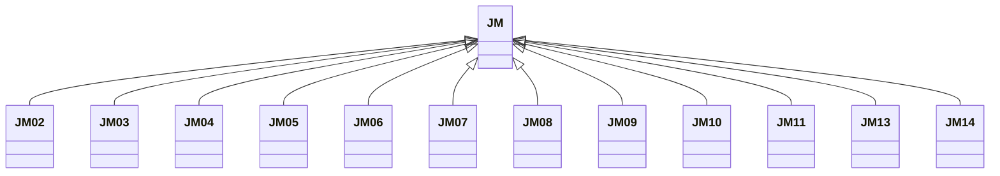

---
search:
  boost: 10.0
---

# Class: JM 


_Concept representing Country of Jamaica_


<div data-search-exclude markdown="1">


URI: [loc:JM](https://w3id.org/lmodel/dpv/loc/JM)





## Inheritance
* **JM**
    * [JM02](JM02.md)
    * [JM03](JM03.md)
    * [JM04](JM04.md)
    * [JM05](JM05.md)
    * [JM06](JM06.md)
    * [JM07](JM07.md)
    * [JM08](JM08.md)
    * [JM09](JM09.md)
    * [JM10](JM10.md)
    * [JM11](JM11.md)
    * [JM13](JM13.md)
    * [JM14](JM14.md)


## Class Properties

| Property | Value |
| --- | --- |
| Class URI | [loc:JM](https://w3id.org/lmodel/dpv/loc/JM) |


## Slots

| Name | Cardinality and Range | Description | Inheritance |
| ---  | --- | --- | --- |


## In Subsets


* [LocSubset](LocSubset.md)


## Aliases


* Jamaica


## Identifier and Mapping Information


### Annotations

| property | value |
| --- | --- |
| upstream_iri | https://w3id.org/dpv/loc/owl#JM |
| dpv_extension_slug | loc |


### Schema Source


* from schema: https://w3id.org/lmodel/dpv/loc


## Mappings

| Mapping Type | Mapped Value |
| ---  | ---  |
| self | loc:JM |
| native | loc:JM |
| exact | dpv_loc:JM, dpv_loc_owl:JM |


## LinkML Source

<!-- TODO: investigate https://stackoverflow.com/questions/37606292/how-to-create-tabbed-code-blocks-in-mkdocs-or-sphinx -->

### Direct

<details>
```yaml
name: JM
annotations:
  upstream_iri:
    tag: upstream_iri
    value: https://w3id.org/dpv/loc/owl#JM
  dpv_extension_slug:
    tag: dpv_extension_slug
    value: loc
description: Concept representing Country of Jamaica
in_subset:
- loc_subset
from_schema: https://w3id.org/lmodel/dpv/loc
aliases:
- Jamaica
exact_mappings:
- dpv_loc:JM
- dpv_loc_owl:JM
class_uri: loc:JM

```
</details>

### Induced

<details>
```yaml
name: JM
annotations:
  upstream_iri:
    tag: upstream_iri
    value: https://w3id.org/dpv/loc/owl#JM
  dpv_extension_slug:
    tag: dpv_extension_slug
    value: loc
description: Concept representing Country of Jamaica
in_subset:
- loc_subset
from_schema: https://w3id.org/lmodel/dpv/loc
aliases:
- Jamaica
exact_mappings:
- dpv_loc:JM
- dpv_loc_owl:JM
class_uri: loc:JM

```
</details></div>