---
search:
  boost: 10.0
---

# Class: JP 


_Concept representing Country of Japan_


<div data-search-exclude markdown="1">


URI: [loc:JP](https://w3id.org/lmodel/dpv/loc/JP)

```mermaid
 classDiagram
    class JP
    click JP href "../JP/"
      JP <|-- JP01
        click JP01 href "../JP01/"
      JP <|-- JP02
        click JP02 href "../JP02/"
      JP <|-- JP03
        click JP03 href "../JP03/"
      JP <|-- JP04
        click JP04 href "../JP04/"
      JP <|-- JP05
        click JP05 href "../JP05/"
      JP <|-- JP06
        click JP06 href "../JP06/"
      JP <|-- JP07
        click JP07 href "../JP07/"
      JP <|-- JP08
        click JP08 href "../JP08/"
      JP <|-- JP09
        click JP09 href "../JP09/"
      JP <|-- JP10
        click JP10 href "../JP10/"
      JP <|-- JP11
        click JP11 href "../JP11/"
      JP <|-- JP12
        click JP12 href "../JP12/"
      JP <|-- JP13
        click JP13 href "../JP13/"
      JP <|-- JP14
        click JP14 href "../JP14/"
      JP <|-- JP15
        click JP15 href "../JP15/"
      JP <|-- JP16
        click JP16 href "../JP16/"
      JP <|-- JP17
        click JP17 href "../JP17/"
      JP <|-- JP18
        click JP18 href "../JP18/"
      JP <|-- JP19
        click JP19 href "../JP19/"
      JP <|-- JP20
        click JP20 href "../JP20/"
      JP <|-- JP21
        click JP21 href "../JP21/"
      JP <|-- JP22
        click JP22 href "../JP22/"
      JP <|-- JP23
        click JP23 href "../JP23/"
      JP <|-- JP24
        click JP24 href "../JP24/"
      JP <|-- JP25
        click JP25 href "../JP25/"
      JP <|-- JP26
        click JP26 href "../JP26/"
      JP <|-- JP27
        click JP27 href "../JP27/"
      JP <|-- JP28
        click JP28 href "../JP28/"
      JP <|-- JP29
        click JP29 href "../JP29/"
      JP <|-- JP30
        click JP30 href "../JP30/"
      JP <|-- JP31
        click JP31 href "../JP31/"
      JP <|-- JP32
        click JP32 href "../JP32/"
      JP <|-- JP33
        click JP33 href "../JP33/"
      JP <|-- JP34
        click JP34 href "../JP34/"
      JP <|-- JP35
        click JP35 href "../JP35/"
      JP <|-- JP36
        click JP36 href "../JP36/"
      JP <|-- JP37
        click JP37 href "../JP37/"
      JP <|-- JP38
        click JP38 href "../JP38/"
      JP <|-- JP39
        click JP39 href "../JP39/"
      JP <|-- JP40
        click JP40 href "../JP40/"
      JP <|-- JP41
        click JP41 href "../JP41/"
      JP <|-- JP42
        click JP42 href "../JP42/"
      JP <|-- JP43
        click JP43 href "../JP43/"
      JP <|-- JP44
        click JP44 href "../JP44/"
      JP <|-- JP45
        click JP45 href "../JP45/"
      JP <|-- JP46
        click JP46 href "../JP46/"
      JP <|-- JP47
        click JP47 href "../JP47/"
      
      
```





## Inheritance
* **JP**
    * [JP01](JP01.md)
    * [JP02](JP02.md)
    * [JP03](JP03.md)
    * [JP04](JP04.md)
    * [JP05](JP05.md)
    * [JP06](JP06.md)
    * [JP07](JP07.md)
    * [JP08](JP08.md)
    * [JP09](JP09.md)
    * [JP10](JP10.md)
    * [JP11](JP11.md)
    * [JP12](JP12.md)
    * [JP13](JP13.md)
    * [JP14](JP14.md)
    * [JP15](JP15.md)
    * [JP16](JP16.md)
    * [JP17](JP17.md)
    * [JP18](JP18.md)
    * [JP19](JP19.md)
    * [JP20](JP20.md)
    * [JP21](JP21.md)
    * [JP22](JP22.md)
    * [JP23](JP23.md)
    * [JP24](JP24.md)
    * [JP25](JP25.md)
    * [JP26](JP26.md)
    * [JP27](JP27.md)
    * [JP28](JP28.md)
    * [JP29](JP29.md)
    * [JP30](JP30.md)
    * [JP31](JP31.md)
    * [JP32](JP32.md)
    * [JP33](JP33.md)
    * [JP34](JP34.md)
    * [JP35](JP35.md)
    * [JP36](JP36.md)
    * [JP37](JP37.md)
    * [JP38](JP38.md)
    * [JP39](JP39.md)
    * [JP40](JP40.md)
    * [JP41](JP41.md)
    * [JP42](JP42.md)
    * [JP43](JP43.md)
    * [JP44](JP44.md)
    * [JP45](JP45.md)
    * [JP46](JP46.md)
    * [JP47](JP47.md)


## Class Properties

| Property | Value |
| --- | --- |
| Class URI | [loc:JP](https://w3id.org/lmodel/dpv/loc/JP) |


## Slots

| Name | Cardinality and Range | Description | Inheritance |
| ---  | --- | --- | --- |


## In Subsets


* [LocSubset](LocSubset.md)


## Aliases


* Japan


## Identifier and Mapping Information


### Annotations

| property | value |
| --- | --- |
| upstream_iri | https://w3id.org/dpv/loc/owl#JP |
| dpv_extension_slug | loc |


### Schema Source


* from schema: https://w3id.org/lmodel/dpv/loc


## Mappings

| Mapping Type | Mapped Value |
| ---  | ---  |
| self | loc:JP |
| native | loc:JP |
| exact | dpv_loc:JP, dpv_loc_owl:JP, iso3166:JP |


## LinkML Source

<!-- TODO: investigate https://stackoverflow.com/questions/37606292/how-to-create-tabbed-code-blocks-in-mkdocs-or-sphinx -->

### Direct

<details>
```yaml
name: JP
annotations:
  upstream_iri:
    tag: upstream_iri
    value: https://w3id.org/dpv/loc/owl#JP
  dpv_extension_slug:
    tag: dpv_extension_slug
    value: loc
description: Concept representing Country of Japan
in_subset:
- loc_subset
from_schema: https://w3id.org/lmodel/dpv/loc
aliases:
- Japan
exact_mappings:
- dpv_loc:JP
- dpv_loc_owl:JP
- iso3166:JP
class_uri: loc:JP

```
</details>

### Induced

<details>
```yaml
name: JP
annotations:
  upstream_iri:
    tag: upstream_iri
    value: https://w3id.org/dpv/loc/owl#JP
  dpv_extension_slug:
    tag: dpv_extension_slug
    value: loc
description: Concept representing Country of Japan
in_subset:
- loc_subset
from_schema: https://w3id.org/lmodel/dpv/loc
aliases:
- Japan
exact_mappings:
- dpv_loc:JP
- dpv_loc_owl:JP
- iso3166:JP
class_uri: loc:JP

```
</details></div>