---
search:
  boost: 10.0
---

# Class: KE 


_Concept representing Country of Kenya_


<div data-search-exclude markdown="1">


URI: [loc:KE](https://w3id.org/lmodel/dpv/loc/KE)

```mermaid
 classDiagram
    class KE
    click KE href "../KE/"
      KE <|-- KE01
        click KE01 href "../KE01/"
      KE <|-- KE02
        click KE02 href "../KE02/"
      KE <|-- KE03
        click KE03 href "../KE03/"
      KE <|-- KE04
        click KE04 href "../KE04/"
      KE <|-- KE05
        click KE05 href "../KE05/"
      KE <|-- KE06
        click KE06 href "../KE06/"
      KE <|-- KE07
        click KE07 href "../KE07/"
      KE <|-- KE08
        click KE08 href "../KE08/"
      KE <|-- KE09
        click KE09 href "../KE09/"
      KE <|-- KE10
        click KE10 href "../KE10/"
      KE <|-- KE11
        click KE11 href "../KE11/"
      KE <|-- KE110
        click KE110 href "../KE110/"
      KE <|-- KE12
        click KE12 href "../KE12/"
      KE <|-- KE13
        click KE13 href "../KE13/"
      KE <|-- KE14
        click KE14 href "../KE14/"
      KE <|-- KE15
        click KE15 href "../KE15/"
      KE <|-- KE16
        click KE16 href "../KE16/"
      KE <|-- KE17
        click KE17 href "../KE17/"
      KE <|-- KE18
        click KE18 href "../KE18/"
      KE <|-- KE19
        click KE19 href "../KE19/"
      KE <|-- KE20
        click KE20 href "../KE20/"
      KE <|-- KE200
        click KE200 href "../KE200/"
      KE <|-- KE21
        click KE21 href "../KE21/"
      KE <|-- KE22
        click KE22 href "../KE22/"
      KE <|-- KE23
        click KE23 href "../KE23/"
      KE <|-- KE24
        click KE24 href "../KE24/"
      KE <|-- KE25
        click KE25 href "../KE25/"
      KE <|-- KE26
        click KE26 href "../KE26/"
      KE <|-- KE27
        click KE27 href "../KE27/"
      KE <|-- KE28
        click KE28 href "../KE28/"
      KE <|-- KE29
        click KE29 href "../KE29/"
      KE <|-- KE30
        click KE30 href "../KE30/"
      KE <|-- KE300
        click KE300 href "../KE300/"
      KE <|-- KE31
        click KE31 href "../KE31/"
      KE <|-- KE32
        click KE32 href "../KE32/"
      KE <|-- KE33
        click KE33 href "../KE33/"
      KE <|-- KE34
        click KE34 href "../KE34/"
      KE <|-- KE35
        click KE35 href "../KE35/"
      KE <|-- KE36
        click KE36 href "../KE36/"
      KE <|-- KE37
        click KE37 href "../KE37/"
      KE <|-- KE38
        click KE38 href "../KE38/"
      KE <|-- KE39
        click KE39 href "../KE39/"
      KE <|-- KE40
        click KE40 href "../KE40/"
      KE <|-- KE400
        click KE400 href "../KE400/"
      KE <|-- KE41
        click KE41 href "../KE41/"
      KE <|-- KE42
        click KE42 href "../KE42/"
      KE <|-- KE43
        click KE43 href "../KE43/"
      KE <|-- KE44
        click KE44 href "../KE44/"
      KE <|-- KE45
        click KE45 href "../KE45/"
      KE <|-- KE46
        click KE46 href "../KE46/"
      KE <|-- KE47
        click KE47 href "../KE47/"
      KE <|-- KE500
        click KE500 href "../KE500/"
      KE <|-- KE600
        click KE600 href "../KE600/"
      KE <|-- KE700
        click KE700 href "../KE700/"
      KE <|-- KE800
        click KE800 href "../KE800/"
      
      
```





## Inheritance
* **KE**
    * [KE01](KE01.md)
    * [KE02](KE02.md)
    * [KE03](KE03.md)
    * [KE04](KE04.md)
    * [KE05](KE05.md)
    * [KE06](KE06.md)
    * [KE07](KE07.md)
    * [KE08](KE08.md)
    * [KE09](KE09.md)
    * [KE10](KE10.md)
    * [KE11](KE11.md)
    * [KE110](KE110.md)
    * [KE12](KE12.md)
    * [KE13](KE13.md)
    * [KE14](KE14.md)
    * [KE15](KE15.md)
    * [KE16](KE16.md)
    * [KE17](KE17.md)
    * [KE18](KE18.md)
    * [KE19](KE19.md)
    * [KE20](KE20.md)
    * [KE200](KE200.md)
    * [KE21](KE21.md)
    * [KE22](KE22.md)
    * [KE23](KE23.md)
    * [KE24](KE24.md)
    * [KE25](KE25.md)
    * [KE26](KE26.md)
    * [KE27](KE27.md)
    * [KE28](KE28.md)
    * [KE29](KE29.md)
    * [KE30](KE30.md)
    * [KE300](KE300.md)
    * [KE31](KE31.md)
    * [KE32](KE32.md)
    * [KE33](KE33.md)
    * [KE34](KE34.md)
    * [KE35](KE35.md)
    * [KE36](KE36.md)
    * [KE37](KE37.md)
    * [KE38](KE38.md)
    * [KE39](KE39.md)
    * [KE40](KE40.md)
    * [KE400](KE400.md)
    * [KE41](KE41.md)
    * [KE42](KE42.md)
    * [KE43](KE43.md)
    * [KE44](KE44.md)
    * [KE45](KE45.md)
    * [KE46](KE46.md)
    * [KE47](KE47.md)
    * [KE500](KE500.md)
    * [KE600](KE600.md)
    * [KE700](KE700.md)
    * [KE800](KE800.md)


## Class Properties

| Property | Value |
| --- | --- |
| Class URI | [loc:KE](https://w3id.org/lmodel/dpv/loc/KE) |


## Slots

| Name | Cardinality and Range | Description | Inheritance |
| ---  | --- | --- | --- |


## In Subsets


* [LocSubset](LocSubset.md)


## Aliases


* Kenya


## Identifier and Mapping Information


### Annotations

| property | value |
| --- | --- |
| upstream_iri | https://w3id.org/dpv/loc/owl#KE |
| dpv_extension_slug | loc |


### Schema Source


* from schema: https://w3id.org/lmodel/dpv/loc


## Mappings

| Mapping Type | Mapped Value |
| ---  | ---  |
| self | loc:KE |
| native | loc:KE |
| exact | dpv_loc:KE, dpv_loc_owl:KE |


## LinkML Source

<!-- TODO: investigate https://stackoverflow.com/questions/37606292/how-to-create-tabbed-code-blocks-in-mkdocs-or-sphinx -->

### Direct

<details>
```yaml
name: KE
annotations:
  upstream_iri:
    tag: upstream_iri
    value: https://w3id.org/dpv/loc/owl#KE
  dpv_extension_slug:
    tag: dpv_extension_slug
    value: loc
description: Concept representing Country of Kenya
in_subset:
- loc_subset
from_schema: https://w3id.org/lmodel/dpv/loc
aliases:
- Kenya
exact_mappings:
- dpv_loc:KE
- dpv_loc_owl:KE
class_uri: loc:KE

```
</details>

### Induced

<details>
```yaml
name: KE
annotations:
  upstream_iri:
    tag: upstream_iri
    value: https://w3id.org/dpv/loc/owl#KE
  dpv_extension_slug:
    tag: dpv_extension_slug
    value: loc
description: Concept representing Country of Kenya
in_subset:
- loc_subset
from_schema: https://w3id.org/lmodel/dpv/loc
aliases:
- Kenya
exact_mappings:
- dpv_loc:KE
- dpv_loc_owl:KE
class_uri: loc:KE

```
</details></div>