---
search:
  boost: 10.0
---

# Class: KH 


_Concept representing Country of Cambodia_


<div data-search-exclude markdown="1">


URI: [loc:KH](https://w3id.org/lmodel/dpv/loc/KH)

```mermaid
 classDiagram
    class KH
    click KH href "../KH/"
      KH <|-- KH1
        click KH1 href "../KH1/"
      KH <|-- KH10
        click KH10 href "../KH10/"
      KH <|-- KH11
        click KH11 href "../KH11/"
      KH <|-- KH12
        click KH12 href "../KH12/"
      KH <|-- KH13
        click KH13 href "../KH13/"
      KH <|-- KH14
        click KH14 href "../KH14/"
      KH <|-- KH15
        click KH15 href "../KH15/"
      KH <|-- KH16
        click KH16 href "../KH16/"
      KH <|-- KH17
        click KH17 href "../KH17/"
      KH <|-- KH18
        click KH18 href "../KH18/"
      KH <|-- KH19
        click KH19 href "../KH19/"
      KH <|-- KH2
        click KH2 href "../KH2/"
      KH <|-- KH20
        click KH20 href "../KH20/"
      KH <|-- KH21
        click KH21 href "../KH21/"
      KH <|-- KH22
        click KH22 href "../KH22/"
      KH <|-- KH23
        click KH23 href "../KH23/"
      KH <|-- KH24
        click KH24 href "../KH24/"
      KH <|-- KH25
        click KH25 href "../KH25/"
      KH <|-- KH3
        click KH3 href "../KH3/"
      KH <|-- KH4
        click KH4 href "../KH4/"
      KH <|-- KH5
        click KH5 href "../KH5/"
      KH <|-- KH6
        click KH6 href "../KH6/"
      KH <|-- KH7
        click KH7 href "../KH7/"
      KH <|-- KH8
        click KH8 href "../KH8/"
      KH <|-- KH9
        click KH9 href "../KH9/"
      
      
```





## Inheritance
* **KH**
    * [KH1](KH1.md)
    * [KH10](KH10.md)
    * [KH11](KH11.md)
    * [KH12](KH12.md)
    * [KH13](KH13.md)
    * [KH14](KH14.md)
    * [KH15](KH15.md)
    * [KH16](KH16.md)
    * [KH17](KH17.md)
    * [KH18](KH18.md)
    * [KH19](KH19.md)
    * [KH2](KH2.md)
    * [KH20](KH20.md)
    * [KH21](KH21.md)
    * [KH22](KH22.md)
    * [KH23](KH23.md)
    * [KH24](KH24.md)
    * [KH25](KH25.md)
    * [KH3](KH3.md)
    * [KH4](KH4.md)
    * [KH5](KH5.md)
    * [KH6](KH6.md)
    * [KH7](KH7.md)
    * [KH8](KH8.md)
    * [KH9](KH9.md)


## Class Properties

| Property | Value |
| --- | --- |
| Class URI | [loc:KH](https://w3id.org/lmodel/dpv/loc/KH) |


## Slots

| Name | Cardinality and Range | Description | Inheritance |
| ---  | --- | --- | --- |


## In Subsets


* [LocSubset](LocSubset.md)


## Aliases


* Cambodia


## Identifier and Mapping Information


### Annotations

| property | value |
| --- | --- |
| upstream_iri | https://w3id.org/dpv/loc/owl#KH |
| dpv_extension_slug | loc |


### Schema Source


* from schema: https://w3id.org/lmodel/dpv/loc


## Mappings

| Mapping Type | Mapped Value |
| ---  | ---  |
| self | loc:KH |
| native | loc:KH |
| exact | dpv_loc:KH, dpv_loc_owl:KH |


## LinkML Source

<!-- TODO: investigate https://stackoverflow.com/questions/37606292/how-to-create-tabbed-code-blocks-in-mkdocs-or-sphinx -->

### Direct

<details>
```yaml
name: KH
annotations:
  upstream_iri:
    tag: upstream_iri
    value: https://w3id.org/dpv/loc/owl#KH
  dpv_extension_slug:
    tag: dpv_extension_slug
    value: loc
description: Concept representing Country of Cambodia
in_subset:
- loc_subset
from_schema: https://w3id.org/lmodel/dpv/loc
aliases:
- Cambodia
exact_mappings:
- dpv_loc:KH
- dpv_loc_owl:KH
class_uri: loc:KH

```
</details>

### Induced

<details>
```yaml
name: KH
annotations:
  upstream_iri:
    tag: upstream_iri
    value: https://w3id.org/dpv/loc/owl#KH
  dpv_extension_slug:
    tag: dpv_extension_slug
    value: loc
description: Concept representing Country of Cambodia
in_subset:
- loc_subset
from_schema: https://w3id.org/lmodel/dpv/loc
aliases:
- Cambodia
exact_mappings:
- dpv_loc:KH
- dpv_loc_owl:KH
class_uri: loc:KH

```
</details></div>