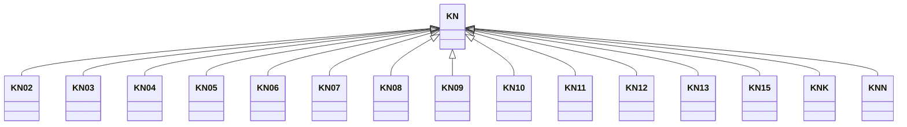

---
search:
  boost: 10.0
---

# Class: KN 


_Concept representing Country of Saint Kitts and Nevis_


<div data-search-exclude markdown="1">


URI: [loc:KN](https://w3id.org/lmodel/dpv/loc/KN)





## Inheritance
* **KN**
    * [KN02](KN02.md)
    * [KN03](KN03.md)
    * [KN04](KN04.md)
    * [KN05](KN05.md)
    * [KN06](KN06.md)
    * [KN07](KN07.md)
    * [KN08](KN08.md)
    * [KN09](KN09.md)
    * [KN10](KN10.md)
    * [KN11](KN11.md)
    * [KN12](KN12.md)
    * [KN13](KN13.md)
    * [KN15](KN15.md)
    * [KNK](KNK.md)
    * [KNN](KNN.md)


## Class Properties

| Property | Value |
| --- | --- |
| Class URI | [loc:KN](https://w3id.org/lmodel/dpv/loc/KN) |


## Slots

| Name | Cardinality and Range | Description | Inheritance |
| ---  | --- | --- | --- |


## In Subsets


* [LocSubset](LocSubset.md)


## Aliases


* Saint Kitts and Nevis


## Identifier and Mapping Information


### Annotations

| property | value |
| --- | --- |
| upstream_iri | https://w3id.org/dpv/loc/owl#KN |
| dpv_extension_slug | loc |


### Schema Source


* from schema: https://w3id.org/lmodel/dpv/loc


## Mappings

| Mapping Type | Mapped Value |
| ---  | ---  |
| self | loc:KN |
| native | loc:KN |
| exact | dpv_loc:KN, dpv_loc_owl:KN |


## LinkML Source

<!-- TODO: investigate https://stackoverflow.com/questions/37606292/how-to-create-tabbed-code-blocks-in-mkdocs-or-sphinx -->

### Direct

<details>
```yaml
name: KN
annotations:
  upstream_iri:
    tag: upstream_iri
    value: https://w3id.org/dpv/loc/owl#KN
  dpv_extension_slug:
    tag: dpv_extension_slug
    value: loc
description: Concept representing Country of Saint Kitts and Nevis
in_subset:
- loc_subset
from_schema: https://w3id.org/lmodel/dpv/loc
aliases:
- Saint Kitts and Nevis
exact_mappings:
- dpv_loc:KN
- dpv_loc_owl:KN
class_uri: loc:KN

```
</details>

### Induced

<details>
```yaml
name: KN
annotations:
  upstream_iri:
    tag: upstream_iri
    value: https://w3id.org/dpv/loc/owl#KN
  dpv_extension_slug:
    tag: dpv_extension_slug
    value: loc
description: Concept representing Country of Saint Kitts and Nevis
in_subset:
- loc_subset
from_schema: https://w3id.org/lmodel/dpv/loc
aliases:
- Saint Kitts and Nevis
exact_mappings:
- dpv_loc:KN
- dpv_loc_owl:KN
class_uri: loc:KN

```
</details></div>