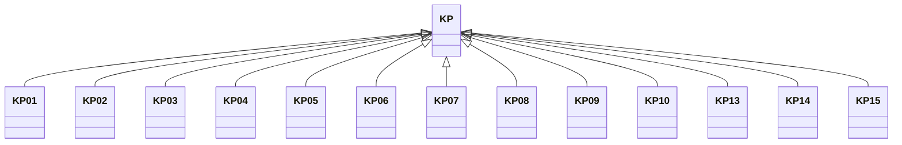

---
search:
  boost: 10.0
---

# Class: KP 


_Concept representing Country of Democratic People's Republic of Korea_


<div data-search-exclude markdown="1">


URI: [loc:KP](https://w3id.org/lmodel/dpv/loc/KP)





## Inheritance
* **KP**
    * [KP01](KP01.md)
    * [KP02](KP02.md)
    * [KP03](KP03.md)
    * [KP04](KP04.md)
    * [KP05](KP05.md)
    * [KP06](KP06.md)
    * [KP07](KP07.md)
    * [KP08](KP08.md)
    * [KP09](KP09.md)
    * [KP10](KP10.md)
    * [KP13](KP13.md)
    * [KP14](KP14.md)
    * [KP15](KP15.md)


## Class Properties

| Property | Value |
| --- | --- |
| Class URI | [loc:KP](https://w3id.org/lmodel/dpv/loc/KP) |


## Slots

| Name | Cardinality and Range | Description | Inheritance |
| ---  | --- | --- | --- |


## In Subsets


* [LocSubset](LocSubset.md)


## Aliases


* Democratic People's Republic of Korea


## Identifier and Mapping Information


### Annotations

| property | value |
| --- | --- |
| upstream_iri | https://w3id.org/dpv/loc/owl#KP |
| dpv_extension_slug | loc |


### Schema Source


* from schema: https://w3id.org/lmodel/dpv/loc


## Mappings

| Mapping Type | Mapped Value |
| ---  | ---  |
| self | loc:KP |
| native | loc:KP |
| exact | dpv_loc:KP, dpv_loc_owl:KP |


## LinkML Source

<!-- TODO: investigate https://stackoverflow.com/questions/37606292/how-to-create-tabbed-code-blocks-in-mkdocs-or-sphinx -->

### Direct

<details>
```yaml
name: KP
annotations:
  upstream_iri:
    tag: upstream_iri
    value: https://w3id.org/dpv/loc/owl#KP
  dpv_extension_slug:
    tag: dpv_extension_slug
    value: loc
description: Concept representing Country of Democratic People's Republic of Korea
in_subset:
- loc_subset
from_schema: https://w3id.org/lmodel/dpv/loc
aliases:
- Democratic People's Republic of Korea
exact_mappings:
- dpv_loc:KP
- dpv_loc_owl:KP
class_uri: loc:KP

```
</details>

### Induced

<details>
```yaml
name: KP
annotations:
  upstream_iri:
    tag: upstream_iri
    value: https://w3id.org/dpv/loc/owl#KP
  dpv_extension_slug:
    tag: dpv_extension_slug
    value: loc
description: Concept representing Country of Democratic People's Republic of Korea
in_subset:
- loc_subset
from_schema: https://w3id.org/lmodel/dpv/loc
aliases:
- Democratic People's Republic of Korea
exact_mappings:
- dpv_loc:KP
- dpv_loc_owl:KP
class_uri: loc:KP

```
</details></div>