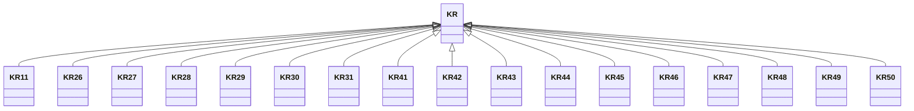

---
search:
  boost: 10.0
---

# Class: KR 


_Concept representing Country of Republic of Korea_


<div data-search-exclude markdown="1">


URI: [loc:KR](https://w3id.org/lmodel/dpv/loc/KR)





## Inheritance
* **KR**
    * [KR11](KR11.md)
    * [KR26](KR26.md)
    * [KR27](KR27.md)
    * [KR28](KR28.md)
    * [KR29](KR29.md)
    * [KR30](KR30.md)
    * [KR31](KR31.md)
    * [KR41](KR41.md)
    * [KR42](KR42.md)
    * [KR43](KR43.md)
    * [KR44](KR44.md)
    * [KR45](KR45.md)
    * [KR46](KR46.md)
    * [KR47](KR47.md)
    * [KR48](KR48.md)
    * [KR49](KR49.md)
    * [KR50](KR50.md)


## Class Properties

| Property | Value |
| --- | --- |
| Class URI | [loc:KR](https://w3id.org/lmodel/dpv/loc/KR) |


## Slots

| Name | Cardinality and Range | Description | Inheritance |
| ---  | --- | --- | --- |


## In Subsets


* [LocSubset](LocSubset.md)


## Aliases


* Republic of Korea


## Identifier and Mapping Information


### Annotations

| property | value |
| --- | --- |
| upstream_iri | https://w3id.org/dpv/loc/owl#KR |
| dpv_extension_slug | loc |


### Schema Source


* from schema: https://w3id.org/lmodel/dpv/loc


## Mappings

| Mapping Type | Mapped Value |
| ---  | ---  |
| self | loc:KR |
| native | loc:KR |
| exact | dpv_loc:KR, dpv_loc_owl:KR, iso3166:KR |


## LinkML Source

<!-- TODO: investigate https://stackoverflow.com/questions/37606292/how-to-create-tabbed-code-blocks-in-mkdocs-or-sphinx -->

### Direct

<details>
```yaml
name: KR
annotations:
  upstream_iri:
    tag: upstream_iri
    value: https://w3id.org/dpv/loc/owl#KR
  dpv_extension_slug:
    tag: dpv_extension_slug
    value: loc
description: Concept representing Country of Republic of Korea
in_subset:
- loc_subset
from_schema: https://w3id.org/lmodel/dpv/loc
aliases:
- Republic of Korea
exact_mappings:
- dpv_loc:KR
- dpv_loc_owl:KR
- iso3166:KR
class_uri: loc:KR

```
</details>

### Induced

<details>
```yaml
name: KR
annotations:
  upstream_iri:
    tag: upstream_iri
    value: https://w3id.org/dpv/loc/owl#KR
  dpv_extension_slug:
    tag: dpv_extension_slug
    value: loc
description: Concept representing Country of Republic of Korea
in_subset:
- loc_subset
from_schema: https://w3id.org/lmodel/dpv/loc
aliases:
- Republic of Korea
exact_mappings:
- dpv_loc:KR
- dpv_loc_owl:KR
- iso3166:KR
class_uri: loc:KR

```
</details></div>