---
search:
  boost: 10.0
---

# Class: KZ 


_Concept representing Country of Kazakhstan_


<div data-search-exclude markdown="1">


URI: [loc:KZ](https://w3id.org/lmodel/dpv/loc/KZ)

```mermaid
 classDiagram
    class KZ
    click KZ href "../KZ/"
      KZ <|-- KZ10
        click KZ10 href "../KZ10/"
      KZ <|-- KZ11
        click KZ11 href "../KZ11/"
      KZ <|-- KZ15
        click KZ15 href "../KZ15/"
      KZ <|-- KZ19
        click KZ19 href "../KZ19/"
      KZ <|-- KZ23
        click KZ23 href "../KZ23/"
      KZ <|-- KZ27
        click KZ27 href "../KZ27/"
      KZ <|-- KZ31
        click KZ31 href "../KZ31/"
      KZ <|-- KZ33
        click KZ33 href "../KZ33/"
      KZ <|-- KZ35
        click KZ35 href "../KZ35/"
      KZ <|-- KZ39
        click KZ39 href "../KZ39/"
      KZ <|-- KZ43
        click KZ43 href "../KZ43/"
      KZ <|-- KZ47
        click KZ47 href "../KZ47/"
      KZ <|-- KZ55
        click KZ55 href "../KZ55/"
      KZ <|-- KZ59
        click KZ59 href "../KZ59/"
      KZ <|-- KZ61
        click KZ61 href "../KZ61/"
      KZ <|-- KZ62
        click KZ62 href "../KZ62/"
      KZ <|-- KZ63
        click KZ63 href "../KZ63/"
      KZ <|-- KZ71
        click KZ71 href "../KZ71/"
      KZ <|-- KZ75
        click KZ75 href "../KZ75/"
      KZ <|-- KZ79
        click KZ79 href "../KZ79/"
      
      
```





## Inheritance
* **KZ**
    * [KZ10](KZ10.md)
    * [KZ11](KZ11.md)
    * [KZ15](KZ15.md)
    * [KZ19](KZ19.md)
    * [KZ23](KZ23.md)
    * [KZ27](KZ27.md)
    * [KZ31](KZ31.md)
    * [KZ33](KZ33.md)
    * [KZ35](KZ35.md)
    * [KZ39](KZ39.md)
    * [KZ43](KZ43.md)
    * [KZ47](KZ47.md)
    * [KZ55](KZ55.md)
    * [KZ59](KZ59.md)
    * [KZ61](KZ61.md)
    * [KZ62](KZ62.md)
    * [KZ63](KZ63.md)
    * [KZ71](KZ71.md)
    * [KZ75](KZ75.md)
    * [KZ79](KZ79.md)


## Class Properties

| Property | Value |
| --- | --- |
| Class URI | [loc:KZ](https://w3id.org/lmodel/dpv/loc/KZ) |


## Slots

| Name | Cardinality and Range | Description | Inheritance |
| ---  | --- | --- | --- |


## In Subsets


* [LocSubset](LocSubset.md)


## Aliases


* Kazakhstan


## Identifier and Mapping Information


### Annotations

| property | value |
| --- | --- |
| upstream_iri | https://w3id.org/dpv/loc/owl#KZ |
| dpv_extension_slug | loc |


### Schema Source


* from schema: https://w3id.org/lmodel/dpv/loc


## Mappings

| Mapping Type | Mapped Value |
| ---  | ---  |
| self | loc:KZ |
| native | loc:KZ |
| exact | dpv_loc:KZ, dpv_loc_owl:KZ |


## LinkML Source

<!-- TODO: investigate https://stackoverflow.com/questions/37606292/how-to-create-tabbed-code-blocks-in-mkdocs-or-sphinx -->

### Direct

<details>
```yaml
name: KZ
annotations:
  upstream_iri:
    tag: upstream_iri
    value: https://w3id.org/dpv/loc/owl#KZ
  dpv_extension_slug:
    tag: dpv_extension_slug
    value: loc
description: Concept representing Country of Kazakhstan
in_subset:
- loc_subset
from_schema: https://w3id.org/lmodel/dpv/loc
aliases:
- Kazakhstan
exact_mappings:
- dpv_loc:KZ
- dpv_loc_owl:KZ
class_uri: loc:KZ

```
</details>

### Induced

<details>
```yaml
name: KZ
annotations:
  upstream_iri:
    tag: upstream_iri
    value: https://w3id.org/dpv/loc/owl#KZ
  dpv_extension_slug:
    tag: dpv_extension_slug
    value: loc
description: Concept representing Country of Kazakhstan
in_subset:
- loc_subset
from_schema: https://w3id.org/lmodel/dpv/loc
aliases:
- Kazakhstan
exact_mappings:
- dpv_loc:KZ
- dpv_loc_owl:KZ
class_uri: loc:KZ

```
</details></div>