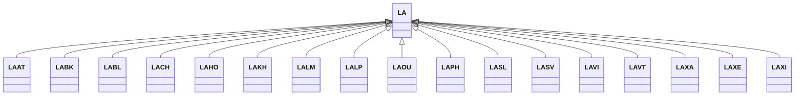

---
search:
  boost: 10.0
---

# Class: LA 


_Concept representing Country of Lao People's Democratic Republic_


<div data-search-exclude markdown="1">


URI: [loc:LA](https://w3id.org/lmodel/dpv/loc/LA)





## Inheritance
* **LA**
    * [LAAT](LAAT.md)
    * [LABK](LABK.md)
    * [LABL](LABL.md)
    * [LACH](LACH.md)
    * [LAHO](LAHO.md)
    * [LAKH](LAKH.md)
    * [LALM](LALM.md)
    * [LALP](LALP.md)
    * [LAOU](LAOU.md)
    * [LAPH](LAPH.md)
    * [LASL](LASL.md)
    * [LASV](LASV.md)
    * [LAVI](LAVI.md)
    * [LAVT](LAVT.md)
    * [LAXA](LAXA.md)
    * [LAXE](LAXE.md)
    * [LAXI](LAXI.md)


## Class Properties

| Property | Value |
| --- | --- |
| Class URI | [loc:LA](https://w3id.org/lmodel/dpv/loc/LA) |


## Slots

| Name | Cardinality and Range | Description | Inheritance |
| ---  | --- | --- | --- |


## In Subsets


* [LocSubset](LocSubset.md)


## Aliases


* Lao People's Democratic Republic


## Identifier and Mapping Information


### Annotations

| property | value |
| --- | --- |
| upstream_iri | https://w3id.org/dpv/loc/owl#LA |
| dpv_extension_slug | loc |


### Schema Source


* from schema: https://w3id.org/lmodel/dpv/loc


## Mappings

| Mapping Type | Mapped Value |
| ---  | ---  |
| self | loc:LA |
| native | loc:LA |
| exact | dpv_loc:LA, dpv_loc_owl:LA |


## LinkML Source

<!-- TODO: investigate https://stackoverflow.com/questions/37606292/how-to-create-tabbed-code-blocks-in-mkdocs-or-sphinx -->

### Direct

<details>
```yaml
name: LA
annotations:
  upstream_iri:
    tag: upstream_iri
    value: https://w3id.org/dpv/loc/owl#LA
  dpv_extension_slug:
    tag: dpv_extension_slug
    value: loc
description: Concept representing Country of Lao People's Democratic Republic
in_subset:
- loc_subset
from_schema: https://w3id.org/lmodel/dpv/loc
aliases:
- Lao People's Democratic Republic
exact_mappings:
- dpv_loc:LA
- dpv_loc_owl:LA
class_uri: loc:LA

```
</details>

### Induced

<details>
```yaml
name: LA
annotations:
  upstream_iri:
    tag: upstream_iri
    value: https://w3id.org/dpv/loc/owl#LA
  dpv_extension_slug:
    tag: dpv_extension_slug
    value: loc
description: Concept representing Country of Lao People's Democratic Republic
in_subset:
- loc_subset
from_schema: https://w3id.org/lmodel/dpv/loc
aliases:
- Lao People's Democratic Republic
exact_mappings:
- dpv_loc:LA
- dpv_loc_owl:LA
class_uri: loc:LA

```
</details></div>