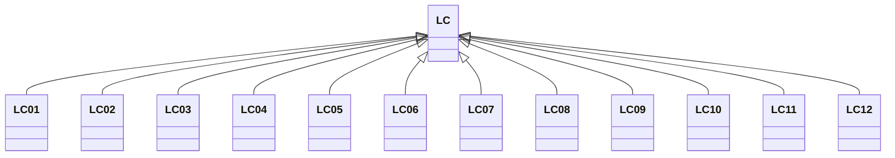

---
search:
  boost: 10.0
---

# Class: LC 


_Concept representing Country of Saint Lucia_


<div data-search-exclude markdown="1">


URI: [loc:LC](https://w3id.org/lmodel/dpv/loc/LC)





## Inheritance
* **LC**
    * [LC01](LC01.md)
    * [LC02](LC02.md)
    * [LC03](LC03.md)
    * [LC04](LC04.md)
    * [LC05](LC05.md)
    * [LC06](LC06.md)
    * [LC07](LC07.md)
    * [LC08](LC08.md)
    * [LC09](LC09.md)
    * [LC10](LC10.md)
    * [LC11](LC11.md)
    * [LC12](LC12.md)


## Class Properties

| Property | Value |
| --- | --- |
| Class URI | [loc:LC](https://w3id.org/lmodel/dpv/loc/LC) |


## Slots

| Name | Cardinality and Range | Description | Inheritance |
| ---  | --- | --- | --- |


## In Subsets


* [LocSubset](LocSubset.md)


## Aliases


* Saint Lucia


## Identifier and Mapping Information


### Annotations

| property | value |
| --- | --- |
| upstream_iri | https://w3id.org/dpv/loc/owl#LC |
| dpv_extension_slug | loc |


### Schema Source


* from schema: https://w3id.org/lmodel/dpv/loc


## Mappings

| Mapping Type | Mapped Value |
| ---  | ---  |
| self | loc:LC |
| native | loc:LC |
| exact | dpv_loc:LC, dpv_loc_owl:LC |


## LinkML Source

<!-- TODO: investigate https://stackoverflow.com/questions/37606292/how-to-create-tabbed-code-blocks-in-mkdocs-or-sphinx -->

### Direct

<details>
```yaml
name: LC
annotations:
  upstream_iri:
    tag: upstream_iri
    value: https://w3id.org/dpv/loc/owl#LC
  dpv_extension_slug:
    tag: dpv_extension_slug
    value: loc
description: Concept representing Country of Saint Lucia
in_subset:
- loc_subset
from_schema: https://w3id.org/lmodel/dpv/loc
aliases:
- Saint Lucia
exact_mappings:
- dpv_loc:LC
- dpv_loc_owl:LC
class_uri: loc:LC

```
</details>

### Induced

<details>
```yaml
name: LC
annotations:
  upstream_iri:
    tag: upstream_iri
    value: https://w3id.org/dpv/loc/owl#LC
  dpv_extension_slug:
    tag: dpv_extension_slug
    value: loc
description: Concept representing Country of Saint Lucia
in_subset:
- loc_subset
from_schema: https://w3id.org/lmodel/dpv/loc
aliases:
- Saint Lucia
exact_mappings:
- dpv_loc:LC
- dpv_loc_owl:LC
class_uri: loc:LC

```
</details></div>