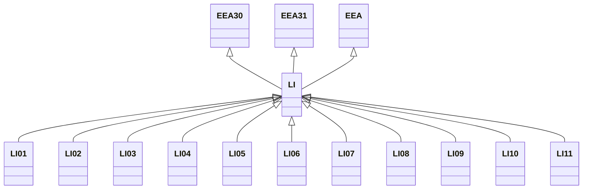

---
search:
  boost: 10.0
---

# Class: LI 


_Concept representing Country of Liechtenstein_


<div data-search-exclude markdown="1">


URI: [loc:LI](https://w3id.org/lmodel/dpv/loc/LI)





## Inheritance
* [EEA](EEA.md)
    * **LI** [ [EEA30](EEA30.md) [EEA31](EEA31.md)]
        * [LI01](LI01.md)
        * [LI02](LI02.md)
        * [LI03](LI03.md)
        * [LI04](LI04.md)
        * [LI05](LI05.md)
        * [LI06](LI06.md)
        * [LI07](LI07.md)
        * [LI08](LI08.md)
        * [LI09](LI09.md)
        * [LI10](LI10.md)
        * [LI11](LI11.md)


## Class Properties

| Property | Value |
| --- | --- |
| Class URI | [loc:LI](https://w3id.org/lmodel/dpv/loc/LI) |


## Slots

| Name | Cardinality and Range | Description | Inheritance |
| ---  | --- | --- | --- |


## In Subsets


* [LocSubset](LocSubset.md)


## Aliases


* Liechtenstein


## Identifier and Mapping Information


### Annotations

| property | value |
| --- | --- |
| upstream_iri | https://w3id.org/dpv/loc/owl#LI |
| dpv_extension_slug | loc |


### Schema Source


* from schema: https://w3id.org/lmodel/dpv/loc


## Mappings

| Mapping Type | Mapped Value |
| ---  | ---  |
| self | loc:LI |
| native | loc:LI |
| exact | dpv_loc:LI, dpv_loc_owl:LI |


## LinkML Source

<!-- TODO: investigate https://stackoverflow.com/questions/37606292/how-to-create-tabbed-code-blocks-in-mkdocs-or-sphinx -->

### Direct

<details>
```yaml
name: LI
annotations:
  upstream_iri:
    tag: upstream_iri
    value: https://w3id.org/dpv/loc/owl#LI
  dpv_extension_slug:
    tag: dpv_extension_slug
    value: loc
description: Concept representing Country of Liechtenstein
in_subset:
- loc_subset
from_schema: https://w3id.org/lmodel/dpv/loc
aliases:
- Liechtenstein
exact_mappings:
- dpv_loc:LI
- dpv_loc_owl:LI
is_a: EEA
mixins:
- EEA30
- EEA31
class_uri: loc:LI

```
</details>

### Induced

<details>
```yaml
name: LI
annotations:
  upstream_iri:
    tag: upstream_iri
    value: https://w3id.org/dpv/loc/owl#LI
  dpv_extension_slug:
    tag: dpv_extension_slug
    value: loc
description: Concept representing Country of Liechtenstein
in_subset:
- loc_subset
from_schema: https://w3id.org/lmodel/dpv/loc
aliases:
- Liechtenstein
exact_mappings:
- dpv_loc:LI
- dpv_loc_owl:LI
is_a: EEA
mixins:
- EEA30
- EEA31
class_uri: loc:LI

```
</details></div>