---
search:
  boost: 10.0
---

# Class: LK 


_Concept representing Country of Sri Lanka_


<div data-search-exclude markdown="1">


URI: [loc:LK](https://w3id.org/lmodel/dpv/loc/LK)

```mermaid
 classDiagram
    class LK
    click LK href "../LK/"
      LK <|-- LK1
        click LK1 href "../LK1/"
      LK <|-- LK11
        click LK11 href "../LK11/"
      LK <|-- LK12
        click LK12 href "../LK12/"
      LK <|-- LK13
        click LK13 href "../LK13/"
      LK <|-- LK2
        click LK2 href "../LK2/"
      LK <|-- LK21
        click LK21 href "../LK21/"
      LK <|-- LK22
        click LK22 href "../LK22/"
      LK <|-- LK23
        click LK23 href "../LK23/"
      LK <|-- LK3
        click LK3 href "../LK3/"
      LK <|-- LK31
        click LK31 href "../LK31/"
      LK <|-- LK32
        click LK32 href "../LK32/"
      LK <|-- LK33
        click LK33 href "../LK33/"
      LK <|-- LK4
        click LK4 href "../LK4/"
      LK <|-- LK41
        click LK41 href "../LK41/"
      LK <|-- LK42
        click LK42 href "../LK42/"
      LK <|-- LK43
        click LK43 href "../LK43/"
      LK <|-- LK44
        click LK44 href "../LK44/"
      LK <|-- LK45
        click LK45 href "../LK45/"
      LK <|-- LK5
        click LK5 href "../LK5/"
      LK <|-- LK51
        click LK51 href "../LK51/"
      LK <|-- LK52
        click LK52 href "../LK52/"
      LK <|-- LK53
        click LK53 href "../LK53/"
      LK <|-- LK6
        click LK6 href "../LK6/"
      LK <|-- LK61
        click LK61 href "../LK61/"
      LK <|-- LK62
        click LK62 href "../LK62/"
      LK <|-- LK7
        click LK7 href "../LK7/"
      LK <|-- LK71
        click LK71 href "../LK71/"
      LK <|-- LK72
        click LK72 href "../LK72/"
      LK <|-- LK8
        click LK8 href "../LK8/"
      LK <|-- LK81
        click LK81 href "../LK81/"
      LK <|-- LK82
        click LK82 href "../LK82/"
      LK <|-- LK9
        click LK9 href "../LK9/"
      LK <|-- LK91
        click LK91 href "../LK91/"
      LK <|-- LK92
        click LK92 href "../LK92/"
      
      
```





## Inheritance
* **LK**
    * [LK1](LK1.md)
    * [LK11](LK11.md)
    * [LK12](LK12.md)
    * [LK13](LK13.md)
    * [LK2](LK2.md)
    * [LK21](LK21.md)
    * [LK22](LK22.md)
    * [LK23](LK23.md)
    * [LK3](LK3.md)
    * [LK31](LK31.md)
    * [LK32](LK32.md)
    * [LK33](LK33.md)
    * [LK4](LK4.md)
    * [LK41](LK41.md)
    * [LK42](LK42.md)
    * [LK43](LK43.md)
    * [LK44](LK44.md)
    * [LK45](LK45.md)
    * [LK5](LK5.md)
    * [LK51](LK51.md)
    * [LK52](LK52.md)
    * [LK53](LK53.md)
    * [LK6](LK6.md)
    * [LK61](LK61.md)
    * [LK62](LK62.md)
    * [LK7](LK7.md)
    * [LK71](LK71.md)
    * [LK72](LK72.md)
    * [LK8](LK8.md)
    * [LK81](LK81.md)
    * [LK82](LK82.md)
    * [LK9](LK9.md)
    * [LK91](LK91.md)
    * [LK92](LK92.md)


## Class Properties

| Property | Value |
| --- | --- |
| Class URI | [loc:LK](https://w3id.org/lmodel/dpv/loc/LK) |


## Slots

| Name | Cardinality and Range | Description | Inheritance |
| ---  | --- | --- | --- |


## In Subsets


* [LocSubset](LocSubset.md)


## Aliases


* Sri Lanka


## Identifier and Mapping Information


### Annotations

| property | value |
| --- | --- |
| upstream_iri | https://w3id.org/dpv/loc/owl#LK |
| dpv_extension_slug | loc |


### Schema Source


* from schema: https://w3id.org/lmodel/dpv/loc


## Mappings

| Mapping Type | Mapped Value |
| ---  | ---  |
| self | loc:LK |
| native | loc:LK |
| exact | dpv_loc:LK, dpv_loc_owl:LK |


## LinkML Source

<!-- TODO: investigate https://stackoverflow.com/questions/37606292/how-to-create-tabbed-code-blocks-in-mkdocs-or-sphinx -->

### Direct

<details>
```yaml
name: LK
annotations:
  upstream_iri:
    tag: upstream_iri
    value: https://w3id.org/dpv/loc/owl#LK
  dpv_extension_slug:
    tag: dpv_extension_slug
    value: loc
description: Concept representing Country of Sri Lanka
in_subset:
- loc_subset
from_schema: https://w3id.org/lmodel/dpv/loc
aliases:
- Sri Lanka
exact_mappings:
- dpv_loc:LK
- dpv_loc_owl:LK
class_uri: loc:LK

```
</details>

### Induced

<details>
```yaml
name: LK
annotations:
  upstream_iri:
    tag: upstream_iri
    value: https://w3id.org/dpv/loc/owl#LK
  dpv_extension_slug:
    tag: dpv_extension_slug
    value: loc
description: Concept representing Country of Sri Lanka
in_subset:
- loc_subset
from_schema: https://w3id.org/lmodel/dpv/loc
aliases:
- Sri Lanka
exact_mappings:
- dpv_loc:LK
- dpv_loc_owl:LK
class_uri: loc:LK

```
</details></div>