---
search:
  boost: 10.0
---

# Class: LT 


_Concept representing Country of Lithuania_


<div data-search-exclude markdown="1">


URI: [loc:LT](https://w3id.org/lmodel/dpv/loc/LT)

```mermaid
 classDiagram
    class LT
    click LT href "../LT/"
      EEA30 <|-- LT
        click EEA30 href "../EEA30/"
      EEA31 <|-- LT
        click EEA31 href "../EEA31/"
      EU <|-- LT
        click EU href "../EU/"
      EU27 <|-- LT
        click EU27 href "../EU27/"
      EU28 <|-- LT
        click EU28 href "../EU28/"
      EEA <|-- LT
        click EEA href "../EEA/"
      

      LT <|-- LT01
        click LT01 href "../LT01/"
      LT <|-- LT02
        click LT02 href "../LT02/"
      LT <|-- LT03
        click LT03 href "../LT03/"
      LT <|-- LT04
        click LT04 href "../LT04/"
      LT <|-- LT05
        click LT05 href "../LT05/"
      LT <|-- LT06
        click LT06 href "../LT06/"
      LT <|-- LT07
        click LT07 href "../LT07/"
      LT <|-- LT08
        click LT08 href "../LT08/"
      LT <|-- LT09
        click LT09 href "../LT09/"
      LT <|-- LT10
        click LT10 href "../LT10/"
      LT <|-- LT11
        click LT11 href "../LT11/"
      LT <|-- LT12
        click LT12 href "../LT12/"
      LT <|-- LT13
        click LT13 href "../LT13/"
      LT <|-- LT14
        click LT14 href "../LT14/"
      LT <|-- LT15
        click LT15 href "../LT15/"
      LT <|-- LT16
        click LT16 href "../LT16/"
      LT <|-- LT17
        click LT17 href "../LT17/"
      LT <|-- LT18
        click LT18 href "../LT18/"
      LT <|-- LT19
        click LT19 href "../LT19/"
      LT <|-- LT20
        click LT20 href "../LT20/"
      LT <|-- LT21
        click LT21 href "../LT21/"
      LT <|-- LT22
        click LT22 href "../LT22/"
      LT <|-- LT23
        click LT23 href "../LT23/"
      LT <|-- LT24
        click LT24 href "../LT24/"
      LT <|-- LT25
        click LT25 href "../LT25/"
      LT <|-- LT26
        click LT26 href "../LT26/"
      LT <|-- LT27
        click LT27 href "../LT27/"
      LT <|-- LT28
        click LT28 href "../LT28/"
      LT <|-- LT29
        click LT29 href "../LT29/"
      LT <|-- LT30
        click LT30 href "../LT30/"
      LT <|-- LT31
        click LT31 href "../LT31/"
      LT <|-- LT32
        click LT32 href "../LT32/"
      LT <|-- LT33
        click LT33 href "../LT33/"
      LT <|-- LT34
        click LT34 href "../LT34/"
      LT <|-- LT35
        click LT35 href "../LT35/"
      LT <|-- LT36
        click LT36 href "../LT36/"
      LT <|-- LT37
        click LT37 href "../LT37/"
      LT <|-- LT38
        click LT38 href "../LT38/"
      LT <|-- LT39
        click LT39 href "../LT39/"
      LT <|-- LT40
        click LT40 href "../LT40/"
      LT <|-- LT41
        click LT41 href "../LT41/"
      LT <|-- LT42
        click LT42 href "../LT42/"
      LT <|-- LT43
        click LT43 href "../LT43/"
      LT <|-- LT44
        click LT44 href "../LT44/"
      LT <|-- LT45
        click LT45 href "../LT45/"
      LT <|-- LT46
        click LT46 href "../LT46/"
      LT <|-- LT47
        click LT47 href "../LT47/"
      LT <|-- LT48
        click LT48 href "../LT48/"
      LT <|-- LT49
        click LT49 href "../LT49/"
      LT <|-- LT50
        click LT50 href "../LT50/"
      LT <|-- LT51
        click LT51 href "../LT51/"
      LT <|-- LT52
        click LT52 href "../LT52/"
      LT <|-- LT53
        click LT53 href "../LT53/"
      LT <|-- LT54
        click LT54 href "../LT54/"
      LT <|-- LT55
        click LT55 href "../LT55/"
      LT <|-- LT56
        click LT56 href "../LT56/"
      LT <|-- LT57
        click LT57 href "../LT57/"
      LT <|-- LT58
        click LT58 href "../LT58/"
      LT <|-- LT59
        click LT59 href "../LT59/"
      LT <|-- LT60
        click LT60 href "../LT60/"
      LT <|-- LTAL
        click LTAL href "../LTAL/"
      LT <|-- LTKL
        click LTKL href "../LTKL/"
      LT <|-- LTKU
        click LTKU href "../LTKU/"
      LT <|-- LTMR
        click LTMR href "../LTMR/"
      LT <|-- LTPN
        click LTPN href "../LTPN/"
      LT <|-- LTSA
        click LTSA href "../LTSA/"
      LT <|-- LTTA
        click LTTA href "../LTTA/"
      LT <|-- LTTE
        click LTTE href "../LTTE/"
      LT <|-- LTUT
        click LTUT href "../LTUT/"
      LT <|-- LTVL
        click LTVL href "../LTVL/"
      

      
```





## Inheritance
* [EEA](EEA.md)
    * **LT** [ [EEA30](EEA30.md) [EEA31](EEA31.md) [EU](EU.md) [EU27](EU27.md) [EU28](EU28.md)]
        * [LT01](LT01.md)
        * [LT02](LT02.md)
        * [LT03](LT03.md)
        * [LT04](LT04.md)
        * [LT05](LT05.md)
        * [LT06](LT06.md)
        * [LT07](LT07.md)
        * [LT08](LT08.md)
        * [LT09](LT09.md)
        * [LT10](LT10.md)
        * [LT11](LT11.md)
        * [LT12](LT12.md)
        * [LT13](LT13.md)
        * [LT14](LT14.md)
        * [LT15](LT15.md)
        * [LT16](LT16.md)
        * [LT17](LT17.md)
        * [LT18](LT18.md)
        * [LT19](LT19.md)
        * [LT20](LT20.md)
        * [LT21](LT21.md)
        * [LT22](LT22.md)
        * [LT23](LT23.md)
        * [LT24](LT24.md)
        * [LT25](LT25.md)
        * [LT26](LT26.md)
        * [LT27](LT27.md)
        * [LT28](LT28.md)
        * [LT29](LT29.md)
        * [LT30](LT30.md)
        * [LT31](LT31.md)
        * [LT32](LT32.md)
        * [LT33](LT33.md)
        * [LT34](LT34.md)
        * [LT35](LT35.md)
        * [LT36](LT36.md)
        * [LT37](LT37.md)
        * [LT38](LT38.md)
        * [LT39](LT39.md)
        * [LT40](LT40.md)
        * [LT41](LT41.md)
        * [LT42](LT42.md)
        * [LT43](LT43.md)
        * [LT44](LT44.md)
        * [LT45](LT45.md)
        * [LT46](LT46.md)
        * [LT47](LT47.md)
        * [LT48](LT48.md)
        * [LT49](LT49.md)
        * [LT50](LT50.md)
        * [LT51](LT51.md)
        * [LT52](LT52.md)
        * [LT53](LT53.md)
        * [LT54](LT54.md)
        * [LT55](LT55.md)
        * [LT56](LT56.md)
        * [LT57](LT57.md)
        * [LT58](LT58.md)
        * [LT59](LT59.md)
        * [LT60](LT60.md)
        * [LTAL](LTAL.md)
        * [LTKL](LTKL.md)
        * [LTKU](LTKU.md)
        * [LTMR](LTMR.md)
        * [LTPN](LTPN.md)
        * [LTSA](LTSA.md)
        * [LTTA](LTTA.md)
        * [LTTE](LTTE.md)
        * [LTUT](LTUT.md)
        * [LTVL](LTVL.md)


## Class Properties

| Property | Value |
| --- | --- |
| Class URI | [loc:LT](https://w3id.org/lmodel/dpv/loc/LT) |


## Slots

| Name | Cardinality and Range | Description | Inheritance |
| ---  | --- | --- | --- |


## In Subsets


* [LocSubset](LocSubset.md)


## Aliases


* Lithuania


## Identifier and Mapping Information


### Annotations

| property | value |
| --- | --- |
| upstream_iri | https://w3id.org/dpv/loc/owl#LT |
| dpv_extension_slug | loc |


### Schema Source


* from schema: https://w3id.org/lmodel/dpv/loc


## Mappings

| Mapping Type | Mapped Value |
| ---  | ---  |
| self | loc:LT |
| native | loc:LT |
| exact | dpv_loc:LT, dpv_loc_owl:LT |


## LinkML Source

<!-- TODO: investigate https://stackoverflow.com/questions/37606292/how-to-create-tabbed-code-blocks-in-mkdocs-or-sphinx -->

### Direct

<details>
```yaml
name: LT
annotations:
  upstream_iri:
    tag: upstream_iri
    value: https://w3id.org/dpv/loc/owl#LT
  dpv_extension_slug:
    tag: dpv_extension_slug
    value: loc
description: Concept representing Country of Lithuania
in_subset:
- loc_subset
from_schema: https://w3id.org/lmodel/dpv/loc
aliases:
- Lithuania
exact_mappings:
- dpv_loc:LT
- dpv_loc_owl:LT
is_a: EEA
mixins:
- EEA30
- EEA31
- EU
- EU27
- EU28
class_uri: loc:LT

```
</details>

### Induced

<details>
```yaml
name: LT
annotations:
  upstream_iri:
    tag: upstream_iri
    value: https://w3id.org/dpv/loc/owl#LT
  dpv_extension_slug:
    tag: dpv_extension_slug
    value: loc
description: Concept representing Country of Lithuania
in_subset:
- loc_subset
from_schema: https://w3id.org/lmodel/dpv/loc
aliases:
- Lithuania
exact_mappings:
- dpv_loc:LT
- dpv_loc_owl:LT
is_a: EEA
mixins:
- EEA30
- EEA31
- EU
- EU27
- EU28
class_uri: loc:LT

```
</details></div>