---
search:
  boost: 10.0
---

# Class: LV 


_Concept representing Country of Latvia_


<div data-search-exclude markdown="1">


URI: [loc:LV](https://w3id.org/lmodel/dpv/loc/LV)

```mermaid
 classDiagram
    class LV
    click LV href "../LV/"
      EEA30 <|-- LV
        click EEA30 href "../EEA30/"
      EEA31 <|-- LV
        click EEA31 href "../EEA31/"
      EU <|-- LV
        click EU href "../EU/"
      EU27 <|-- LV
        click EU27 href "../EU27/"
      EU28 <|-- LV
        click EU28 href "../EU28/"
      EEA <|-- LV
        click EEA href "../EEA/"
      

      LV <|-- LV001
        click LV001 href "../LV001/"
      LV <|-- LV002
        click LV002 href "../LV002/"
      LV <|-- LV003
        click LV003 href "../LV003/"
      LV <|-- LV004
        click LV004 href "../LV004/"
      LV <|-- LV005
        click LV005 href "../LV005/"
      LV <|-- LV006
        click LV006 href "../LV006/"
      LV <|-- LV007
        click LV007 href "../LV007/"
      LV <|-- LV008
        click LV008 href "../LV008/"
      LV <|-- LV009
        click LV009 href "../LV009/"
      LV <|-- LV010
        click LV010 href "../LV010/"
      LV <|-- LV011
        click LV011 href "../LV011/"
      LV <|-- LV012
        click LV012 href "../LV012/"
      LV <|-- LV013
        click LV013 href "../LV013/"
      LV <|-- LV014
        click LV014 href "../LV014/"
      LV <|-- LV015
        click LV015 href "../LV015/"
      LV <|-- LV016
        click LV016 href "../LV016/"
      LV <|-- LV017
        click LV017 href "../LV017/"
      LV <|-- LV018
        click LV018 href "../LV018/"
      LV <|-- LV019
        click LV019 href "../LV019/"
      LV <|-- LV020
        click LV020 href "../LV020/"
      LV <|-- LV021
        click LV021 href "../LV021/"
      LV <|-- LV022
        click LV022 href "../LV022/"
      LV <|-- LV023
        click LV023 href "../LV023/"
      LV <|-- LV024
        click LV024 href "../LV024/"
      LV <|-- LV025
        click LV025 href "../LV025/"
      LV <|-- LV026
        click LV026 href "../LV026/"
      LV <|-- LV027
        click LV027 href "../LV027/"
      LV <|-- LV028
        click LV028 href "../LV028/"
      LV <|-- LV029
        click LV029 href "../LV029/"
      LV <|-- LV030
        click LV030 href "../LV030/"
      LV <|-- LV031
        click LV031 href "../LV031/"
      LV <|-- LV032
        click LV032 href "../LV032/"
      LV <|-- LV033
        click LV033 href "../LV033/"
      LV <|-- LV034
        click LV034 href "../LV034/"
      LV <|-- LV035
        click LV035 href "../LV035/"
      LV <|-- LV036
        click LV036 href "../LV036/"
      LV <|-- LV037
        click LV037 href "../LV037/"
      LV <|-- LV038
        click LV038 href "../LV038/"
      LV <|-- LV039
        click LV039 href "../LV039/"
      LV <|-- LV040
        click LV040 href "../LV040/"
      LV <|-- LV041
        click LV041 href "../LV041/"
      LV <|-- LV042
        click LV042 href "../LV042/"
      LV <|-- LV043
        click LV043 href "../LV043/"
      LV <|-- LV044
        click LV044 href "../LV044/"
      LV <|-- LV045
        click LV045 href "../LV045/"
      LV <|-- LV046
        click LV046 href "../LV046/"
      LV <|-- LV047
        click LV047 href "../LV047/"
      LV <|-- LV048
        click LV048 href "../LV048/"
      LV <|-- LV049
        click LV049 href "../LV049/"
      LV <|-- LV050
        click LV050 href "../LV050/"
      LV <|-- LV051
        click LV051 href "../LV051/"
      LV <|-- LV052
        click LV052 href "../LV052/"
      LV <|-- LV053
        click LV053 href "../LV053/"
      LV <|-- LV054
        click LV054 href "../LV054/"
      LV <|-- LV055
        click LV055 href "../LV055/"
      LV <|-- LV056
        click LV056 href "../LV056/"
      LV <|-- LV057
        click LV057 href "../LV057/"
      LV <|-- LV058
        click LV058 href "../LV058/"
      LV <|-- LV059
        click LV059 href "../LV059/"
      LV <|-- LV060
        click LV060 href "../LV060/"
      LV <|-- LV061
        click LV061 href "../LV061/"
      LV <|-- LV062
        click LV062 href "../LV062/"
      LV <|-- LV063
        click LV063 href "../LV063/"
      LV <|-- LV064
        click LV064 href "../LV064/"
      LV <|-- LV065
        click LV065 href "../LV065/"
      LV <|-- LV066
        click LV066 href "../LV066/"
      LV <|-- LV067
        click LV067 href "../LV067/"
      LV <|-- LV068
        click LV068 href "../LV068/"
      LV <|-- LV069
        click LV069 href "../LV069/"
      LV <|-- LV070
        click LV070 href "../LV070/"
      LV <|-- LV071
        click LV071 href "../LV071/"
      LV <|-- LV072
        click LV072 href "../LV072/"
      LV <|-- LV073
        click LV073 href "../LV073/"
      LV <|-- LV074
        click LV074 href "../LV074/"
      LV <|-- LV075
        click LV075 href "../LV075/"
      LV <|-- LV076
        click LV076 href "../LV076/"
      LV <|-- LV077
        click LV077 href "../LV077/"
      LV <|-- LV078
        click LV078 href "../LV078/"
      LV <|-- LV079
        click LV079 href "../LV079/"
      LV <|-- LV080
        click LV080 href "../LV080/"
      LV <|-- LV081
        click LV081 href "../LV081/"
      LV <|-- LV082
        click LV082 href "../LV082/"
      LV <|-- LV083
        click LV083 href "../LV083/"
      LV <|-- LV084
        click LV084 href "../LV084/"
      LV <|-- LV085
        click LV085 href "../LV085/"
      LV <|-- LV086
        click LV086 href "../LV086/"
      LV <|-- LV087
        click LV087 href "../LV087/"
      LV <|-- LV088
        click LV088 href "../LV088/"
      LV <|-- LV089
        click LV089 href "../LV089/"
      LV <|-- LV090
        click LV090 href "../LV090/"
      LV <|-- LV091
        click LV091 href "../LV091/"
      LV <|-- LV092
        click LV092 href "../LV092/"
      LV <|-- LV093
        click LV093 href "../LV093/"
      LV <|-- LV094
        click LV094 href "../LV094/"
      LV <|-- LV095
        click LV095 href "../LV095/"
      LV <|-- LV096
        click LV096 href "../LV096/"
      LV <|-- LV097
        click LV097 href "../LV097/"
      LV <|-- LV098
        click LV098 href "../LV098/"
      LV <|-- LV099
        click LV099 href "../LV099/"
      LV <|-- LV100
        click LV100 href "../LV100/"
      LV <|-- LV101
        click LV101 href "../LV101/"
      LV <|-- LV102
        click LV102 href "../LV102/"
      LV <|-- LV103
        click LV103 href "../LV103/"
      LV <|-- LV104
        click LV104 href "../LV104/"
      LV <|-- LV105
        click LV105 href "../LV105/"
      LV <|-- LV106
        click LV106 href "../LV106/"
      LV <|-- LV107
        click LV107 href "../LV107/"
      LV <|-- LV108
        click LV108 href "../LV108/"
      LV <|-- LV109
        click LV109 href "../LV109/"
      LV <|-- LV110
        click LV110 href "../LV110/"
      LV <|-- LV111
        click LV111 href "../LV111/"
      LV <|-- LV112
        click LV112 href "../LV112/"
      LV <|-- LV113
        click LV113 href "../LV113/"
      LV <|-- LVDGV
        click LVDGV href "../LVDGV/"
      LV <|-- LVJEL
        click LVJEL href "../LVJEL/"
      LV <|-- LVJKB
        click LVJKB href "../LVJKB/"
      LV <|-- LVJUR
        click LVJUR href "../LVJUR/"
      LV <|-- LVLPX
        click LVLPX href "../LVLPX/"
      LV <|-- LVREZ
        click LVREZ href "../LVREZ/"
      LV <|-- LVRIX
        click LVRIX href "../LVRIX/"
      LV <|-- LVVEN
        click LVVEN href "../LVVEN/"
      LV <|-- LVVMR
        click LVVMR href "../LVVMR/"
      

      
```





## Inheritance
* [EEA](EEA.md)
    * **LV** [ [EEA30](EEA30.md) [EEA31](EEA31.md) [EU](EU.md) [EU27](EU27.md) [EU28](EU28.md)]
        * [LV001](LV001.md)
        * [LV002](LV002.md)
        * [LV003](LV003.md)
        * [LV004](LV004.md)
        * [LV005](LV005.md)
        * [LV006](LV006.md)
        * [LV007](LV007.md)
        * [LV008](LV008.md)
        * [LV009](LV009.md)
        * [LV010](LV010.md)
        * [LV011](LV011.md)
        * [LV012](LV012.md)
        * [LV013](LV013.md)
        * [LV014](LV014.md)
        * [LV015](LV015.md)
        * [LV016](LV016.md)
        * [LV017](LV017.md)
        * [LV018](LV018.md)
        * [LV019](LV019.md)
        * [LV020](LV020.md)
        * [LV021](LV021.md)
        * [LV022](LV022.md)
        * [LV023](LV023.md)
        * [LV024](LV024.md)
        * [LV025](LV025.md)
        * [LV026](LV026.md)
        * [LV027](LV027.md)
        * [LV028](LV028.md)
        * [LV029](LV029.md)
        * [LV030](LV030.md)
        * [LV031](LV031.md)
        * [LV032](LV032.md)
        * [LV033](LV033.md)
        * [LV034](LV034.md)
        * [LV035](LV035.md)
        * [LV036](LV036.md)
        * [LV037](LV037.md)
        * [LV038](LV038.md)
        * [LV039](LV039.md)
        * [LV040](LV040.md)
        * [LV041](LV041.md)
        * [LV042](LV042.md)
        * [LV043](LV043.md)
        * [LV044](LV044.md)
        * [LV045](LV045.md)
        * [LV046](LV046.md)
        * [LV047](LV047.md)
        * [LV048](LV048.md)
        * [LV049](LV049.md)
        * [LV050](LV050.md)
        * [LV051](LV051.md)
        * [LV052](LV052.md)
        * [LV053](LV053.md)
        * [LV054](LV054.md)
        * [LV055](LV055.md)
        * [LV056](LV056.md)
        * [LV057](LV057.md)
        * [LV058](LV058.md)
        * [LV059](LV059.md)
        * [LV060](LV060.md)
        * [LV061](LV061.md)
        * [LV062](LV062.md)
        * [LV063](LV063.md)
        * [LV064](LV064.md)
        * [LV065](LV065.md)
        * [LV066](LV066.md)
        * [LV067](LV067.md)
        * [LV068](LV068.md)
        * [LV069](LV069.md)
        * [LV070](LV070.md)
        * [LV071](LV071.md)
        * [LV072](LV072.md)
        * [LV073](LV073.md)
        * [LV074](LV074.md)
        * [LV075](LV075.md)
        * [LV076](LV076.md)
        * [LV077](LV077.md)
        * [LV078](LV078.md)
        * [LV079](LV079.md)
        * [LV080](LV080.md)
        * [LV081](LV081.md)
        * [LV082](LV082.md)
        * [LV083](LV083.md)
        * [LV084](LV084.md)
        * [LV085](LV085.md)
        * [LV086](LV086.md)
        * [LV087](LV087.md)
        * [LV088](LV088.md)
        * [LV089](LV089.md)
        * [LV090](LV090.md)
        * [LV091](LV091.md)
        * [LV092](LV092.md)
        * [LV093](LV093.md)
        * [LV094](LV094.md)
        * [LV095](LV095.md)
        * [LV096](LV096.md)
        * [LV097](LV097.md)
        * [LV098](LV098.md)
        * [LV099](LV099.md)
        * [LV100](LV100.md)
        * [LV101](LV101.md)
        * [LV102](LV102.md)
        * [LV103](LV103.md)
        * [LV104](LV104.md)
        * [LV105](LV105.md)
        * [LV106](LV106.md)
        * [LV107](LV107.md)
        * [LV108](LV108.md)
        * [LV109](LV109.md)
        * [LV110](LV110.md)
        * [LV111](LV111.md)
        * [LV112](LV112.md)
        * [LV113](LV113.md)
        * [LVDGV](LVDGV.md)
        * [LVJEL](LVJEL.md)
        * [LVJKB](LVJKB.md)
        * [LVJUR](LVJUR.md)
        * [LVLPX](LVLPX.md)
        * [LVREZ](LVREZ.md)
        * [LVRIX](LVRIX.md)
        * [LVVEN](LVVEN.md)
        * [LVVMR](LVVMR.md)


## Class Properties

| Property | Value |
| --- | --- |
| Class URI | [loc:LV](https://w3id.org/lmodel/dpv/loc/LV) |


## Slots

| Name | Cardinality and Range | Description | Inheritance |
| ---  | --- | --- | --- |


## In Subsets


* [LocSubset](LocSubset.md)


## Aliases


* Latvia


## Identifier and Mapping Information


### Annotations

| property | value |
| --- | --- |
| upstream_iri | https://w3id.org/dpv/loc/owl#LV |
| dpv_extension_slug | loc |


### Schema Source


* from schema: https://w3id.org/lmodel/dpv/loc


## Mappings

| Mapping Type | Mapped Value |
| ---  | ---  |
| self | loc:LV |
| native | loc:LV |
| exact | dpv_loc:LV, dpv_loc_owl:LV |


## LinkML Source

<!-- TODO: investigate https://stackoverflow.com/questions/37606292/how-to-create-tabbed-code-blocks-in-mkdocs-or-sphinx -->

### Direct

<details>
```yaml
name: LV
annotations:
  upstream_iri:
    tag: upstream_iri
    value: https://w3id.org/dpv/loc/owl#LV
  dpv_extension_slug:
    tag: dpv_extension_slug
    value: loc
description: Concept representing Country of Latvia
in_subset:
- loc_subset
from_schema: https://w3id.org/lmodel/dpv/loc
aliases:
- Latvia
exact_mappings:
- dpv_loc:LV
- dpv_loc_owl:LV
is_a: EEA
mixins:
- EEA30
- EEA31
- EU
- EU27
- EU28
class_uri: loc:LV

```
</details>

### Induced

<details>
```yaml
name: LV
annotations:
  upstream_iri:
    tag: upstream_iri
    value: https://w3id.org/dpv/loc/owl#LV
  dpv_extension_slug:
    tag: dpv_extension_slug
    value: loc
description: Concept representing Country of Latvia
in_subset:
- loc_subset
from_schema: https://w3id.org/lmodel/dpv/loc
aliases:
- Latvia
exact_mappings:
- dpv_loc:LV
- dpv_loc_owl:LV
is_a: EEA
mixins:
- EEA30
- EEA31
- EU
- EU27
- EU28
class_uri: loc:LV

```
</details></div>