---
search:
  boost: 10.0
---

# Class: MA 


_Concept representing Country of Morocco_


<div data-search-exclude markdown="1">


URI: [loc:MA](https://w3id.org/lmodel/dpv/loc/MA)

```mermaid
 classDiagram
    class MA
    click MA href "../MA/"
      MA <|-- MA01
        click MA01 href "../MA01/"
      MA <|-- MA02
        click MA02 href "../MA02/"
      MA <|-- MA03
        click MA03 href "../MA03/"
      MA <|-- MA04
        click MA04 href "../MA04/"
      MA <|-- MA05
        click MA05 href "../MA05/"
      MA <|-- MA06
        click MA06 href "../MA06/"
      MA <|-- MA07
        click MA07 href "../MA07/"
      MA <|-- MA08
        click MA08 href "../MA08/"
      MA <|-- MA09
        click MA09 href "../MA09/"
      MA <|-- MA10
        click MA10 href "../MA10/"
      MA <|-- MA11
        click MA11 href "../MA11/"
      MA <|-- MA12
        click MA12 href "../MA12/"
      MA <|-- MAAGD
        click MAAGD href "../MAAGD/"
      MA <|-- MAASZ
        click MAASZ href "../MAASZ/"
      MA <|-- MAAZI
        click MAAZI href "../MAAZI/"
      MA <|-- MABEM
        click MABEM href "../MABEM/"
      MA <|-- MABER
        click MABER href "../MABER/"
      MA <|-- MABOM
        click MABOM href "../MABOM/"
      MA <|-- MACAS
        click MACAS href "../MACAS/"
      MA <|-- MACHE
        click MACHE href "../MACHE/"
      MA <|-- MACHI
        click MACHI href "../MACHI/"
      MA <|-- MACHT
        click MACHT href "../MACHT/"
      MA <|-- MADRI
        click MADRI href "../MADRI/"
      MA <|-- MAESI
        click MAESI href "../MAESI/"
      MA <|-- MAFES
        click MAFES href "../MAFES/"
      MA <|-- MAFIG
        click MAFIG href "../MAFIG/"
      MA <|-- MAFQH
        click MAFQH href "../MAFQH/"
      MA <|-- MAGUE
        click MAGUE href "../MAGUE/"
      MA <|-- MAGUF
        click MAGUF href "../MAGUF/"
      MA <|-- MAHAJ
        click MAHAJ href "../MAHAJ/"
      MA <|-- MAHAO
        click MAHAO href "../MAHAO/"
      MA <|-- MAHOC
        click MAHOC href "../MAHOC/"
      MA <|-- MAIFR
        click MAIFR href "../MAIFR/"
      MA <|-- MAJDI
        click MAJDI href "../MAJDI/"
      MA <|-- MAKEN
        click MAKEN href "../MAKEN/"
      MA <|-- MAKES
        click MAKES href "../MAKES/"
      MA <|-- MAKHE
        click MAKHE href "../MAKHE/"
      MA <|-- MAKHN
        click MAKHN href "../MAKHN/"
      MA <|-- MAKHO
        click MAKHO href "../MAKHO/"
      MA <|-- MALAR
        click MALAR href "../MALAR/"
      MA <|-- MAMAR
        click MAMAR href "../MAMAR/"
      MA <|-- MAMDF
        click MAMDF href "../MAMDF/"
      MA <|-- MAMEK
        click MAMEK href "../MAMEK/"
      MA <|-- MAMID
        click MAMID href "../MAMID/"
      MA <|-- MAMOU
        click MAMOU href "../MAMOU/"
      MA <|-- MANAD
        click MANAD href "../MANAD/"
      MA <|-- MAOUA
        click MAOUA href "../MAOUA/"
      MA <|-- MAOUJ
        click MAOUJ href "../MAOUJ/"
      MA <|-- MAOUZ
        click MAOUZ href "../MAOUZ/"
      MA <|-- MARAB
        click MARAB href "../MARAB/"
      MA <|-- MASAF
        click MASAF href "../MASAF/"
      MA <|-- MASAL
        click MASAL href "../MASAL/"
      MA <|-- MASEF
        click MASEF href "../MASEF/"
      MA <|-- MASIB
        click MASIB href "../MASIB/"
      MA <|-- MASIF
        click MASIF href "../MASIF/"
      MA <|-- MASIK
        click MASIK href "../MASIK/"
      MA <|-- MASIL
        click MASIL href "../MASIL/"
      MA <|-- MASKH
        click MASKH href "../MASKH/"
      MA <|-- MATAI
        click MATAI href "../MATAI/"
      MA <|-- MATAO
        click MATAO href "../MATAO/"
      MA <|-- MATAR
        click MATAR href "../MATAR/"
      MA <|-- MATAT
        click MATAT href "../MATAT/"
      MA <|-- MATAZ
        click MATAZ href "../MATAZ/"
      MA <|-- MATET
        click MATET href "../MATET/"
      MA <|-- MATIZ
        click MATIZ href "../MATIZ/"
      MA <|-- MATNG
        click MATNG href "../MATNG/"
      MA <|-- MATNT
        click MATNT href "../MATNT/"
      MA <|-- MAYUS
        click MAYUS href "../MAYUS/"
      MA <|-- MAZAG
        click MAZAG href "../MAZAG/"
      
      
```





## Inheritance
* **MA**
    * [MA01](MA01.md)
    * [MA02](MA02.md)
    * [MA03](MA03.md)
    * [MA04](MA04.md)
    * [MA05](MA05.md)
    * [MA06](MA06.md)
    * [MA07](MA07.md)
    * [MA08](MA08.md)
    * [MA09](MA09.md)
    * [MA10](MA10.md)
    * [MA11](MA11.md)
    * [MA12](MA12.md)
    * [MAAGD](MAAGD.md)
    * [MAASZ](MAASZ.md)
    * [MAAZI](MAAZI.md)
    * [MABEM](MABEM.md)
    * [MABER](MABER.md)
    * [MABOM](MABOM.md)
    * [MACAS](MACAS.md)
    * [MACHE](MACHE.md)
    * [MACHI](MACHI.md)
    * [MACHT](MACHT.md)
    * [MADRI](MADRI.md)
    * [MAESI](MAESI.md)
    * [MAFES](MAFES.md)
    * [MAFIG](MAFIG.md)
    * [MAFQH](MAFQH.md)
    * [MAGUE](MAGUE.md)
    * [MAGUF](MAGUF.md)
    * [MAHAJ](MAHAJ.md)
    * [MAHAO](MAHAO.md)
    * [MAHOC](MAHOC.md)
    * [MAIFR](MAIFR.md)
    * [MAJDI](MAJDI.md)
    * [MAKEN](MAKEN.md)
    * [MAKES](MAKES.md)
    * [MAKHE](MAKHE.md)
    * [MAKHN](MAKHN.md)
    * [MAKHO](MAKHO.md)
    * [MALAR](MALAR.md)
    * [MAMAR](MAMAR.md)
    * [MAMDF](MAMDF.md)
    * [MAMEK](MAMEK.md)
    * [MAMID](MAMID.md)
    * [MAMOU](MAMOU.md)
    * [MANAD](MANAD.md)
    * [MAOUA](MAOUA.md)
    * [MAOUJ](MAOUJ.md)
    * [MAOUZ](MAOUZ.md)
    * [MARAB](MARAB.md)
    * [MASAF](MASAF.md)
    * [MASAL](MASAL.md)
    * [MASEF](MASEF.md)
    * [MASIB](MASIB.md)
    * [MASIF](MASIF.md)
    * [MASIK](MASIK.md)
    * [MASIL](MASIL.md)
    * [MASKH](MASKH.md)
    * [MATAI](MATAI.md)
    * [MATAO](MATAO.md)
    * [MATAR](MATAR.md)
    * [MATAT](MATAT.md)
    * [MATAZ](MATAZ.md)
    * [MATET](MATET.md)
    * [MATIZ](MATIZ.md)
    * [MATNG](MATNG.md)
    * [MATNT](MATNT.md)
    * [MAYUS](MAYUS.md)
    * [MAZAG](MAZAG.md)


## Class Properties

| Property | Value |
| --- | --- |
| Class URI | [loc:MA](https://w3id.org/lmodel/dpv/loc/MA) |


## Slots

| Name | Cardinality and Range | Description | Inheritance |
| ---  | --- | --- | --- |


## In Subsets


* [LocSubset](LocSubset.md)


## Aliases


* Morocco


## Identifier and Mapping Information


### Annotations

| property | value |
| --- | --- |
| upstream_iri | https://w3id.org/dpv/loc/owl#MA |
| dpv_extension_slug | loc |


### Schema Source


* from schema: https://w3id.org/lmodel/dpv/loc


## Mappings

| Mapping Type | Mapped Value |
| ---  | ---  |
| self | loc:MA |
| native | loc:MA |
| exact | dpv_loc:MA, dpv_loc_owl:MA |


## LinkML Source

<!-- TODO: investigate https://stackoverflow.com/questions/37606292/how-to-create-tabbed-code-blocks-in-mkdocs-or-sphinx -->

### Direct

<details>
```yaml
name: MA
annotations:
  upstream_iri:
    tag: upstream_iri
    value: https://w3id.org/dpv/loc/owl#MA
  dpv_extension_slug:
    tag: dpv_extension_slug
    value: loc
description: Concept representing Country of Morocco
in_subset:
- loc_subset
from_schema: https://w3id.org/lmodel/dpv/loc
aliases:
- Morocco
exact_mappings:
- dpv_loc:MA
- dpv_loc_owl:MA
class_uri: loc:MA

```
</details>

### Induced

<details>
```yaml
name: MA
annotations:
  upstream_iri:
    tag: upstream_iri
    value: https://w3id.org/dpv/loc/owl#MA
  dpv_extension_slug:
    tag: dpv_extension_slug
    value: loc
description: Concept representing Country of Morocco
in_subset:
- loc_subset
from_schema: https://w3id.org/lmodel/dpv/loc
aliases:
- Morocco
exact_mappings:
- dpv_loc:MA
- dpv_loc_owl:MA
class_uri: loc:MA

```
</details></div>