---
search:
  boost: 10.0
---

# Class: MD 


_Concept representing Country of Republic of Moldova_


<div data-search-exclude markdown="1">


URI: [loc:MD](https://w3id.org/lmodel/dpv/loc/MD)

```mermaid
 classDiagram
    class MD
    click MD href "../MD/"
      MD <|-- MDAN
        click MDAN href "../MDAN/"
      MD <|-- MDBA
        click MDBA href "../MDBA/"
      MD <|-- MDBR
        click MDBR href "../MDBR/"
      MD <|-- MDBS
        click MDBS href "../MDBS/"
      MD <|-- MDCA
        click MDCA href "../MDCA/"
      MD <|-- MDCL
        click MDCL href "../MDCL/"
      MD <|-- MDCM
        click MDCM href "../MDCM/"
      MD <|-- MDCR
        click MDCR href "../MDCR/"
      MD <|-- MDCS
        click MDCS href "../MDCS/"
      MD <|-- MDCT
        click MDCT href "../MDCT/"
      MD <|-- MDCU
        click MDCU href "../MDCU/"
      MD <|-- MDDO
        click MDDO href "../MDDO/"
      MD <|-- MDDR
        click MDDR href "../MDDR/"
      MD <|-- MDDU
        click MDDU href "../MDDU/"
      MD <|-- MDED
        click MDED href "../MDED/"
      MD <|-- MDFA
        click MDFA href "../MDFA/"
      MD <|-- MDFL
        click MDFL href "../MDFL/"
      MD <|-- MDGA
        click MDGA href "../MDGA/"
      MD <|-- MDGL
        click MDGL href "../MDGL/"
      MD <|-- MDHI
        click MDHI href "../MDHI/"
      MD <|-- MDIA
        click MDIA href "../MDIA/"
      MD <|-- MDLE
        click MDLE href "../MDLE/"
      MD <|-- MDNI
        click MDNI href "../MDNI/"
      MD <|-- MDOC
        click MDOC href "../MDOC/"
      MD <|-- MDOR
        click MDOR href "../MDOR/"
      MD <|-- MDRE
        click MDRE href "../MDRE/"
      MD <|-- MDRI
        click MDRI href "../MDRI/"
      MD <|-- MDSD
        click MDSD href "../MDSD/"
      MD <|-- MDSI
        click MDSI href "../MDSI/"
      MD <|-- MDSN
        click MDSN href "../MDSN/"
      MD <|-- MDSO
        click MDSO href "../MDSO/"
      MD <|-- MDST
        click MDST href "../MDST/"
      MD <|-- MDSV
        click MDSV href "../MDSV/"
      MD <|-- MDTA
        click MDTA href "../MDTA/"
      MD <|-- MDTE
        click MDTE href "../MDTE/"
      MD <|-- MDUN
        click MDUN href "../MDUN/"
      
      
```





## Inheritance
* **MD**
    * [MDAN](MDAN.md)
    * [MDBA](MDBA.md)
    * [MDBR](MDBR.md)
    * [MDBS](MDBS.md)
    * [MDCA](MDCA.md)
    * [MDCL](MDCL.md)
    * [MDCM](MDCM.md)
    * [MDCR](MDCR.md)
    * [MDCS](MDCS.md)
    * [MDCT](MDCT.md)
    * [MDCU](MDCU.md)
    * [MDDO](MDDO.md)
    * [MDDR](MDDR.md)
    * [MDDU](MDDU.md)
    * [MDED](MDED.md)
    * [MDFA](MDFA.md)
    * [MDFL](MDFL.md)
    * [MDGA](MDGA.md)
    * [MDGL](MDGL.md)
    * [MDHI](MDHI.md)
    * [MDIA](MDIA.md)
    * [MDLE](MDLE.md)
    * [MDNI](MDNI.md)
    * [MDOC](MDOC.md)
    * [MDOR](MDOR.md)
    * [MDRE](MDRE.md)
    * [MDRI](MDRI.md)
    * [MDSD](MDSD.md)
    * [MDSI](MDSI.md)
    * [MDSN](MDSN.md)
    * [MDSO](MDSO.md)
    * [MDST](MDST.md)
    * [MDSV](MDSV.md)
    * [MDTA](MDTA.md)
    * [MDTE](MDTE.md)
    * [MDUN](MDUN.md)


## Class Properties

| Property | Value |
| --- | --- |
| Class URI | [loc:MD](https://w3id.org/lmodel/dpv/loc/MD) |


## Slots

| Name | Cardinality and Range | Description | Inheritance |
| ---  | --- | --- | --- |


## In Subsets


* [LocSubset](LocSubset.md)


## Aliases


* Republic of Moldova


## Identifier and Mapping Information


### Annotations

| property | value |
| --- | --- |
| upstream_iri | https://w3id.org/dpv/loc/owl#MD |
| dpv_extension_slug | loc |


### Schema Source


* from schema: https://w3id.org/lmodel/dpv/loc


## Mappings

| Mapping Type | Mapped Value |
| ---  | ---  |
| self | loc:MD |
| native | loc:MD |
| exact | dpv_loc:MD, dpv_loc_owl:MD |


## LinkML Source

<!-- TODO: investigate https://stackoverflow.com/questions/37606292/how-to-create-tabbed-code-blocks-in-mkdocs-or-sphinx -->

### Direct

<details>
```yaml
name: MD
annotations:
  upstream_iri:
    tag: upstream_iri
    value: https://w3id.org/dpv/loc/owl#MD
  dpv_extension_slug:
    tag: dpv_extension_slug
    value: loc
description: Concept representing Country of Republic of Moldova
in_subset:
- loc_subset
from_schema: https://w3id.org/lmodel/dpv/loc
aliases:
- Republic of Moldova
exact_mappings:
- dpv_loc:MD
- dpv_loc_owl:MD
class_uri: loc:MD

```
</details>

### Induced

<details>
```yaml
name: MD
annotations:
  upstream_iri:
    tag: upstream_iri
    value: https://w3id.org/dpv/loc/owl#MD
  dpv_extension_slug:
    tag: dpv_extension_slug
    value: loc
description: Concept representing Country of Republic of Moldova
in_subset:
- loc_subset
from_schema: https://w3id.org/lmodel/dpv/loc
aliases:
- Republic of Moldova
exact_mappings:
- dpv_loc:MD
- dpv_loc_owl:MD
class_uri: loc:MD

```
</details></div>