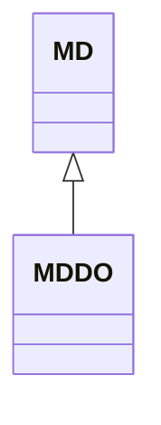

---
search:
  boost: 10.0
---

# Class: MDDO 


_Concept representing region Dondușeni District in country Republic of_

_Moldova_


<div data-search-exclude markdown="1">


URI: [loc:MD-DO](https://w3id.org/lmodel/dpv/loc/MD-DO)





## Inheritance
* [MD](MD.md)
    * **MDDO**


## Class Properties

| Property | Value |
| --- | --- |
| Class URI | [loc:MD-DO](https://w3id.org/lmodel/dpv/loc/MD-DO) |


## Slots

| Name | Cardinality and Range | Description | Inheritance |
| ---  | --- | --- | --- |


## In Subsets


* [LocSubset](LocSubset.md)


## Aliases


* MD-DO
* Dondușeni District


## Identifier and Mapping Information


### Annotations

| property | value |
| --- | --- |
| upstream_iri | https://w3id.org/dpv/loc/owl#MD-DO |
| dpv_extension_slug | loc |


### Schema Source


* from schema: https://w3id.org/lmodel/dpv/loc


## Mappings

| Mapping Type | Mapped Value |
| ---  | ---  |
| self | loc:MD-DO |
| native | loc:MDDO |
| exact | dpv_loc:MD-DO, dpv_loc_owl:MD-DO |


## LinkML Source

<!-- TODO: investigate https://stackoverflow.com/questions/37606292/how-to-create-tabbed-code-blocks-in-mkdocs-or-sphinx -->

### Direct

<details>
```yaml
name: MDDO
annotations:
  upstream_iri:
    tag: upstream_iri
    value: https://w3id.org/dpv/loc/owl#MD-DO
  dpv_extension_slug:
    tag: dpv_extension_slug
    value: loc
description: 'Concept representing region Dondușeni District in country Republic of

  Moldova'
in_subset:
- loc_subset
from_schema: https://w3id.org/lmodel/dpv/loc
aliases:
- MD-DO
- Dondușeni District
exact_mappings:
- dpv_loc:MD-DO
- dpv_loc_owl:MD-DO
is_a: MD
class_uri: loc:MD-DO

```
</details>

### Induced

<details>
```yaml
name: MDDO
annotations:
  upstream_iri:
    tag: upstream_iri
    value: https://w3id.org/dpv/loc/owl#MD-DO
  dpv_extension_slug:
    tag: dpv_extension_slug
    value: loc
description: 'Concept representing region Dondușeni District in country Republic of

  Moldova'
in_subset:
- loc_subset
from_schema: https://w3id.org/lmodel/dpv/loc
aliases:
- MD-DO
- Dondușeni District
exact_mappings:
- dpv_loc:MD-DO
- dpv_loc_owl:MD-DO
is_a: MD
class_uri: loc:MD-DO

```
</details></div>