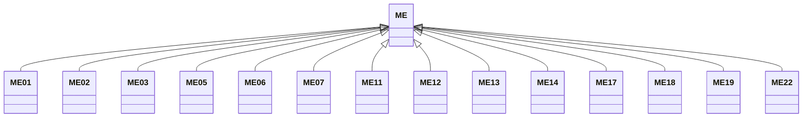

---
search:
  boost: 10.0
---

# Class: ME 


_Concept representing Country of Montenegro_


<div data-search-exclude markdown="1">


URI: [loc:ME](https://w3id.org/lmodel/dpv/loc/ME)





## Inheritance
* **ME**
    * [ME01](ME01.md)
    * [ME02](ME02.md)
    * [ME03](ME03.md)
    * [ME05](ME05.md)
    * [ME06](ME06.md)
    * [ME07](ME07.md)
    * [ME11](ME11.md)
    * [ME12](ME12.md)
    * [ME13](ME13.md)
    * [ME14](ME14.md)
    * [ME17](ME17.md)
    * [ME18](ME18.md)
    * [ME19](ME19.md)
    * [ME22](ME22.md)


## Class Properties

| Property | Value |
| --- | --- |
| Class URI | [loc:ME](https://w3id.org/lmodel/dpv/loc/ME) |


## Slots

| Name | Cardinality and Range | Description | Inheritance |
| ---  | --- | --- | --- |


## In Subsets


* [LocSubset](LocSubset.md)


## Aliases


* Montenegro


## Identifier and Mapping Information


### Annotations

| property | value |
| --- | --- |
| upstream_iri | https://w3id.org/dpv/loc/owl#ME |
| dpv_extension_slug | loc |


### Schema Source


* from schema: https://w3id.org/lmodel/dpv/loc


## Mappings

| Mapping Type | Mapped Value |
| ---  | ---  |
| self | loc:ME |
| native | loc:ME |
| exact | dpv_loc:ME, dpv_loc_owl:ME |


## LinkML Source

<!-- TODO: investigate https://stackoverflow.com/questions/37606292/how-to-create-tabbed-code-blocks-in-mkdocs-or-sphinx -->

### Direct

<details>
```yaml
name: ME
annotations:
  upstream_iri:
    tag: upstream_iri
    value: https://w3id.org/dpv/loc/owl#ME
  dpv_extension_slug:
    tag: dpv_extension_slug
    value: loc
description: Concept representing Country of Montenegro
in_subset:
- loc_subset
from_schema: https://w3id.org/lmodel/dpv/loc
aliases:
- Montenegro
exact_mappings:
- dpv_loc:ME
- dpv_loc_owl:ME
class_uri: loc:ME

```
</details>

### Induced

<details>
```yaml
name: ME
annotations:
  upstream_iri:
    tag: upstream_iri
    value: https://w3id.org/dpv/loc/owl#ME
  dpv_extension_slug:
    tag: dpv_extension_slug
    value: loc
description: Concept representing Country of Montenegro
in_subset:
- loc_subset
from_schema: https://w3id.org/lmodel/dpv/loc
aliases:
- Montenegro
exact_mappings:
- dpv_loc:ME
- dpv_loc_owl:ME
class_uri: loc:ME

```
</details></div>