---
search:
  boost: 10.0
---

# Class: MK 


_Concept representing Country of North Macedonia_


<div data-search-exclude markdown="1">


URI: [loc:MK](https://w3id.org/lmodel/dpv/loc/MK)

```mermaid
 classDiagram
    class MK
    click MK href "../MK/"
      MK <|-- MK101
        click MK101 href "../MK101/"
      MK <|-- MK102
        click MK102 href "../MK102/"
      MK <|-- MK103
        click MK103 href "../MK103/"
      MK <|-- MK104
        click MK104 href "../MK104/"
      MK <|-- MK105
        click MK105 href "../MK105/"
      MK <|-- MK106
        click MK106 href "../MK106/"
      MK <|-- MK107
        click MK107 href "../MK107/"
      MK <|-- MK108
        click MK108 href "../MK108/"
      MK <|-- MK109
        click MK109 href "../MK109/"
      MK <|-- MK15
        click MK15 href "../MK15/"
      MK <|-- MK201
        click MK201 href "../MK201/"
      MK <|-- MK202
        click MK202 href "../MK202/"
      MK <|-- MK203
        click MK203 href "../MK203/"
      MK <|-- MK204
        click MK204 href "../MK204/"
      MK <|-- MK205
        click MK205 href "../MK205/"
      MK <|-- MK206
        click MK206 href "../MK206/"
      MK <|-- MK207
        click MK207 href "../MK207/"
      MK <|-- MK208
        click MK208 href "../MK208/"
      MK <|-- MK209
        click MK209 href "../MK209/"
      MK <|-- MK210
        click MK210 href "../MK210/"
      MK <|-- MK211
        click MK211 href "../MK211/"
      MK <|-- MK28
        click MK28 href "../MK28/"
      MK <|-- MK301
        click MK301 href "../MK301/"
      MK <|-- MK303
        click MK303 href "../MK303/"
      MK <|-- MK304
        click MK304 href "../MK304/"
      MK <|-- MK307
        click MK307 href "../MK307/"
      MK <|-- MK308
        click MK308 href "../MK308/"
      MK <|-- MK31
        click MK31 href "../MK31/"
      MK <|-- MK310
        click MK310 href "../MK310/"
      MK <|-- MK311
        click MK311 href "../MK311/"
      MK <|-- MK312
        click MK312 href "../MK312/"
      MK <|-- MK313
        click MK313 href "../MK313/"
      MK <|-- MK401
        click MK401 href "../MK401/"
      MK <|-- MK402
        click MK402 href "../MK402/"
      MK <|-- MK403
        click MK403 href "../MK403/"
      MK <|-- MK404
        click MK404 href "../MK404/"
      MK <|-- MK405
        click MK405 href "../MK405/"
      MK <|-- MK406
        click MK406 href "../MK406/"
      MK <|-- MK407
        click MK407 href "../MK407/"
      MK <|-- MK408
        click MK408 href "../MK408/"
      MK <|-- MK409
        click MK409 href "../MK409/"
      MK <|-- MK410
        click MK410 href "../MK410/"
      MK <|-- MK47
        click MK47 href "../MK47/"
      MK <|-- MK501
        click MK501 href "../MK501/"
      MK <|-- MK502
        click MK502 href "../MK502/"
      MK <|-- MK503
        click MK503 href "../MK503/"
      MK <|-- MK504
        click MK504 href "../MK504/"
      MK <|-- MK505
        click MK505 href "../MK505/"
      MK <|-- MK506
        click MK506 href "../MK506/"
      MK <|-- MK507
        click MK507 href "../MK507/"
      MK <|-- MK508
        click MK508 href "../MK508/"
      MK <|-- MK509
        click MK509 href "../MK509/"
      MK <|-- MK57
        click MK57 href "../MK57/"
      MK <|-- MK601
        click MK601 href "../MK601/"
      MK <|-- MK602
        click MK602 href "../MK602/"
      MK <|-- MK603
        click MK603 href "../MK603/"
      MK <|-- MK604
        click MK604 href "../MK604/"
      MK <|-- MK605
        click MK605 href "../MK605/"
      MK <|-- MK606
        click MK606 href "../MK606/"
      MK <|-- MK607
        click MK607 href "../MK607/"
      MK <|-- MK608
        click MK608 href "../MK608/"
      MK <|-- MK609
        click MK609 href "../MK609/"
      MK <|-- MK701
        click MK701 href "../MK701/"
      MK <|-- MK702
        click MK702 href "../MK702/"
      MK <|-- MK703
        click MK703 href "../MK703/"
      MK <|-- MK704
        click MK704 href "../MK704/"
      MK <|-- MK705
        click MK705 href "../MK705/"
      MK <|-- MK706
        click MK706 href "../MK706/"
      MK <|-- MK801
        click MK801 href "../MK801/"
      MK <|-- MK802
        click MK802 href "../MK802/"
      MK <|-- MK803
        click MK803 href "../MK803/"
      MK <|-- MK804
        click MK804 href "../MK804/"
      MK <|-- MK805
        click MK805 href "../MK805/"
      MK <|-- MK806
        click MK806 href "../MK806/"
      MK <|-- MK807
        click MK807 href "../MK807/"
      MK <|-- MK808
        click MK808 href "../MK808/"
      MK <|-- MK809
        click MK809 href "../MK809/"
      MK <|-- MK810
        click MK810 href "../MK810/"
      MK <|-- MK811
        click MK811 href "../MK811/"
      MK <|-- MK812
        click MK812 href "../MK812/"
      MK <|-- MK813
        click MK813 href "../MK813/"
      MK <|-- MK814
        click MK814 href "../MK814/"
      MK <|-- MK815
        click MK815 href "../MK815/"
      MK <|-- MK816
        click MK816 href "../MK816/"
      MK <|-- MK817
        click MK817 href "../MK817/"
      
      
```





## Inheritance
* **MK**
    * [MK101](MK101.md)
    * [MK102](MK102.md)
    * [MK103](MK103.md)
    * [MK104](MK104.md)
    * [MK105](MK105.md)
    * [MK106](MK106.md)
    * [MK107](MK107.md)
    * [MK108](MK108.md)
    * [MK109](MK109.md)
    * [MK15](MK15.md)
    * [MK201](MK201.md)
    * [MK202](MK202.md)
    * [MK203](MK203.md)
    * [MK204](MK204.md)
    * [MK205](MK205.md)
    * [MK206](MK206.md)
    * [MK207](MK207.md)
    * [MK208](MK208.md)
    * [MK209](MK209.md)
    * [MK210](MK210.md)
    * [MK211](MK211.md)
    * [MK28](MK28.md)
    * [MK301](MK301.md)
    * [MK303](MK303.md)
    * [MK304](MK304.md)
    * [MK307](MK307.md)
    * [MK308](MK308.md)
    * [MK31](MK31.md)
    * [MK310](MK310.md)
    * [MK311](MK311.md)
    * [MK312](MK312.md)
    * [MK313](MK313.md)
    * [MK401](MK401.md)
    * [MK402](MK402.md)
    * [MK403](MK403.md)
    * [MK404](MK404.md)
    * [MK405](MK405.md)
    * [MK406](MK406.md)
    * [MK407](MK407.md)
    * [MK408](MK408.md)
    * [MK409](MK409.md)
    * [MK410](MK410.md)
    * [MK47](MK47.md)
    * [MK501](MK501.md)
    * [MK502](MK502.md)
    * [MK503](MK503.md)
    * [MK504](MK504.md)
    * [MK505](MK505.md)
    * [MK506](MK506.md)
    * [MK507](MK507.md)
    * [MK508](MK508.md)
    * [MK509](MK509.md)
    * [MK57](MK57.md)
    * [MK601](MK601.md)
    * [MK602](MK602.md)
    * [MK603](MK603.md)
    * [MK604](MK604.md)
    * [MK605](MK605.md)
    * [MK606](MK606.md)
    * [MK607](MK607.md)
    * [MK608](MK608.md)
    * [MK609](MK609.md)
    * [MK701](MK701.md)
    * [MK702](MK702.md)
    * [MK703](MK703.md)
    * [MK704](MK704.md)
    * [MK705](MK705.md)
    * [MK706](MK706.md)
    * [MK801](MK801.md)
    * [MK802](MK802.md)
    * [MK803](MK803.md)
    * [MK804](MK804.md)
    * [MK805](MK805.md)
    * [MK806](MK806.md)
    * [MK807](MK807.md)
    * [MK808](MK808.md)
    * [MK809](MK809.md)
    * [MK810](MK810.md)
    * [MK811](MK811.md)
    * [MK812](MK812.md)
    * [MK813](MK813.md)
    * [MK814](MK814.md)
    * [MK815](MK815.md)
    * [MK816](MK816.md)
    * [MK817](MK817.md)


## Class Properties

| Property | Value |
| --- | --- |
| Class URI | [loc:MK](https://w3id.org/lmodel/dpv/loc/MK) |


## Slots

| Name | Cardinality and Range | Description | Inheritance |
| ---  | --- | --- | --- |


## In Subsets


* [LocSubset](LocSubset.md)


## Aliases


* North Macedonia


## Identifier and Mapping Information


### Annotations

| property | value |
| --- | --- |
| upstream_iri | https://w3id.org/dpv/loc/owl#MK |
| dpv_extension_slug | loc |


### Schema Source


* from schema: https://w3id.org/lmodel/dpv/loc


## Mappings

| Mapping Type | Mapped Value |
| ---  | ---  |
| self | loc:MK |
| native | loc:MK |
| exact | dpv_loc:MK, dpv_loc_owl:MK |


## LinkML Source

<!-- TODO: investigate https://stackoverflow.com/questions/37606292/how-to-create-tabbed-code-blocks-in-mkdocs-or-sphinx -->

### Direct

<details>
```yaml
name: MK
annotations:
  upstream_iri:
    tag: upstream_iri
    value: https://w3id.org/dpv/loc/owl#MK
  dpv_extension_slug:
    tag: dpv_extension_slug
    value: loc
description: Concept representing Country of North Macedonia
in_subset:
- loc_subset
from_schema: https://w3id.org/lmodel/dpv/loc
aliases:
- North Macedonia
exact_mappings:
- dpv_loc:MK
- dpv_loc_owl:MK
class_uri: loc:MK

```
</details>

### Induced

<details>
```yaml
name: MK
annotations:
  upstream_iri:
    tag: upstream_iri
    value: https://w3id.org/dpv/loc/owl#MK
  dpv_extension_slug:
    tag: dpv_extension_slug
    value: loc
description: Concept representing Country of North Macedonia
in_subset:
- loc_subset
from_schema: https://w3id.org/lmodel/dpv/loc
aliases:
- North Macedonia
exact_mappings:
- dpv_loc:MK
- dpv_loc_owl:MK
class_uri: loc:MK

```
</details></div>