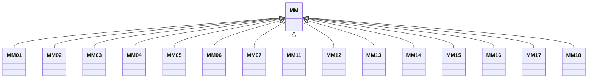

---
search:
  boost: 10.0
---

# Class: MM 


_Concept representing Country of Myanmar_


<div data-search-exclude markdown="1">


URI: [loc:MM](https://w3id.org/lmodel/dpv/loc/MM)





## Inheritance
* **MM**
    * [MM01](MM01.md)
    * [MM02](MM02.md)
    * [MM03](MM03.md)
    * [MM04](MM04.md)
    * [MM05](MM05.md)
    * [MM06](MM06.md)
    * [MM07](MM07.md)
    * [MM11](MM11.md)
    * [MM12](MM12.md)
    * [MM13](MM13.md)
    * [MM14](MM14.md)
    * [MM15](MM15.md)
    * [MM16](MM16.md)
    * [MM17](MM17.md)
    * [MM18](MM18.md)


## Class Properties

| Property | Value |
| --- | --- |
| Class URI | [loc:MM](https://w3id.org/lmodel/dpv/loc/MM) |


## Slots

| Name | Cardinality and Range | Description | Inheritance |
| ---  | --- | --- | --- |


## In Subsets


* [LocSubset](LocSubset.md)


## Aliases


* Myanmar


## Identifier and Mapping Information


### Annotations

| property | value |
| --- | --- |
| upstream_iri | https://w3id.org/dpv/loc/owl#MM |
| dpv_extension_slug | loc |


### Schema Source


* from schema: https://w3id.org/lmodel/dpv/loc


## Mappings

| Mapping Type | Mapped Value |
| ---  | ---  |
| self | loc:MM |
| native | loc:MM |
| exact | dpv_loc:MM, dpv_loc_owl:MM |


## LinkML Source

<!-- TODO: investigate https://stackoverflow.com/questions/37606292/how-to-create-tabbed-code-blocks-in-mkdocs-or-sphinx -->

### Direct

<details>
```yaml
name: MM
annotations:
  upstream_iri:
    tag: upstream_iri
    value: https://w3id.org/dpv/loc/owl#MM
  dpv_extension_slug:
    tag: dpv_extension_slug
    value: loc
description: Concept representing Country of Myanmar
in_subset:
- loc_subset
from_schema: https://w3id.org/lmodel/dpv/loc
aliases:
- Myanmar
exact_mappings:
- dpv_loc:MM
- dpv_loc_owl:MM
class_uri: loc:MM

```
</details>

### Induced

<details>
```yaml
name: MM
annotations:
  upstream_iri:
    tag: upstream_iri
    value: https://w3id.org/dpv/loc/owl#MM
  dpv_extension_slug:
    tag: dpv_extension_slug
    value: loc
description: Concept representing Country of Myanmar
in_subset:
- loc_subset
from_schema: https://w3id.org/lmodel/dpv/loc
aliases:
- Myanmar
exact_mappings:
- dpv_loc:MM
- dpv_loc_owl:MM
class_uri: loc:MM

```
</details></div>