---
search:
  boost: 10.0
---

# Class: MN 


_Concept representing Country of Mongolia_


<div data-search-exclude markdown="1">


URI: [loc:MN](https://w3id.org/lmodel/dpv/loc/MN)

```mermaid
 classDiagram
    class MN
    click MN href "../MN/"
      MN <|-- MN035
        click MN035 href "../MN035/"
      MN <|-- MN037
        click MN037 href "../MN037/"
      MN <|-- MN039
        click MN039 href "../MN039/"
      MN <|-- MN041
        click MN041 href "../MN041/"
      MN <|-- MN043
        click MN043 href "../MN043/"
      MN <|-- MN046
        click MN046 href "../MN046/"
      MN <|-- MN047
        click MN047 href "../MN047/"
      MN <|-- MN049
        click MN049 href "../MN049/"
      MN <|-- MN051
        click MN051 href "../MN051/"
      MN <|-- MN053
        click MN053 href "../MN053/"
      MN <|-- MN055
        click MN055 href "../MN055/"
      MN <|-- MN057
        click MN057 href "../MN057/"
      MN <|-- MN059
        click MN059 href "../MN059/"
      MN <|-- MN061
        click MN061 href "../MN061/"
      MN <|-- MN063
        click MN063 href "../MN063/"
      MN <|-- MN064
        click MN064 href "../MN064/"
      MN <|-- MN065
        click MN065 href "../MN065/"
      MN <|-- MN067
        click MN067 href "../MN067/"
      MN <|-- MN069
        click MN069 href "../MN069/"
      MN <|-- MN071
        click MN071 href "../MN071/"
      MN <|-- MN073
        click MN073 href "../MN073/"
      MN <|-- MN1
        click MN1 href "../MN1/"
      
      
```





## Inheritance
* **MN**
    * [MN035](MN035.md)
    * [MN037](MN037.md)
    * [MN039](MN039.md)
    * [MN041](MN041.md)
    * [MN043](MN043.md)
    * [MN046](MN046.md)
    * [MN047](MN047.md)
    * [MN049](MN049.md)
    * [MN051](MN051.md)
    * [MN053](MN053.md)
    * [MN055](MN055.md)
    * [MN057](MN057.md)
    * [MN059](MN059.md)
    * [MN061](MN061.md)
    * [MN063](MN063.md)
    * [MN064](MN064.md)
    * [MN065](MN065.md)
    * [MN067](MN067.md)
    * [MN069](MN069.md)
    * [MN071](MN071.md)
    * [MN073](MN073.md)
    * [MN1](MN1.md)


## Class Properties

| Property | Value |
| --- | --- |
| Class URI | [loc:MN](https://w3id.org/lmodel/dpv/loc/MN) |


## Slots

| Name | Cardinality and Range | Description | Inheritance |
| ---  | --- | --- | --- |


## In Subsets


* [LocSubset](LocSubset.md)


## Aliases


* Mongolia


## Identifier and Mapping Information


### Annotations

| property | value |
| --- | --- |
| upstream_iri | https://w3id.org/dpv/loc/owl#MN |
| dpv_extension_slug | loc |


### Schema Source


* from schema: https://w3id.org/lmodel/dpv/loc


## Mappings

| Mapping Type | Mapped Value |
| ---  | ---  |
| self | loc:MN |
| native | loc:MN |
| exact | dpv_loc:MN, dpv_loc_owl:MN |


## LinkML Source

<!-- TODO: investigate https://stackoverflow.com/questions/37606292/how-to-create-tabbed-code-blocks-in-mkdocs-or-sphinx -->

### Direct

<details>
```yaml
name: MN
annotations:
  upstream_iri:
    tag: upstream_iri
    value: https://w3id.org/dpv/loc/owl#MN
  dpv_extension_slug:
    tag: dpv_extension_slug
    value: loc
description: Concept representing Country of Mongolia
in_subset:
- loc_subset
from_schema: https://w3id.org/lmodel/dpv/loc
aliases:
- Mongolia
exact_mappings:
- dpv_loc:MN
- dpv_loc_owl:MN
class_uri: loc:MN

```
</details>

### Induced

<details>
```yaml
name: MN
annotations:
  upstream_iri:
    tag: upstream_iri
    value: https://w3id.org/dpv/loc/owl#MN
  dpv_extension_slug:
    tag: dpv_extension_slug
    value: loc
description: Concept representing Country of Mongolia
in_subset:
- loc_subset
from_schema: https://w3id.org/lmodel/dpv/loc
aliases:
- Mongolia
exact_mappings:
- dpv_loc:MN
- dpv_loc_owl:MN
class_uri: loc:MN

```
</details></div>