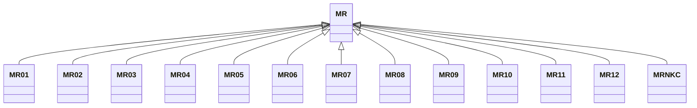

---
search:
  boost: 10.0
---

# Class: MR 


_Concept representing Country of Mauritania_


<div data-search-exclude markdown="1">


URI: [loc:MR](https://w3id.org/lmodel/dpv/loc/MR)





## Inheritance
* **MR**
    * [MR01](MR01.md)
    * [MR02](MR02.md)
    * [MR03](MR03.md)
    * [MR04](MR04.md)
    * [MR05](MR05.md)
    * [MR06](MR06.md)
    * [MR07](MR07.md)
    * [MR08](MR08.md)
    * [MR09](MR09.md)
    * [MR10](MR10.md)
    * [MR11](MR11.md)
    * [MR12](MR12.md)
    * [MRNKC](MRNKC.md)


## Class Properties

| Property | Value |
| --- | --- |
| Class URI | [loc:MR](https://w3id.org/lmodel/dpv/loc/MR) |


## Slots

| Name | Cardinality and Range | Description | Inheritance |
| ---  | --- | --- | --- |


## In Subsets


* [LocSubset](LocSubset.md)


## Aliases


* Mauritania


## Identifier and Mapping Information


### Annotations

| property | value |
| --- | --- |
| upstream_iri | https://w3id.org/dpv/loc/owl#MR |
| dpv_extension_slug | loc |


### Schema Source


* from schema: https://w3id.org/lmodel/dpv/loc


## Mappings

| Mapping Type | Mapped Value |
| ---  | ---  |
| self | loc:MR |
| native | loc:MR |
| exact | dpv_loc:MR, dpv_loc_owl:MR |


## LinkML Source

<!-- TODO: investigate https://stackoverflow.com/questions/37606292/how-to-create-tabbed-code-blocks-in-mkdocs-or-sphinx -->

### Direct

<details>
```yaml
name: MR
annotations:
  upstream_iri:
    tag: upstream_iri
    value: https://w3id.org/dpv/loc/owl#MR
  dpv_extension_slug:
    tag: dpv_extension_slug
    value: loc
description: Concept representing Country of Mauritania
in_subset:
- loc_subset
from_schema: https://w3id.org/lmodel/dpv/loc
aliases:
- Mauritania
exact_mappings:
- dpv_loc:MR
- dpv_loc_owl:MR
class_uri: loc:MR

```
</details>

### Induced

<details>
```yaml
name: MR
annotations:
  upstream_iri:
    tag: upstream_iri
    value: https://w3id.org/dpv/loc/owl#MR
  dpv_extension_slug:
    tag: dpv_extension_slug
    value: loc
description: Concept representing Country of Mauritania
in_subset:
- loc_subset
from_schema: https://w3id.org/lmodel/dpv/loc
aliases:
- Mauritania
exact_mappings:
- dpv_loc:MR
- dpv_loc_owl:MR
class_uri: loc:MR

```
</details></div>