---
search:
  boost: 10.0
---

# Class: MT 


_Concept representing Country of Malta_


<div data-search-exclude markdown="1">


URI: [loc:MT](https://w3id.org/lmodel/dpv/loc/MT)

```mermaid
 classDiagram
    class MT
    click MT href "../MT/"
      EEA30 <|-- MT
        click EEA30 href "../EEA30/"
      EEA31 <|-- MT
        click EEA31 href "../EEA31/"
      EU <|-- MT
        click EU href "../EU/"
      EU27 <|-- MT
        click EU27 href "../EU27/"
      EU28 <|-- MT
        click EU28 href "../EU28/"
      EEA <|-- MT
        click EEA href "../EEA/"
      

      MT <|-- MT01
        click MT01 href "../MT01/"
      MT <|-- MT02
        click MT02 href "../MT02/"
      MT <|-- MT03
        click MT03 href "../MT03/"
      MT <|-- MT04
        click MT04 href "../MT04/"
      MT <|-- MT05
        click MT05 href "../MT05/"
      MT <|-- MT06
        click MT06 href "../MT06/"
      MT <|-- MT07
        click MT07 href "../MT07/"
      MT <|-- MT08
        click MT08 href "../MT08/"
      MT <|-- MT09
        click MT09 href "../MT09/"
      MT <|-- MT10
        click MT10 href "../MT10/"
      MT <|-- MT11
        click MT11 href "../MT11/"
      MT <|-- MT12
        click MT12 href "../MT12/"
      MT <|-- MT13
        click MT13 href "../MT13/"
      MT <|-- MT14
        click MT14 href "../MT14/"
      MT <|-- MT15
        click MT15 href "../MT15/"
      MT <|-- MT16
        click MT16 href "../MT16/"
      MT <|-- MT17
        click MT17 href "../MT17/"
      MT <|-- MT18
        click MT18 href "../MT18/"
      MT <|-- MT19
        click MT19 href "../MT19/"
      MT <|-- MT20
        click MT20 href "../MT20/"
      MT <|-- MT21
        click MT21 href "../MT21/"
      MT <|-- MT22
        click MT22 href "../MT22/"
      MT <|-- MT23
        click MT23 href "../MT23/"
      MT <|-- MT24
        click MT24 href "../MT24/"
      MT <|-- MT25
        click MT25 href "../MT25/"
      MT <|-- MT26
        click MT26 href "../MT26/"
      MT <|-- MT27
        click MT27 href "../MT27/"
      MT <|-- MT28
        click MT28 href "../MT28/"
      MT <|-- MT29
        click MT29 href "../MT29/"
      MT <|-- MT30
        click MT30 href "../MT30/"
      MT <|-- MT31
        click MT31 href "../MT31/"
      MT <|-- MT32
        click MT32 href "../MT32/"
      MT <|-- MT33
        click MT33 href "../MT33/"
      MT <|-- MT34
        click MT34 href "../MT34/"
      MT <|-- MT35
        click MT35 href "../MT35/"
      MT <|-- MT36
        click MT36 href "../MT36/"
      MT <|-- MT37
        click MT37 href "../MT37/"
      MT <|-- MT38
        click MT38 href "../MT38/"
      MT <|-- MT39
        click MT39 href "../MT39/"
      MT <|-- MT40
        click MT40 href "../MT40/"
      MT <|-- MT41
        click MT41 href "../MT41/"
      MT <|-- MT42
        click MT42 href "../MT42/"
      MT <|-- MT43
        click MT43 href "../MT43/"
      MT <|-- MT44
        click MT44 href "../MT44/"
      MT <|-- MT45
        click MT45 href "../MT45/"
      MT <|-- MT46
        click MT46 href "../MT46/"
      MT <|-- MT47
        click MT47 href "../MT47/"
      MT <|-- MT48
        click MT48 href "../MT48/"
      MT <|-- MT49
        click MT49 href "../MT49/"
      MT <|-- MT50
        click MT50 href "../MT50/"
      MT <|-- MT51
        click MT51 href "../MT51/"
      MT <|-- MT52
        click MT52 href "../MT52/"
      MT <|-- MT53
        click MT53 href "../MT53/"
      MT <|-- MT54
        click MT54 href "../MT54/"
      MT <|-- MT55
        click MT55 href "../MT55/"
      MT <|-- MT56
        click MT56 href "../MT56/"
      MT <|-- MT57
        click MT57 href "../MT57/"
      MT <|-- MT58
        click MT58 href "../MT58/"
      MT <|-- MT59
        click MT59 href "../MT59/"
      MT <|-- MT60
        click MT60 href "../MT60/"
      MT <|-- MT61
        click MT61 href "../MT61/"
      MT <|-- MT62
        click MT62 href "../MT62/"
      MT <|-- MT63
        click MT63 href "../MT63/"
      MT <|-- MT64
        click MT64 href "../MT64/"
      MT <|-- MT65
        click MT65 href "../MT65/"
      MT <|-- MT66
        click MT66 href "../MT66/"
      MT <|-- MT67
        click MT67 href "../MT67/"
      MT <|-- MT68
        click MT68 href "../MT68/"
      

      
```





## Inheritance
* [EEA](EEA.md)
    * **MT** [ [EEA30](EEA30.md) [EEA31](EEA31.md) [EU](EU.md) [EU27](EU27.md) [EU28](EU28.md)]
        * [MT01](MT01.md)
        * [MT02](MT02.md)
        * [MT03](MT03.md)
        * [MT04](MT04.md)
        * [MT05](MT05.md)
        * [MT06](MT06.md)
        * [MT07](MT07.md)
        * [MT08](MT08.md)
        * [MT09](MT09.md)
        * [MT10](MT10.md)
        * [MT11](MT11.md)
        * [MT12](MT12.md)
        * [MT13](MT13.md)
        * [MT14](MT14.md)
        * [MT15](MT15.md)
        * [MT16](MT16.md)
        * [MT17](MT17.md)
        * [MT18](MT18.md)
        * [MT19](MT19.md)
        * [MT20](MT20.md)
        * [MT21](MT21.md)
        * [MT22](MT22.md)
        * [MT23](MT23.md)
        * [MT24](MT24.md)
        * [MT25](MT25.md)
        * [MT26](MT26.md)
        * [MT27](MT27.md)
        * [MT28](MT28.md)
        * [MT29](MT29.md)
        * [MT30](MT30.md)
        * [MT31](MT31.md)
        * [MT32](MT32.md)
        * [MT33](MT33.md)
        * [MT34](MT34.md)
        * [MT35](MT35.md)
        * [MT36](MT36.md)
        * [MT37](MT37.md)
        * [MT38](MT38.md)
        * [MT39](MT39.md)
        * [MT40](MT40.md)
        * [MT41](MT41.md)
        * [MT42](MT42.md)
        * [MT43](MT43.md)
        * [MT44](MT44.md)
        * [MT45](MT45.md)
        * [MT46](MT46.md)
        * [MT47](MT47.md)
        * [MT48](MT48.md)
        * [MT49](MT49.md)
        * [MT50](MT50.md)
        * [MT51](MT51.md)
        * [MT52](MT52.md)
        * [MT53](MT53.md)
        * [MT54](MT54.md)
        * [MT55](MT55.md)
        * [MT56](MT56.md)
        * [MT57](MT57.md)
        * [MT58](MT58.md)
        * [MT59](MT59.md)
        * [MT60](MT60.md)
        * [MT61](MT61.md)
        * [MT62](MT62.md)
        * [MT63](MT63.md)
        * [MT64](MT64.md)
        * [MT65](MT65.md)
        * [MT66](MT66.md)
        * [MT67](MT67.md)
        * [MT68](MT68.md)


## Class Properties

| Property | Value |
| --- | --- |
| Class URI | [loc:MT](https://w3id.org/lmodel/dpv/loc/MT) |


## Slots

| Name | Cardinality and Range | Description | Inheritance |
| ---  | --- | --- | --- |


## In Subsets


* [LocSubset](LocSubset.md)


## Aliases


* Malta


## Identifier and Mapping Information


### Annotations

| property | value |
| --- | --- |
| upstream_iri | https://w3id.org/dpv/loc/owl#MT |
| dpv_extension_slug | loc |


### Schema Source


* from schema: https://w3id.org/lmodel/dpv/loc


## Mappings

| Mapping Type | Mapped Value |
| ---  | ---  |
| self | loc:MT |
| native | loc:MT |
| exact | dpv_loc:MT, dpv_loc_owl:MT |


## LinkML Source

<!-- TODO: investigate https://stackoverflow.com/questions/37606292/how-to-create-tabbed-code-blocks-in-mkdocs-or-sphinx -->

### Direct

<details>
```yaml
name: MT
annotations:
  upstream_iri:
    tag: upstream_iri
    value: https://w3id.org/dpv/loc/owl#MT
  dpv_extension_slug:
    tag: dpv_extension_slug
    value: loc
description: Concept representing Country of Malta
in_subset:
- loc_subset
from_schema: https://w3id.org/lmodel/dpv/loc
aliases:
- Malta
exact_mappings:
- dpv_loc:MT
- dpv_loc_owl:MT
is_a: EEA
mixins:
- EEA30
- EEA31
- EU
- EU27
- EU28
class_uri: loc:MT

```
</details>

### Induced

<details>
```yaml
name: MT
annotations:
  upstream_iri:
    tag: upstream_iri
    value: https://w3id.org/dpv/loc/owl#MT
  dpv_extension_slug:
    tag: dpv_extension_slug
    value: loc
description: Concept representing Country of Malta
in_subset:
- loc_subset
from_schema: https://w3id.org/lmodel/dpv/loc
aliases:
- Malta
exact_mappings:
- dpv_loc:MT
- dpv_loc_owl:MT
is_a: EEA
mixins:
- EEA30
- EEA31
- EU
- EU27
- EU28
class_uri: loc:MT

```
</details></div>