---
search:
  boost: 10.0
---

# Class: MX 


_Concept representing Country of Mexico_


<div data-search-exclude markdown="1">


URI: [loc:MX](https://w3id.org/lmodel/dpv/loc/MX)

```mermaid
 classDiagram
    class MX
    click MX href "../MX/"
      MX <|-- MXAGU
        click MXAGU href "../MXAGU/"
      MX <|-- MXBCN
        click MXBCN href "../MXBCN/"
      MX <|-- MXBCS
        click MXBCS href "../MXBCS/"
      MX <|-- MXCAM
        click MXCAM href "../MXCAM/"
      MX <|-- MXCHH
        click MXCHH href "../MXCHH/"
      MX <|-- MXCHP
        click MXCHP href "../MXCHP/"
      MX <|-- MXCMX
        click MXCMX href "../MXCMX/"
      MX <|-- MXCOA
        click MXCOA href "../MXCOA/"
      MX <|-- MXCOL
        click MXCOL href "../MXCOL/"
      MX <|-- MXDUR
        click MXDUR href "../MXDUR/"
      MX <|-- MXGRO
        click MXGRO href "../MXGRO/"
      MX <|-- MXGUA
        click MXGUA href "../MXGUA/"
      MX <|-- MXHID
        click MXHID href "../MXHID/"
      MX <|-- MXJAGDL
        click MXJAGDL href "../MXJAGDL/"
      MX <|-- MXJAL
        click MXJAL href "../MXJAL/"
      MX <|-- MXMEX
        click MXMEX href "../MXMEX/"
      MX <|-- MXMIC
        click MXMIC href "../MXMIC/"
      MX <|-- MXMOR
        click MXMOR href "../MXMOR/"
      MX <|-- MXNAY
        click MXNAY href "../MXNAY/"
      MX <|-- MXNLE
        click MXNLE href "../MXNLE/"
      MX <|-- MXOAX
        click MXOAX href "../MXOAX/"
      MX <|-- MXPUE
        click MXPUE href "../MXPUE/"
      MX <|-- MXQUE
        click MXQUE href "../MXQUE/"
      MX <|-- MXROO
        click MXROO href "../MXROO/"
      MX <|-- MXSIN
        click MXSIN href "../MXSIN/"
      MX <|-- MXSLP
        click MXSLP href "../MXSLP/"
      MX <|-- MXSON
        click MXSON href "../MXSON/"
      MX <|-- MXTAB
        click MXTAB href "../MXTAB/"
      MX <|-- MXTAM
        click MXTAM href "../MXTAM/"
      MX <|-- MXTLA
        click MXTLA href "../MXTLA/"
      MX <|-- MXVER
        click MXVER href "../MXVER/"
      MX <|-- MXYUC
        click MXYUC href "../MXYUC/"
      MX <|-- MXZAC
        click MXZAC href "../MXZAC/"
      
      
```





## Inheritance
* **MX**
    * [MXAGU](MXAGU.md)
    * [MXBCN](MXBCN.md)
    * [MXBCS](MXBCS.md)
    * [MXCAM](MXCAM.md)
    * [MXCHH](MXCHH.md)
    * [MXCHP](MXCHP.md)
    * [MXCMX](MXCMX.md)
    * [MXCOA](MXCOA.md)
    * [MXCOL](MXCOL.md)
    * [MXDUR](MXDUR.md)
    * [MXGRO](MXGRO.md)
    * [MXGUA](MXGUA.md)
    * [MXHID](MXHID.md)
    * [MXJAGDL](MXJAGDL.md)
    * [MXJAL](MXJAL.md)
    * [MXMEX](MXMEX.md)
    * [MXMIC](MXMIC.md)
    * [MXMOR](MXMOR.md)
    * [MXNAY](MXNAY.md)
    * [MXNLE](MXNLE.md)
    * [MXOAX](MXOAX.md)
    * [MXPUE](MXPUE.md)
    * [MXQUE](MXQUE.md)
    * [MXROO](MXROO.md)
    * [MXSIN](MXSIN.md)
    * [MXSLP](MXSLP.md)
    * [MXSON](MXSON.md)
    * [MXTAB](MXTAB.md)
    * [MXTAM](MXTAM.md)
    * [MXTLA](MXTLA.md)
    * [MXVER](MXVER.md)
    * [MXYUC](MXYUC.md)
    * [MXZAC](MXZAC.md)


## Class Properties

| Property | Value |
| --- | --- |
| Class URI | [loc:MX](https://w3id.org/lmodel/dpv/loc/MX) |


## Slots

| Name | Cardinality and Range | Description | Inheritance |
| ---  | --- | --- | --- |


## In Subsets


* [LocSubset](LocSubset.md)


## Aliases


* Mexico


## Identifier and Mapping Information


### Annotations

| property | value |
| --- | --- |
| upstream_iri | https://w3id.org/dpv/loc/owl#MX |
| dpv_extension_slug | loc |


### Schema Source


* from schema: https://w3id.org/lmodel/dpv/loc


## Mappings

| Mapping Type | Mapped Value |
| ---  | ---  |
| self | loc:MX |
| native | loc:MX |
| exact | dpv_loc:MX, dpv_loc_owl:MX |


## LinkML Source

<!-- TODO: investigate https://stackoverflow.com/questions/37606292/how-to-create-tabbed-code-blocks-in-mkdocs-or-sphinx -->

### Direct

<details>
```yaml
name: MX
annotations:
  upstream_iri:
    tag: upstream_iri
    value: https://w3id.org/dpv/loc/owl#MX
  dpv_extension_slug:
    tag: dpv_extension_slug
    value: loc
description: Concept representing Country of Mexico
in_subset:
- loc_subset
from_schema: https://w3id.org/lmodel/dpv/loc
aliases:
- Mexico
exact_mappings:
- dpv_loc:MX
- dpv_loc_owl:MX
class_uri: loc:MX

```
</details>

### Induced

<details>
```yaml
name: MX
annotations:
  upstream_iri:
    tag: upstream_iri
    value: https://w3id.org/dpv/loc/owl#MX
  dpv_extension_slug:
    tag: dpv_extension_slug
    value: loc
description: Concept representing Country of Mexico
in_subset:
- loc_subset
from_schema: https://w3id.org/lmodel/dpv/loc
aliases:
- Mexico
exact_mappings:
- dpv_loc:MX
- dpv_loc_owl:MX
class_uri: loc:MX

```
</details></div>