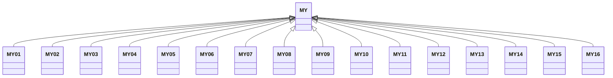

---
search:
  boost: 10.0
---

# Class: MY 


_Concept representing Country of Malaysia_


<div data-search-exclude markdown="1">


URI: [loc:MY](https://w3id.org/lmodel/dpv/loc/MY)





## Inheritance
* **MY**
    * [MY01](MY01.md)
    * [MY02](MY02.md)
    * [MY03](MY03.md)
    * [MY04](MY04.md)
    * [MY05](MY05.md)
    * [MY06](MY06.md)
    * [MY07](MY07.md)
    * [MY08](MY08.md)
    * [MY09](MY09.md)
    * [MY10](MY10.md)
    * [MY11](MY11.md)
    * [MY12](MY12.md)
    * [MY13](MY13.md)
    * [MY14](MY14.md)
    * [MY15](MY15.md)
    * [MY16](MY16.md)


## Class Properties

| Property | Value |
| --- | --- |
| Class URI | [loc:MY](https://w3id.org/lmodel/dpv/loc/MY) |


## Slots

| Name | Cardinality and Range | Description | Inheritance |
| ---  | --- | --- | --- |


## In Subsets


* [LocSubset](LocSubset.md)


## Aliases


* Malaysia


## Identifier and Mapping Information


### Annotations

| property | value |
| --- | --- |
| upstream_iri | https://w3id.org/dpv/loc/owl#MY |
| dpv_extension_slug | loc |


### Schema Source


* from schema: https://w3id.org/lmodel/dpv/loc


## Mappings

| Mapping Type | Mapped Value |
| ---  | ---  |
| self | loc:MY |
| native | loc:MY |
| exact | dpv_loc:MY, dpv_loc_owl:MY |


## LinkML Source

<!-- TODO: investigate https://stackoverflow.com/questions/37606292/how-to-create-tabbed-code-blocks-in-mkdocs-or-sphinx -->

### Direct

<details>
```yaml
name: MY
annotations:
  upstream_iri:
    tag: upstream_iri
    value: https://w3id.org/dpv/loc/owl#MY
  dpv_extension_slug:
    tag: dpv_extension_slug
    value: loc
description: Concept representing Country of Malaysia
in_subset:
- loc_subset
from_schema: https://w3id.org/lmodel/dpv/loc
aliases:
- Malaysia
exact_mappings:
- dpv_loc:MY
- dpv_loc_owl:MY
class_uri: loc:MY

```
</details>

### Induced

<details>
```yaml
name: MY
annotations:
  upstream_iri:
    tag: upstream_iri
    value: https://w3id.org/dpv/loc/owl#MY
  dpv_extension_slug:
    tag: dpv_extension_slug
    value: loc
description: Concept representing Country of Malaysia
in_subset:
- loc_subset
from_schema: https://w3id.org/lmodel/dpv/loc
aliases:
- Malaysia
exact_mappings:
- dpv_loc:MY
- dpv_loc_owl:MY
class_uri: loc:MY

```
</details></div>