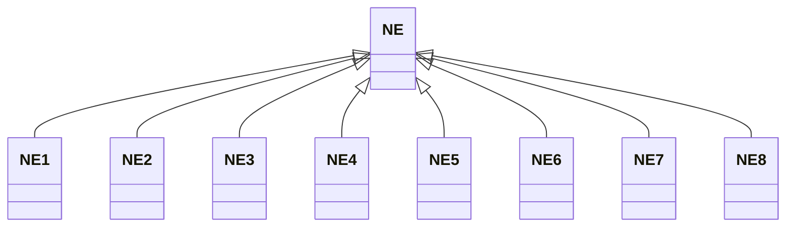

---
search:
  boost: 10.0
---

# Class: NE 


_Concept representing Country of Niger_


<div data-search-exclude markdown="1">


URI: [loc:NE](https://w3id.org/lmodel/dpv/loc/NE)





## Inheritance
* **NE**
    * [NE1](NE1.md)
    * [NE2](NE2.md)
    * [NE3](NE3.md)
    * [NE4](NE4.md)
    * [NE5](NE5.md)
    * [NE6](NE6.md)
    * [NE7](NE7.md)
    * [NE8](NE8.md)


## Class Properties

| Property | Value |
| --- | --- |
| Class URI | [loc:NE](https://w3id.org/lmodel/dpv/loc/NE) |


## Slots

| Name | Cardinality and Range | Description | Inheritance |
| ---  | --- | --- | --- |


## In Subsets


* [LocSubset](LocSubset.md)


## Aliases


* Niger


## Identifier and Mapping Information


### Annotations

| property | value |
| --- | --- |
| upstream_iri | https://w3id.org/dpv/loc/owl#NE |
| dpv_extension_slug | loc |


### Schema Source


* from schema: https://w3id.org/lmodel/dpv/loc


## Mappings

| Mapping Type | Mapped Value |
| ---  | ---  |
| self | loc:NE |
| native | loc:NE |
| exact | dpv_loc:NE, dpv_loc_owl:NE |


## LinkML Source

<!-- TODO: investigate https://stackoverflow.com/questions/37606292/how-to-create-tabbed-code-blocks-in-mkdocs-or-sphinx -->

### Direct

<details>
```yaml
name: NE
annotations:
  upstream_iri:
    tag: upstream_iri
    value: https://w3id.org/dpv/loc/owl#NE
  dpv_extension_slug:
    tag: dpv_extension_slug
    value: loc
description: Concept representing Country of Niger
in_subset:
- loc_subset
from_schema: https://w3id.org/lmodel/dpv/loc
aliases:
- Niger
exact_mappings:
- dpv_loc:NE
- dpv_loc_owl:NE
class_uri: loc:NE

```
</details>

### Induced

<details>
```yaml
name: NE
annotations:
  upstream_iri:
    tag: upstream_iri
    value: https://w3id.org/dpv/loc/owl#NE
  dpv_extension_slug:
    tag: dpv_extension_slug
    value: loc
description: Concept representing Country of Niger
in_subset:
- loc_subset
from_schema: https://w3id.org/lmodel/dpv/loc
aliases:
- Niger
exact_mappings:
- dpv_loc:NE
- dpv_loc_owl:NE
class_uri: loc:NE

```
</details></div>