---
search:
  boost: 10.0
---

# Class: NG 


_Concept representing Country of Nigeria_


<div data-search-exclude markdown="1">


URI: [loc:NG](https://w3id.org/lmodel/dpv/loc/NG)

```mermaid
 classDiagram
    class NG
    click NG href "../NG/"
      NG <|-- NGAB
        click NGAB href "../NGAB/"
      NG <|-- NGAD
        click NGAD href "../NGAD/"
      NG <|-- NGAK
        click NGAK href "../NGAK/"
      NG <|-- NGAN
        click NGAN href "../NGAN/"
      NG <|-- NGBA
        click NGBA href "../NGBA/"
      NG <|-- NGBE
        click NGBE href "../NGBE/"
      NG <|-- NGBO
        click NGBO href "../NGBO/"
      NG <|-- NGBY
        click NGBY href "../NGBY/"
      NG <|-- NGCR
        click NGCR href "../NGCR/"
      NG <|-- NGDE
        click NGDE href "../NGDE/"
      NG <|-- NGED
        click NGED href "../NGED/"
      NG <|-- NGEK
        click NGEK href "../NGEK/"
      NG <|-- NGEN
        click NGEN href "../NGEN/"
      NG <|-- NGFC
        click NGFC href "../NGFC/"
      NG <|-- NGGO
        click NGGO href "../NGGO/"
      NG <|-- NGJI
        click NGJI href "../NGJI/"
      NG <|-- NGKD
        click NGKD href "../NGKD/"
      NG <|-- NGKN
        click NGKN href "../NGKN/"
      NG <|-- NGKO
        click NGKO href "../NGKO/"
      NG <|-- NGKT
        click NGKT href "../NGKT/"
      NG <|-- NGLA
        click NGLA href "../NGLA/"
      NG <|-- NGNA
        click NGNA href "../NGNA/"
      NG <|-- NGNI
        click NGNI href "../NGNI/"
      NG <|-- NGOG
        click NGOG href "../NGOG/"
      NG <|-- NGON
        click NGON href "../NGON/"
      NG <|-- NGOS
        click NGOS href "../NGOS/"
      NG <|-- NGOY
        click NGOY href "../NGOY/"
      NG <|-- NGPL
        click NGPL href "../NGPL/"
      NG <|-- NGRI
        click NGRI href "../NGRI/"
      NG <|-- NGSO
        click NGSO href "../NGSO/"
      NG <|-- NGTA
        click NGTA href "../NGTA/"
      NG <|-- NGZA
        click NGZA href "../NGZA/"
      
      
```





## Inheritance
* **NG**
    * [NGAB](NGAB.md)
    * [NGAD](NGAD.md)
    * [NGAK](NGAK.md)
    * [NGAN](NGAN.md)
    * [NGBA](NGBA.md)
    * [NGBE](NGBE.md)
    * [NGBO](NGBO.md)
    * [NGBY](NGBY.md)
    * [NGCR](NGCR.md)
    * [NGDE](NGDE.md)
    * [NGED](NGED.md)
    * [NGEK](NGEK.md)
    * [NGEN](NGEN.md)
    * [NGFC](NGFC.md)
    * [NGGO](NGGO.md)
    * [NGJI](NGJI.md)
    * [NGKD](NGKD.md)
    * [NGKN](NGKN.md)
    * [NGKO](NGKO.md)
    * [NGKT](NGKT.md)
    * [NGLA](NGLA.md)
    * [NGNA](NGNA.md)
    * [NGNI](NGNI.md)
    * [NGOG](NGOG.md)
    * [NGON](NGON.md)
    * [NGOS](NGOS.md)
    * [NGOY](NGOY.md)
    * [NGPL](NGPL.md)
    * [NGRI](NGRI.md)
    * [NGSO](NGSO.md)
    * [NGTA](NGTA.md)
    * [NGZA](NGZA.md)


## Class Properties

| Property | Value |
| --- | --- |
| Class URI | [loc:NG](https://w3id.org/lmodel/dpv/loc/NG) |


## Slots

| Name | Cardinality and Range | Description | Inheritance |
| ---  | --- | --- | --- |


## In Subsets


* [LocSubset](LocSubset.md)


## Aliases


* Nigeria


## Identifier and Mapping Information


### Annotations

| property | value |
| --- | --- |
| upstream_iri | https://w3id.org/dpv/loc/owl#NG |
| dpv_extension_slug | loc |


### Schema Source


* from schema: https://w3id.org/lmodel/dpv/loc


## Mappings

| Mapping Type | Mapped Value |
| ---  | ---  |
| self | loc:NG |
| native | loc:NG |
| exact | dpv_loc:NG, dpv_loc_owl:NG |


## LinkML Source

<!-- TODO: investigate https://stackoverflow.com/questions/37606292/how-to-create-tabbed-code-blocks-in-mkdocs-or-sphinx -->

### Direct

<details>
```yaml
name: NG
annotations:
  upstream_iri:
    tag: upstream_iri
    value: https://w3id.org/dpv/loc/owl#NG
  dpv_extension_slug:
    tag: dpv_extension_slug
    value: loc
description: Concept representing Country of Nigeria
in_subset:
- loc_subset
from_schema: https://w3id.org/lmodel/dpv/loc
aliases:
- Nigeria
exact_mappings:
- dpv_loc:NG
- dpv_loc_owl:NG
class_uri: loc:NG

```
</details>

### Induced

<details>
```yaml
name: NG
annotations:
  upstream_iri:
    tag: upstream_iri
    value: https://w3id.org/dpv/loc/owl#NG
  dpv_extension_slug:
    tag: dpv_extension_slug
    value: loc
description: Concept representing Country of Nigeria
in_subset:
- loc_subset
from_schema: https://w3id.org/lmodel/dpv/loc
aliases:
- Nigeria
exact_mappings:
- dpv_loc:NG
- dpv_loc_owl:NG
class_uri: loc:NG

```
</details></div>