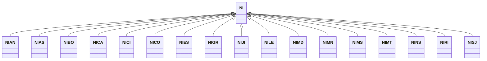

---
search:
  boost: 10.0
---

# Class: NI 


_Concept representing Country of Nicaragua_


<div data-search-exclude markdown="1">


URI: [loc:NI](https://w3id.org/lmodel/dpv/loc/NI)





## Inheritance
* **NI**
    * [NIAN](NIAN.md)
    * [NIAS](NIAS.md)
    * [NIBO](NIBO.md)
    * [NICA](NICA.md)
    * [NICI](NICI.md)
    * [NICO](NICO.md)
    * [NIES](NIES.md)
    * [NIGR](NIGR.md)
    * [NIJI](NIJI.md)
    * [NILE](NILE.md)
    * [NIMD](NIMD.md)
    * [NIMN](NIMN.md)
    * [NIMS](NIMS.md)
    * [NIMT](NIMT.md)
    * [NINS](NINS.md)
    * [NIRI](NIRI.md)
    * [NISJ](NISJ.md)


## Class Properties

| Property | Value |
| --- | --- |
| Class URI | [loc:NI](https://w3id.org/lmodel/dpv/loc/NI) |


## Slots

| Name | Cardinality and Range | Description | Inheritance |
| ---  | --- | --- | --- |


## In Subsets


* [LocSubset](LocSubset.md)


## Aliases


* Nicaragua


## Identifier and Mapping Information


### Annotations

| property | value |
| --- | --- |
| upstream_iri | https://w3id.org/dpv/loc/owl#NI |
| dpv_extension_slug | loc |


### Schema Source


* from schema: https://w3id.org/lmodel/dpv/loc


## Mappings

| Mapping Type | Mapped Value |
| ---  | ---  |
| self | loc:NI |
| native | loc:NI |
| exact | dpv_loc:NI, dpv_loc_owl:NI |


## LinkML Source

<!-- TODO: investigate https://stackoverflow.com/questions/37606292/how-to-create-tabbed-code-blocks-in-mkdocs-or-sphinx -->

### Direct

<details>
```yaml
name: NI
annotations:
  upstream_iri:
    tag: upstream_iri
    value: https://w3id.org/dpv/loc/owl#NI
  dpv_extension_slug:
    tag: dpv_extension_slug
    value: loc
description: Concept representing Country of Nicaragua
in_subset:
- loc_subset
from_schema: https://w3id.org/lmodel/dpv/loc
aliases:
- Nicaragua
exact_mappings:
- dpv_loc:NI
- dpv_loc_owl:NI
class_uri: loc:NI

```
</details>

### Induced

<details>
```yaml
name: NI
annotations:
  upstream_iri:
    tag: upstream_iri
    value: https://w3id.org/dpv/loc/owl#NI
  dpv_extension_slug:
    tag: dpv_extension_slug
    value: loc
description: Concept representing Country of Nicaragua
in_subset:
- loc_subset
from_schema: https://w3id.org/lmodel/dpv/loc
aliases:
- Nicaragua
exact_mappings:
- dpv_loc:NI
- dpv_loc_owl:NI
class_uri: loc:NI

```
</details></div>