---
search:
  boost: 10.0
---

# Class: NL 


_Concept representing Country of Netherlands_


<div data-search-exclude markdown="1">


URI: [loc:NL](https://w3id.org/lmodel/dpv/loc/NL)

```mermaid
 classDiagram
    class NL
    click NL href "../NL/"
      EEA30 <|-- NL
        click EEA30 href "../EEA30/"
      EEA31 <|-- NL
        click EEA31 href "../EEA31/"
      EU <|-- NL
        click EU href "../EU/"
      EU27 <|-- NL
        click EU27 href "../EU27/"
      EU28 <|-- NL
        click EU28 href "../EU28/"
      EEA <|-- NL
        click EEA href "../EEA/"
      

      NL <|-- AW
        click AW href "../AW/"
      NL <|-- BQ
        click BQ href "../BQ/"
      NL <|-- CW
        click CW href "../CW/"
      NL <|-- NLAW
        click NLAW href "../NLAW/"
      NL <|-- NLBQ1
        click NLBQ1 href "../NLBQ1/"
      NL <|-- NLBQ2
        click NLBQ2 href "../NLBQ2/"
      NL <|-- NLBQ3
        click NLBQ3 href "../NLBQ3/"
      NL <|-- NLCW
        click NLCW href "../NLCW/"
      NL <|-- NLDR
        click NLDR href "../NLDR/"
      NL <|-- NLFL
        click NLFL href "../NLFL/"
      NL <|-- NLFR
        click NLFR href "../NLFR/"
      NL <|-- NLGE
        click NLGE href "../NLGE/"
      NL <|-- NLGR
        click NLGR href "../NLGR/"
      NL <|-- NLLI
        click NLLI href "../NLLI/"
      NL <|-- NLNB
        click NLNB href "../NLNB/"
      NL <|-- NLNH
        click NLNH href "../NLNH/"
      NL <|-- NLOV
        click NLOV href "../NLOV/"
      NL <|-- NLSX
        click NLSX href "../NLSX/"
      NL <|-- NLUT
        click NLUT href "../NLUT/"
      NL <|-- NLZE
        click NLZE href "../NLZE/"
      NL <|-- NLZH
        click NLZH href "../NLZH/"
      NL <|-- SX
        click SX href "../SX/"
      

      
```





## Inheritance
* [EEA](EEA.md)
    * **NL** [ [EEA30](EEA30.md) [EEA31](EEA31.md) [EU](EU.md) [EU27](EU27.md) [EU28](EU28.md)]
        * [AW](AW.md)
        * [BQ](BQ.md)
        * [CW](CW.md)
        * [NLAW](NLAW.md)
        * [NLBQ1](NLBQ1.md)
        * [NLBQ2](NLBQ2.md)
        * [NLBQ3](NLBQ3.md)
        * [NLCW](NLCW.md)
        * [NLDR](NLDR.md)
        * [NLFL](NLFL.md)
        * [NLFR](NLFR.md)
        * [NLGE](NLGE.md)
        * [NLGR](NLGR.md)
        * [NLLI](NLLI.md)
        * [NLNB](NLNB.md)
        * [NLNH](NLNH.md)
        * [NLOV](NLOV.md)
        * [NLSX](NLSX.md)
        * [NLUT](NLUT.md)
        * [NLZE](NLZE.md)
        * [NLZH](NLZH.md)
        * [SX](SX.md)


## Class Properties

| Property | Value |
| --- | --- |
| Class URI | [loc:NL](https://w3id.org/lmodel/dpv/loc/NL) |


## Slots

| Name | Cardinality and Range | Description | Inheritance |
| ---  | --- | --- | --- |


## In Subsets


* [LocSubset](LocSubset.md)


## Aliases


* Netherlands


## Identifier and Mapping Information


### Annotations

| property | value |
| --- | --- |
| upstream_iri | https://w3id.org/dpv/loc/owl#NL |
| dpv_extension_slug | loc |


### Schema Source


* from schema: https://w3id.org/lmodel/dpv/loc


## Mappings

| Mapping Type | Mapped Value |
| ---  | ---  |
| self | loc:NL |
| native | loc:NL |
| exact | dpv_loc:NL, dpv_loc_owl:NL, iso3166:NL |


## LinkML Source

<!-- TODO: investigate https://stackoverflow.com/questions/37606292/how-to-create-tabbed-code-blocks-in-mkdocs-or-sphinx -->

### Direct

<details>
```yaml
name: NL
annotations:
  upstream_iri:
    tag: upstream_iri
    value: https://w3id.org/dpv/loc/owl#NL
  dpv_extension_slug:
    tag: dpv_extension_slug
    value: loc
description: Concept representing Country of Netherlands
in_subset:
- loc_subset
from_schema: https://w3id.org/lmodel/dpv/loc
aliases:
- Netherlands
exact_mappings:
- dpv_loc:NL
- dpv_loc_owl:NL
- iso3166:NL
is_a: EEA
mixins:
- EEA30
- EEA31
- EU
- EU27
- EU28
class_uri: loc:NL

```
</details>

### Induced

<details>
```yaml
name: NL
annotations:
  upstream_iri:
    tag: upstream_iri
    value: https://w3id.org/dpv/loc/owl#NL
  dpv_extension_slug:
    tag: dpv_extension_slug
    value: loc
description: Concept representing Country of Netherlands
in_subset:
- loc_subset
from_schema: https://w3id.org/lmodel/dpv/loc
aliases:
- Netherlands
exact_mappings:
- dpv_loc:NL
- dpv_loc_owl:NL
- iso3166:NL
is_a: EEA
mixins:
- EEA30
- EEA31
- EU
- EU27
- EU28
class_uri: loc:NL

```
</details></div>