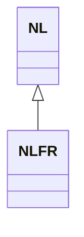

---
search:
  boost: 10.0
---

# Class: NLFR 


_Concept representing region Friesland in country Netherlands_


<div data-search-exclude markdown="1">


URI: [loc:NL-FR](https://w3id.org/lmodel/dpv/loc/NL-FR)





## Inheritance
* [EEA](EEA.md)
    * [NL](NL.md) [ [EEA30](EEA30.md) [EEA31](EEA31.md) [EU](EU.md) [EU27](EU27.md) [EU28](EU28.md)]
        * **NLFR**


## Class Properties

| Property | Value |
| --- | --- |
| Class URI | [loc:NL-FR](https://w3id.org/lmodel/dpv/loc/NL-FR) |


## Slots

| Name | Cardinality and Range | Description | Inheritance |
| ---  | --- | --- | --- |


## In Subsets


* [LocSubset](LocSubset.md)


## Aliases


* NL-FR
* Friesland


## Identifier and Mapping Information


### Annotations

| property | value |
| --- | --- |
| upstream_iri | https://w3id.org/dpv/loc/owl#NL-FR |
| dpv_extension_slug | loc |


### Schema Source


* from schema: https://w3id.org/lmodel/dpv/loc


## Mappings

| Mapping Type | Mapped Value |
| ---  | ---  |
| self | loc:NL-FR |
| native | loc:NLFR |
| exact | dpv_loc:NL-FR, dpv_loc_owl:NL-FR |


## LinkML Source

<!-- TODO: investigate https://stackoverflow.com/questions/37606292/how-to-create-tabbed-code-blocks-in-mkdocs-or-sphinx -->

### Direct

<details>
```yaml
name: NLFR
annotations:
  upstream_iri:
    tag: upstream_iri
    value: https://w3id.org/dpv/loc/owl#NL-FR
  dpv_extension_slug:
    tag: dpv_extension_slug
    value: loc
description: Concept representing region Friesland in country Netherlands
in_subset:
- loc_subset
from_schema: https://w3id.org/lmodel/dpv/loc
aliases:
- NL-FR
- Friesland
exact_mappings:
- dpv_loc:NL-FR
- dpv_loc_owl:NL-FR
is_a: NL
class_uri: loc:NL-FR

```
</details>

### Induced

<details>
```yaml
name: NLFR
annotations:
  upstream_iri:
    tag: upstream_iri
    value: https://w3id.org/dpv/loc/owl#NL-FR
  dpv_extension_slug:
    tag: dpv_extension_slug
    value: loc
description: Concept representing region Friesland in country Netherlands
in_subset:
- loc_subset
from_schema: https://w3id.org/lmodel/dpv/loc
aliases:
- NL-FR
- Friesland
exact_mappings:
- dpv_loc:NL-FR
- dpv_loc_owl:NL-FR
is_a: NL
class_uri: loc:NL-FR

```
</details></div>