---
search:
  boost: 10.0
---

# Class: NO 


_Concept representing Country of Norway_


<div data-search-exclude markdown="1">


URI: [loc:NO](https://w3id.org/lmodel/dpv/loc/NO)

```mermaid
 classDiagram
    class NO
    click NO href "../NO/"
      EEA30 <|-- NO
        click EEA30 href "../EEA30/"
      EEA31 <|-- NO
        click EEA31 href "../EEA31/"
      EEA <|-- NO
        click EEA href "../EEA/"
      

      NO <|-- NO03
        click NO03 href "../NO03/"
      NO <|-- NO04
        click NO04 href "../NO04/"
      NO <|-- NO05
        click NO05 href "../NO05/"
      NO <|-- NO09
        click NO09 href "../NO09/"
      NO <|-- NO10
        click NO10 href "../NO10/"
      NO <|-- NO11
        click NO11 href "../NO11/"
      NO <|-- NO12
        click NO12 href "../NO12/"
      NO <|-- NO14
        click NO14 href "../NO14/"
      NO <|-- NO15
        click NO15 href "../NO15/"
      NO <|-- NO16
        click NO16 href "../NO16/"
      NO <|-- NO17
        click NO17 href "../NO17/"
      NO <|-- NO18
        click NO18 href "../NO18/"
      NO <|-- NO21
        click NO21 href "../NO21/"
      NO <|-- NO22
        click NO22 href "../NO22/"
      NO <|-- NO30
        click NO30 href "../NO30/"
      NO <|-- NO31
        click NO31 href "../NO31/"
      NO <|-- NO32
        click NO32 href "../NO32/"
      NO <|-- NO33
        click NO33 href "../NO33/"
      NO <|-- NO34
        click NO34 href "../NO34/"
      NO <|-- NO38
        click NO38 href "../NO38/"
      NO <|-- NO39
        click NO39 href "../NO39/"
      NO <|-- NO3905
        click NO3905 href "../NO3905/"
      NO <|-- NO40
        click NO40 href "../NO40/"
      NO <|-- NO42
        click NO42 href "../NO42/"
      NO <|-- NO46
        click NO46 href "../NO46/"
      NO <|-- NO50
        click NO50 href "../NO50/"
      NO <|-- NO54
        click NO54 href "../NO54/"
      NO <|-- NO55
        click NO55 href "../NO55/"
      NO <|-- NO56
        click NO56 href "../NO56/"
      NO <|-- SJ
        click SJ href "../SJ/"
      

      
```





## Inheritance
* [EEA](EEA.md)
    * **NO** [ [EEA30](EEA30.md) [EEA31](EEA31.md)]
        * [NO03](NO03.md)
        * [NO04](NO04.md)
        * [NO05](NO05.md)
        * [NO09](NO09.md)
        * [NO10](NO10.md)
        * [NO11](NO11.md)
        * [NO12](NO12.md)
        * [NO14](NO14.md)
        * [NO15](NO15.md)
        * [NO16](NO16.md)
        * [NO17](NO17.md)
        * [NO18](NO18.md)
        * [NO21](NO21.md)
        * [NO22](NO22.md)
        * [NO30](NO30.md)
        * [NO31](NO31.md)
        * [NO32](NO32.md)
        * [NO33](NO33.md)
        * [NO34](NO34.md)
        * [NO38](NO38.md)
        * [NO39](NO39.md)
        * [NO3905](NO3905.md)
        * [NO40](NO40.md)
        * [NO42](NO42.md)
        * [NO46](NO46.md)
        * [NO50](NO50.md)
        * [NO54](NO54.md)
        * [NO55](NO55.md)
        * [NO56](NO56.md)
        * [SJ](SJ.md)


## Class Properties

| Property | Value |
| --- | --- |
| Class URI | [loc:NO](https://w3id.org/lmodel/dpv/loc/NO) |


## Slots

| Name | Cardinality and Range | Description | Inheritance |
| ---  | --- | --- | --- |


## In Subsets


* [LocSubset](LocSubset.md)


## Aliases


* Norway


## Identifier and Mapping Information


### Annotations

| property | value |
| --- | --- |
| upstream_iri | https://w3id.org/dpv/loc/owl#NO |
| dpv_extension_slug | loc |


### Schema Source


* from schema: https://w3id.org/lmodel/dpv/loc


## Mappings

| Mapping Type | Mapped Value |
| ---  | ---  |
| self | loc:NO |
| native | loc:NO |
| exact | dpv_loc:NO, dpv_loc_owl:NO |


## LinkML Source

<!-- TODO: investigate https://stackoverflow.com/questions/37606292/how-to-create-tabbed-code-blocks-in-mkdocs-or-sphinx -->

### Direct

<details>
```yaml
name: 'NO'
annotations:
  upstream_iri:
    tag: upstream_iri
    value: https://w3id.org/dpv/loc/owl#NO
  dpv_extension_slug:
    tag: dpv_extension_slug
    value: loc
description: Concept representing Country of Norway
in_subset:
- loc_subset
from_schema: https://w3id.org/lmodel/dpv/loc
aliases:
- Norway
exact_mappings:
- dpv_loc:NO
- dpv_loc_owl:NO
is_a: EEA
mixins:
- EEA30
- EEA31
class_uri: loc:NO

```
</details>

### Induced

<details>
```yaml
name: 'NO'
annotations:
  upstream_iri:
    tag: upstream_iri
    value: https://w3id.org/dpv/loc/owl#NO
  dpv_extension_slug:
    tag: dpv_extension_slug
    value: loc
description: Concept representing Country of Norway
in_subset:
- loc_subset
from_schema: https://w3id.org/lmodel/dpv/loc
aliases:
- Norway
exact_mappings:
- dpv_loc:NO
- dpv_loc_owl:NO
is_a: EEA
mixins:
- EEA30
- EEA31
class_uri: loc:NO

```
</details></div>