---
search:
  boost: 10.0
---

# Class: NP 


_Concept representing Country of Nepal_


<div data-search-exclude markdown="1">


URI: [loc:NP](https://w3id.org/lmodel/dpv/loc/NP)

```mermaid
 classDiagram
    class NP
    click NP href "../NP/"
      NP <|-- NP1
        click NP1 href "../NP1/"
      NP <|-- NP2
        click NP2 href "../NP2/"
      NP <|-- NP3
        click NP3 href "../NP3/"
      NP <|-- NP4
        click NP4 href "../NP4/"
      NP <|-- NP5
        click NP5 href "../NP5/"
      NP <|-- NPBA
        click NPBA href "../NPBA/"
      NP <|-- NPBH
        click NPBH href "../NPBH/"
      NP <|-- NPDH
        click NPDH href "../NPDH/"
      NP <|-- NPGA
        click NPGA href "../NPGA/"
      NP <|-- NPJA
        click NPJA href "../NPJA/"
      NP <|-- NPKA
        click NPKA href "../NPKA/"
      NP <|-- NPKO
        click NPKO href "../NPKO/"
      NP <|-- NPLU
        click NPLU href "../NPLU/"
      NP <|-- NPMA
        click NPMA href "../NPMA/"
      NP <|-- NPME
        click NPME href "../NPME/"
      NP <|-- NPNA
        click NPNA href "../NPNA/"
      NP <|-- NPP1
        click NPP1 href "../NPP1/"
      NP <|-- NPP2
        click NPP2 href "../NPP2/"
      NP <|-- NPP5
        click NPP5 href "../NPP5/"
      NP <|-- NPP6
        click NPP6 href "../NPP6/"
      NP <|-- NPP7
        click NPP7 href "../NPP7/"
      NP <|-- NPRA
        click NPRA href "../NPRA/"
      NP <|-- NPSA
        click NPSA href "../NPSA/"
      NP <|-- NPSE
        click NPSE href "../NPSE/"
      
      
```





## Inheritance
* **NP**
    * [NP1](NP1.md)
    * [NP2](NP2.md)
    * [NP3](NP3.md)
    * [NP4](NP4.md)
    * [NP5](NP5.md)
    * [NPBA](NPBA.md)
    * [NPBH](NPBH.md)
    * [NPDH](NPDH.md)
    * [NPGA](NPGA.md)
    * [NPJA](NPJA.md)
    * [NPKA](NPKA.md)
    * [NPKO](NPKO.md)
    * [NPLU](NPLU.md)
    * [NPMA](NPMA.md)
    * [NPME](NPME.md)
    * [NPNA](NPNA.md)
    * [NPP1](NPP1.md)
    * [NPP2](NPP2.md)
    * [NPP5](NPP5.md)
    * [NPP6](NPP6.md)
    * [NPP7](NPP7.md)
    * [NPRA](NPRA.md)
    * [NPSA](NPSA.md)
    * [NPSE](NPSE.md)


## Class Properties

| Property | Value |
| --- | --- |
| Class URI | [loc:NP](https://w3id.org/lmodel/dpv/loc/NP) |


## Slots

| Name | Cardinality and Range | Description | Inheritance |
| ---  | --- | --- | --- |


## In Subsets


* [LocSubset](LocSubset.md)


## Aliases


* Nepal


## Identifier and Mapping Information


### Annotations

| property | value |
| --- | --- |
| upstream_iri | https://w3id.org/dpv/loc/owl#NP |
| dpv_extension_slug | loc |


### Schema Source


* from schema: https://w3id.org/lmodel/dpv/loc


## Mappings

| Mapping Type | Mapped Value |
| ---  | ---  |
| self | loc:NP |
| native | loc:NP |
| exact | dpv_loc:NP, dpv_loc_owl:NP |


## LinkML Source

<!-- TODO: investigate https://stackoverflow.com/questions/37606292/how-to-create-tabbed-code-blocks-in-mkdocs-or-sphinx -->

### Direct

<details>
```yaml
name: NP
annotations:
  upstream_iri:
    tag: upstream_iri
    value: https://w3id.org/dpv/loc/owl#NP
  dpv_extension_slug:
    tag: dpv_extension_slug
    value: loc
description: Concept representing Country of Nepal
in_subset:
- loc_subset
from_schema: https://w3id.org/lmodel/dpv/loc
aliases:
- Nepal
exact_mappings:
- dpv_loc:NP
- dpv_loc_owl:NP
class_uri: loc:NP

```
</details>

### Induced

<details>
```yaml
name: NP
annotations:
  upstream_iri:
    tag: upstream_iri
    value: https://w3id.org/dpv/loc/owl#NP
  dpv_extension_slug:
    tag: dpv_extension_slug
    value: loc
description: Concept representing Country of Nepal
in_subset:
- loc_subset
from_schema: https://w3id.org/lmodel/dpv/loc
aliases:
- Nepal
exact_mappings:
- dpv_loc:NP
- dpv_loc_owl:NP
class_uri: loc:NP

```
</details></div>