---
search:
  boost: 10.0
---

# Class: NZ 


_Concept representing Country of New Zealand_


<div data-search-exclude markdown="1">


URI: [loc:NZ](https://w3id.org/lmodel/dpv/loc/NZ)

```mermaid
 classDiagram
    class NZ
    click NZ href "../NZ/"
      NZ <|-- NZAUK
        click NZAUK href "../NZAUK/"
      NZ <|-- NZBOP
        click NZBOP href "../NZBOP/"
      NZ <|-- NZCAN
        click NZCAN href "../NZCAN/"
      NZ <|-- NZCIT
        click NZCIT href "../NZCIT/"
      NZ <|-- NZGIS
        click NZGIS href "../NZGIS/"
      NZ <|-- NZHKB
        click NZHKB href "../NZHKB/"
      NZ <|-- NZMBH
        click NZMBH href "../NZMBH/"
      NZ <|-- NZMWT
        click NZMWT href "../NZMWT/"
      NZ <|-- NZN
        click NZN href "../NZN/"
      NZ <|-- NZNSN
        click NZNSN href "../NZNSN/"
      NZ <|-- NZNTL
        click NZNTL href "../NZNTL/"
      NZ <|-- NZOTA
        click NZOTA href "../NZOTA/"
      NZ <|-- NZS
        click NZS href "../NZS/"
      NZ <|-- NZSTL
        click NZSTL href "../NZSTL/"
      NZ <|-- NZTAS
        click NZTAS href "../NZTAS/"
      NZ <|-- NZTKI
        click NZTKI href "../NZTKI/"
      NZ <|-- NZWGN
        click NZWGN href "../NZWGN/"
      NZ <|-- NZWKO
        click NZWKO href "../NZWKO/"
      NZ <|-- NZWTC
        click NZWTC href "../NZWTC/"
      
      
```





## Inheritance
* **NZ**
    * [NZAUK](NZAUK.md)
    * [NZBOP](NZBOP.md)
    * [NZCAN](NZCAN.md)
    * [NZCIT](NZCIT.md)
    * [NZGIS](NZGIS.md)
    * [NZHKB](NZHKB.md)
    * [NZMBH](NZMBH.md)
    * [NZMWT](NZMWT.md)
    * [NZN](NZN.md)
    * [NZNSN](NZNSN.md)
    * [NZNTL](NZNTL.md)
    * [NZOTA](NZOTA.md)
    * [NZS](NZS.md)
    * [NZSTL](NZSTL.md)
    * [NZTAS](NZTAS.md)
    * [NZTKI](NZTKI.md)
    * [NZWGN](NZWGN.md)
    * [NZWKO](NZWKO.md)
    * [NZWTC](NZWTC.md)


## Class Properties

| Property | Value |
| --- | --- |
| Class URI | [loc:NZ](https://w3id.org/lmodel/dpv/loc/NZ) |


## Slots

| Name | Cardinality and Range | Description | Inheritance |
| ---  | --- | --- | --- |


## In Subsets


* [LocSubset](LocSubset.md)


## Aliases


* New Zealand


## Identifier and Mapping Information


### Annotations

| property | value |
| --- | --- |
| upstream_iri | https://w3id.org/dpv/loc/owl#NZ |
| dpv_extension_slug | loc |


### Schema Source


* from schema: https://w3id.org/lmodel/dpv/loc


## Mappings

| Mapping Type | Mapped Value |
| ---  | ---  |
| self | loc:NZ |
| native | loc:NZ |
| exact | dpv_loc:NZ, dpv_loc_owl:NZ |


## LinkML Source

<!-- TODO: investigate https://stackoverflow.com/questions/37606292/how-to-create-tabbed-code-blocks-in-mkdocs-or-sphinx -->

### Direct

<details>
```yaml
name: NZ
annotations:
  upstream_iri:
    tag: upstream_iri
    value: https://w3id.org/dpv/loc/owl#NZ
  dpv_extension_slug:
    tag: dpv_extension_slug
    value: loc
description: Concept representing Country of New Zealand
in_subset:
- loc_subset
from_schema: https://w3id.org/lmodel/dpv/loc
aliases:
- New Zealand
exact_mappings:
- dpv_loc:NZ
- dpv_loc_owl:NZ
class_uri: loc:NZ

```
</details>

### Induced

<details>
```yaml
name: NZ
annotations:
  upstream_iri:
    tag: upstream_iri
    value: https://w3id.org/dpv/loc/owl#NZ
  dpv_extension_slug:
    tag: dpv_extension_slug
    value: loc
description: Concept representing Country of New Zealand
in_subset:
- loc_subset
from_schema: https://w3id.org/lmodel/dpv/loc
aliases:
- New Zealand
exact_mappings:
- dpv_loc:NZ
- dpv_loc_owl:NZ
class_uri: loc:NZ

```
</details></div>