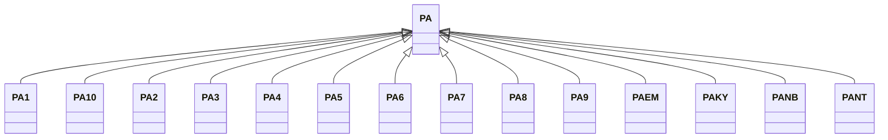

---
search:
  boost: 10.0
---

# Class: PA 


_Concept representing Country of Panama_


<div data-search-exclude markdown="1">


URI: [loc:PA](https://w3id.org/lmodel/dpv/loc/PA)





## Inheritance
* **PA**
    * [PA1](PA1.md)
    * [PA10](PA10.md)
    * [PA2](PA2.md)
    * [PA3](PA3.md)
    * [PA4](PA4.md)
    * [PA5](PA5.md)
    * [PA6](PA6.md)
    * [PA7](PA7.md)
    * [PA8](PA8.md)
    * [PA9](PA9.md)
    * [PAEM](PAEM.md)
    * [PAKY](PAKY.md)
    * [PANB](PANB.md)
    * [PANT](PANT.md)


## Class Properties

| Property | Value |
| --- | --- |
| Class URI | [loc:PA](https://w3id.org/lmodel/dpv/loc/PA) |


## Slots

| Name | Cardinality and Range | Description | Inheritance |
| ---  | --- | --- | --- |


## In Subsets


* [LocSubset](LocSubset.md)


## Aliases


* Panama


## Identifier and Mapping Information


### Annotations

| property | value |
| --- | --- |
| upstream_iri | https://w3id.org/dpv/loc/owl#PA |
| dpv_extension_slug | loc |


### Schema Source


* from schema: https://w3id.org/lmodel/dpv/loc


## Mappings

| Mapping Type | Mapped Value |
| ---  | ---  |
| self | loc:PA |
| native | loc:PA |
| exact | dpv_loc:PA, dpv_loc_owl:PA |


## LinkML Source

<!-- TODO: investigate https://stackoverflow.com/questions/37606292/how-to-create-tabbed-code-blocks-in-mkdocs-or-sphinx -->

### Direct

<details>
```yaml
name: PA
annotations:
  upstream_iri:
    tag: upstream_iri
    value: https://w3id.org/dpv/loc/owl#PA
  dpv_extension_slug:
    tag: dpv_extension_slug
    value: loc
description: Concept representing Country of Panama
in_subset:
- loc_subset
from_schema: https://w3id.org/lmodel/dpv/loc
aliases:
- Panama
exact_mappings:
- dpv_loc:PA
- dpv_loc_owl:PA
class_uri: loc:PA

```
</details>

### Induced

<details>
```yaml
name: PA
annotations:
  upstream_iri:
    tag: upstream_iri
    value: https://w3id.org/dpv/loc/owl#PA
  dpv_extension_slug:
    tag: dpv_extension_slug
    value: loc
description: Concept representing Country of Panama
in_subset:
- loc_subset
from_schema: https://w3id.org/lmodel/dpv/loc
aliases:
- Panama
exact_mappings:
- dpv_loc:PA
- dpv_loc_owl:PA
class_uri: loc:PA

```
</details></div>