---
search:
  boost: 10.0
---

# Class: PE 


_Concept representing Country of Peru_


<div data-search-exclude markdown="1">


URI: [loc:PE](https://w3id.org/lmodel/dpv/loc/PE)

```mermaid
 classDiagram
    class PE
    click PE href "../PE/"
      PE <|-- PEAMA
        click PEAMA href "../PEAMA/"
      PE <|-- PEANC
        click PEANC href "../PEANC/"
      PE <|-- PEAPU
        click PEAPU href "../PEAPU/"
      PE <|-- PEARE
        click PEARE href "../PEARE/"
      PE <|-- PEAYA
        click PEAYA href "../PEAYA/"
      PE <|-- PECAJ
        click PECAJ href "../PECAJ/"
      PE <|-- PECAL
        click PECAL href "../PECAL/"
      PE <|-- PECUS
        click PECUS href "../PECUS/"
      PE <|-- PEHUC
        click PEHUC href "../PEHUC/"
      PE <|-- PEHUV
        click PEHUV href "../PEHUV/"
      PE <|-- PEICA
        click PEICA href "../PEICA/"
      PE <|-- PEJUN
        click PEJUN href "../PEJUN/"
      PE <|-- PELAL
        click PELAL href "../PELAL/"
      PE <|-- PELAM
        click PELAM href "../PELAM/"
      PE <|-- PELIM
        click PELIM href "../PELIM/"
      PE <|-- PELMA
        click PELMA href "../PELMA/"
      PE <|-- PELOR
        click PELOR href "../PELOR/"
      PE <|-- PEMDD
        click PEMDD href "../PEMDD/"
      PE <|-- PEMOQ
        click PEMOQ href "../PEMOQ/"
      PE <|-- PEPAS
        click PEPAS href "../PEPAS/"
      PE <|-- PEPIU
        click PEPIU href "../PEPIU/"
      PE <|-- PEPUN
        click PEPUN href "../PEPUN/"
      PE <|-- PESAM
        click PESAM href "../PESAM/"
      PE <|-- PETAC
        click PETAC href "../PETAC/"
      PE <|-- PETUM
        click PETUM href "../PETUM/"
      PE <|-- PEUCA
        click PEUCA href "../PEUCA/"
      
      
```





## Inheritance
* **PE**
    * [PEAMA](PEAMA.md)
    * [PEANC](PEANC.md)
    * [PEAPU](PEAPU.md)
    * [PEARE](PEARE.md)
    * [PEAYA](PEAYA.md)
    * [PECAJ](PECAJ.md)
    * [PECAL](PECAL.md)
    * [PECUS](PECUS.md)
    * [PEHUC](PEHUC.md)
    * [PEHUV](PEHUV.md)
    * [PEICA](PEICA.md)
    * [PEJUN](PEJUN.md)
    * [PELAL](PELAL.md)
    * [PELAM](PELAM.md)
    * [PELIM](PELIM.md)
    * [PELMA](PELMA.md)
    * [PELOR](PELOR.md)
    * [PEMDD](PEMDD.md)
    * [PEMOQ](PEMOQ.md)
    * [PEPAS](PEPAS.md)
    * [PEPIU](PEPIU.md)
    * [PEPUN](PEPUN.md)
    * [PESAM](PESAM.md)
    * [PETAC](PETAC.md)
    * [PETUM](PETUM.md)
    * [PEUCA](PEUCA.md)


## Class Properties

| Property | Value |
| --- | --- |
| Class URI | [loc:PE](https://w3id.org/lmodel/dpv/loc/PE) |


## Slots

| Name | Cardinality and Range | Description | Inheritance |
| ---  | --- | --- | --- |


## In Subsets


* [LocSubset](LocSubset.md)


## Aliases


* Peru


## Identifier and Mapping Information


### Annotations

| property | value |
| --- | --- |
| upstream_iri | https://w3id.org/dpv/loc/owl#PE |
| dpv_extension_slug | loc |


### Schema Source


* from schema: https://w3id.org/lmodel/dpv/loc


## Mappings

| Mapping Type | Mapped Value |
| ---  | ---  |
| self | loc:PE |
| native | loc:PE |
| exact | dpv_loc:PE, dpv_loc_owl:PE |


## LinkML Source

<!-- TODO: investigate https://stackoverflow.com/questions/37606292/how-to-create-tabbed-code-blocks-in-mkdocs-or-sphinx -->

### Direct

<details>
```yaml
name: PE
annotations:
  upstream_iri:
    tag: upstream_iri
    value: https://w3id.org/dpv/loc/owl#PE
  dpv_extension_slug:
    tag: dpv_extension_slug
    value: loc
description: Concept representing Country of Peru
in_subset:
- loc_subset
from_schema: https://w3id.org/lmodel/dpv/loc
aliases:
- Peru
exact_mappings:
- dpv_loc:PE
- dpv_loc_owl:PE
class_uri: loc:PE

```
</details>

### Induced

<details>
```yaml
name: PE
annotations:
  upstream_iri:
    tag: upstream_iri
    value: https://w3id.org/dpv/loc/owl#PE
  dpv_extension_slug:
    tag: dpv_extension_slug
    value: loc
description: Concept representing Country of Peru
in_subset:
- loc_subset
from_schema: https://w3id.org/lmodel/dpv/loc
aliases:
- Peru
exact_mappings:
- dpv_loc:PE
- dpv_loc_owl:PE
class_uri: loc:PE

```
</details></div>