---
search:
  boost: 10.0
---

# Class: PH 


_Concept representing Country of Philippines_


<div data-search-exclude markdown="1">


URI: [loc:PH](https://w3id.org/lmodel/dpv/loc/PH)

```mermaid
 classDiagram
    class PH
    click PH href "../PH/"
      PH <|-- PH00
        click PH00 href "../PH00/"
      PH <|-- PH01
        click PH01 href "../PH01/"
      PH <|-- PH02
        click PH02 href "../PH02/"
      PH <|-- PH03
        click PH03 href "../PH03/"
      PH <|-- PH05
        click PH05 href "../PH05/"
      PH <|-- PH06
        click PH06 href "../PH06/"
      PH <|-- PH07
        click PH07 href "../PH07/"
      PH <|-- PH08
        click PH08 href "../PH08/"
      PH <|-- PH09
        click PH09 href "../PH09/"
      PH <|-- PH10
        click PH10 href "../PH10/"
      PH <|-- PH11
        click PH11 href "../PH11/"
      PH <|-- PH12
        click PH12 href "../PH12/"
      PH <|-- PH13
        click PH13 href "../PH13/"
      PH <|-- PH14
        click PH14 href "../PH14/"
      PH <|-- PH15
        click PH15 href "../PH15/"
      PH <|-- PH40
        click PH40 href "../PH40/"
      PH <|-- PH41
        click PH41 href "../PH41/"
      PH <|-- PHABR
        click PHABR href "../PHABR/"
      PH <|-- PHAGN
        click PHAGN href "../PHAGN/"
      PH <|-- PHAGS
        click PHAGS href "../PHAGS/"
      PH <|-- PHAKL
        click PHAKL href "../PHAKL/"
      PH <|-- PHALB
        click PHALB href "../PHALB/"
      PH <|-- PHANT
        click PHANT href "../PHANT/"
      PH <|-- PHAPA
        click PHAPA href "../PHAPA/"
      PH <|-- PHAUR
        click PHAUR href "../PHAUR/"
      PH <|-- PHBAN
        click PHBAN href "../PHBAN/"
      PH <|-- PHBAS
        click PHBAS href "../PHBAS/"
      PH <|-- PHBEN
        click PHBEN href "../PHBEN/"
      PH <|-- PHBIL
        click PHBIL href "../PHBIL/"
      PH <|-- PHBOH
        click PHBOH href "../PHBOH/"
      PH <|-- PHBTG
        click PHBTG href "../PHBTG/"
      PH <|-- PHBTN
        click PHBTN href "../PHBTN/"
      PH <|-- PHBUK
        click PHBUK href "../PHBUK/"
      PH <|-- PHBUL
        click PHBUL href "../PHBUL/"
      PH <|-- PHCAG
        click PHCAG href "../PHCAG/"
      PH <|-- PHCAM
        click PHCAM href "../PHCAM/"
      PH <|-- PHCAN
        click PHCAN href "../PHCAN/"
      PH <|-- PHCAP
        click PHCAP href "../PHCAP/"
      PH <|-- PHCAS
        click PHCAS href "../PHCAS/"
      PH <|-- PHCAT
        click PHCAT href "../PHCAT/"
      PH <|-- PHCAV
        click PHCAV href "../PHCAV/"
      PH <|-- PHCEB
        click PHCEB href "../PHCEB/"
      PH <|-- PHCOM
        click PHCOM href "../PHCOM/"
      PH <|-- PHDAO
        click PHDAO href "../PHDAO/"
      PH <|-- PHDAS
        click PHDAS href "../PHDAS/"
      PH <|-- PHDAV
        click PHDAV href "../PHDAV/"
      PH <|-- PHDIN
        click PHDIN href "../PHDIN/"
      PH <|-- PHDVO
        click PHDVO href "../PHDVO/"
      PH <|-- PHEAS
        click PHEAS href "../PHEAS/"
      PH <|-- PHGUI
        click PHGUI href "../PHGUI/"
      PH <|-- PHIFU
        click PHIFU href "../PHIFU/"
      PH <|-- PHILI
        click PHILI href "../PHILI/"
      PH <|-- PHILN
        click PHILN href "../PHILN/"
      PH <|-- PHILS
        click PHILS href "../PHILS/"
      PH <|-- PHISA
        click PHISA href "../PHISA/"
      PH <|-- PHKAL
        click PHKAL href "../PHKAL/"
      PH <|-- PHLAG
        click PHLAG href "../PHLAG/"
      PH <|-- PHLAN
        click PHLAN href "../PHLAN/"
      PH <|-- PHLAS
        click PHLAS href "../PHLAS/"
      PH <|-- PHLEY
        click PHLEY href "../PHLEY/"
      PH <|-- PHLUN
        click PHLUN href "../PHLUN/"
      PH <|-- PHMAD
        click PHMAD href "../PHMAD/"
      PH <|-- PHMAG
        click PHMAG href "../PHMAG/"
      PH <|-- PHMAS
        click PHMAS href "../PHMAS/"
      PH <|-- PHMDC
        click PHMDC href "../PHMDC/"
      PH <|-- PHMDR
        click PHMDR href "../PHMDR/"
      PH <|-- PHMGN
        click PHMGN href "../PHMGN/"
      PH <|-- PHMGS
        click PHMGS href "../PHMGS/"
      PH <|-- PHMOU
        click PHMOU href "../PHMOU/"
      PH <|-- PHMSC
        click PHMSC href "../PHMSC/"
      PH <|-- PHMSR
        click PHMSR href "../PHMSR/"
      PH <|-- PHNCO
        click PHNCO href "../PHNCO/"
      PH <|-- PHNEC
        click PHNEC href "../PHNEC/"
      PH <|-- PHNER
        click PHNER href "../PHNER/"
      PH <|-- PHNSA
        click PHNSA href "../PHNSA/"
      PH <|-- PHNUE
        click PHNUE href "../PHNUE/"
      PH <|-- PHNUV
        click PHNUV href "../PHNUV/"
      PH <|-- PHPAM
        click PHPAM href "../PHPAM/"
      PH <|-- PHPAN
        click PHPAN href "../PHPAN/"
      PH <|-- PHPLW
        click PHPLW href "../PHPLW/"
      PH <|-- PHQUE
        click PHQUE href "../PHQUE/"
      PH <|-- PHQUI
        click PHQUI href "../PHQUI/"
      PH <|-- PHRIZ
        click PHRIZ href "../PHRIZ/"
      PH <|-- PHROM
        click PHROM href "../PHROM/"
      PH <|-- PHSAR
        click PHSAR href "../PHSAR/"
      PH <|-- PHSCO
        click PHSCO href "../PHSCO/"
      PH <|-- PHSIG
        click PHSIG href "../PHSIG/"
      PH <|-- PHSLE
        click PHSLE href "../PHSLE/"
      PH <|-- PHSLU
        click PHSLU href "../PHSLU/"
      PH <|-- PHSOR
        click PHSOR href "../PHSOR/"
      PH <|-- PHSUK
        click PHSUK href "../PHSUK/"
      PH <|-- PHSUN
        click PHSUN href "../PHSUN/"
      PH <|-- PHSUR
        click PHSUR href "../PHSUR/"
      PH <|-- PHTAR
        click PHTAR href "../PHTAR/"
      PH <|-- PHTAW
        click PHTAW href "../PHTAW/"
      PH <|-- PHWSA
        click PHWSA href "../PHWSA/"
      PH <|-- PHZAN
        click PHZAN href "../PHZAN/"
      PH <|-- PHZAS
        click PHZAS href "../PHZAS/"
      PH <|-- PHZMB
        click PHZMB href "../PHZMB/"
      PH <|-- PHZSI
        click PHZSI href "../PHZSI/"
      
      
```





## Inheritance
* **PH**
    * [PH00](PH00.md)
    * [PH01](PH01.md)
    * [PH02](PH02.md)
    * [PH03](PH03.md)
    * [PH05](PH05.md)
    * [PH06](PH06.md)
    * [PH07](PH07.md)
    * [PH08](PH08.md)
    * [PH09](PH09.md)
    * [PH10](PH10.md)
    * [PH11](PH11.md)
    * [PH12](PH12.md)
    * [PH13](PH13.md)
    * [PH14](PH14.md)
    * [PH15](PH15.md)
    * [PH40](PH40.md)
    * [PH41](PH41.md)
    * [PHABR](PHABR.md)
    * [PHAGN](PHAGN.md)
    * [PHAGS](PHAGS.md)
    * [PHAKL](PHAKL.md)
    * [PHALB](PHALB.md)
    * [PHANT](PHANT.md)
    * [PHAPA](PHAPA.md)
    * [PHAUR](PHAUR.md)
    * [PHBAN](PHBAN.md)
    * [PHBAS](PHBAS.md)
    * [PHBEN](PHBEN.md)
    * [PHBIL](PHBIL.md)
    * [PHBOH](PHBOH.md)
    * [PHBTG](PHBTG.md)
    * [PHBTN](PHBTN.md)
    * [PHBUK](PHBUK.md)
    * [PHBUL](PHBUL.md)
    * [PHCAG](PHCAG.md)
    * [PHCAM](PHCAM.md)
    * [PHCAN](PHCAN.md)
    * [PHCAP](PHCAP.md)
    * [PHCAS](PHCAS.md)
    * [PHCAT](PHCAT.md)
    * [PHCAV](PHCAV.md)
    * [PHCEB](PHCEB.md)
    * [PHCOM](PHCOM.md)
    * [PHDAO](PHDAO.md)
    * [PHDAS](PHDAS.md)
    * [PHDAV](PHDAV.md)
    * [PHDIN](PHDIN.md)
    * [PHDVO](PHDVO.md)
    * [PHEAS](PHEAS.md)
    * [PHGUI](PHGUI.md)
    * [PHIFU](PHIFU.md)
    * [PHILI](PHILI.md)
    * [PHILN](PHILN.md)
    * [PHILS](PHILS.md)
    * [PHISA](PHISA.md)
    * [PHKAL](PHKAL.md)
    * [PHLAG](PHLAG.md)
    * [PHLAN](PHLAN.md)
    * [PHLAS](PHLAS.md)
    * [PHLEY](PHLEY.md)
    * [PHLUN](PHLUN.md)
    * [PHMAD](PHMAD.md)
    * [PHMAG](PHMAG.md)
    * [PHMAS](PHMAS.md)
    * [PHMDC](PHMDC.md)
    * [PHMDR](PHMDR.md)
    * [PHMGN](PHMGN.md)
    * [PHMGS](PHMGS.md)
    * [PHMOU](PHMOU.md)
    * [PHMSC](PHMSC.md)
    * [PHMSR](PHMSR.md)
    * [PHNCO](PHNCO.md)
    * [PHNEC](PHNEC.md)
    * [PHNER](PHNER.md)
    * [PHNSA](PHNSA.md)
    * [PHNUE](PHNUE.md)
    * [PHNUV](PHNUV.md)
    * [PHPAM](PHPAM.md)
    * [PHPAN](PHPAN.md)
    * [PHPLW](PHPLW.md)
    * [PHQUE](PHQUE.md)
    * [PHQUI](PHQUI.md)
    * [PHRIZ](PHRIZ.md)
    * [PHROM](PHROM.md)
    * [PHSAR](PHSAR.md)
    * [PHSCO](PHSCO.md)
    * [PHSIG](PHSIG.md)
    * [PHSLE](PHSLE.md)
    * [PHSLU](PHSLU.md)
    * [PHSOR](PHSOR.md)
    * [PHSUK](PHSUK.md)
    * [PHSUN](PHSUN.md)
    * [PHSUR](PHSUR.md)
    * [PHTAR](PHTAR.md)
    * [PHTAW](PHTAW.md)
    * [PHWSA](PHWSA.md)
    * [PHZAN](PHZAN.md)
    * [PHZAS](PHZAS.md)
    * [PHZMB](PHZMB.md)
    * [PHZSI](PHZSI.md)


## Class Properties

| Property | Value |
| --- | --- |
| Class URI | [loc:PH](https://w3id.org/lmodel/dpv/loc/PH) |


## Slots

| Name | Cardinality and Range | Description | Inheritance |
| ---  | --- | --- | --- |


## In Subsets


* [LocSubset](LocSubset.md)


## Aliases


* Philippines


## Identifier and Mapping Information


### Annotations

| property | value |
| --- | --- |
| upstream_iri | https://w3id.org/dpv/loc/owl#PH |
| dpv_extension_slug | loc |


### Schema Source


* from schema: https://w3id.org/lmodel/dpv/loc


## Mappings

| Mapping Type | Mapped Value |
| ---  | ---  |
| self | loc:PH |
| native | loc:PH |
| exact | dpv_loc:PH, dpv_loc_owl:PH |


## LinkML Source

<!-- TODO: investigate https://stackoverflow.com/questions/37606292/how-to-create-tabbed-code-blocks-in-mkdocs-or-sphinx -->

### Direct

<details>
```yaml
name: PH
annotations:
  upstream_iri:
    tag: upstream_iri
    value: https://w3id.org/dpv/loc/owl#PH
  dpv_extension_slug:
    tag: dpv_extension_slug
    value: loc
description: Concept representing Country of Philippines
in_subset:
- loc_subset
from_schema: https://w3id.org/lmodel/dpv/loc
aliases:
- Philippines
exact_mappings:
- dpv_loc:PH
- dpv_loc_owl:PH
class_uri: loc:PH

```
</details>

### Induced

<details>
```yaml
name: PH
annotations:
  upstream_iri:
    tag: upstream_iri
    value: https://w3id.org/dpv/loc/owl#PH
  dpv_extension_slug:
    tag: dpv_extension_slug
    value: loc
description: Concept representing Country of Philippines
in_subset:
- loc_subset
from_schema: https://w3id.org/lmodel/dpv/loc
aliases:
- Philippines
exact_mappings:
- dpv_loc:PH
- dpv_loc_owl:PH
class_uri: loc:PH

```
</details></div>