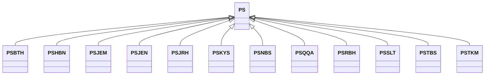

---
search:
  boost: 10.0
---

# Class: PS 


_Concept representing Country of State of Palestine_


<div data-search-exclude markdown="1">


URI: [loc:PS](https://w3id.org/lmodel/dpv/loc/PS)





## Inheritance
* **PS**
    * [PSBTH](PSBTH.md)
    * [PSHBN](PSHBN.md)
    * [PSJEM](PSJEM.md)
    * [PSJEN](PSJEN.md)
    * [PSJRH](PSJRH.md)
    * [PSKYS](PSKYS.md)
    * [PSNBS](PSNBS.md)
    * [PSQQA](PSQQA.md)
    * [PSRBH](PSRBH.md)
    * [PSSLT](PSSLT.md)
    * [PSTBS](PSTBS.md)
    * [PSTKM](PSTKM.md)


## Class Properties

| Property | Value |
| --- | --- |
| Class URI | [loc:PS](https://w3id.org/lmodel/dpv/loc/PS) |


## Slots

| Name | Cardinality and Range | Description | Inheritance |
| ---  | --- | --- | --- |


## In Subsets


* [LocSubset](LocSubset.md)


## Aliases


* State of Palestine


## Identifier and Mapping Information


### Annotations

| property | value |
| --- | --- |
| upstream_iri | https://w3id.org/dpv/loc/owl#PS |
| dpv_extension_slug | loc |


### Schema Source


* from schema: https://w3id.org/lmodel/dpv/loc


## Mappings

| Mapping Type | Mapped Value |
| ---  | ---  |
| self | loc:PS |
| native | loc:PS |
| exact | dpv_loc:PS, dpv_loc_owl:PS |


## LinkML Source

<!-- TODO: investigate https://stackoverflow.com/questions/37606292/how-to-create-tabbed-code-blocks-in-mkdocs-or-sphinx -->

### Direct

<details>
```yaml
name: PS
annotations:
  upstream_iri:
    tag: upstream_iri
    value: https://w3id.org/dpv/loc/owl#PS
  dpv_extension_slug:
    tag: dpv_extension_slug
    value: loc
description: Concept representing Country of State of Palestine
in_subset:
- loc_subset
from_schema: https://w3id.org/lmodel/dpv/loc
aliases:
- State of Palestine
exact_mappings:
- dpv_loc:PS
- dpv_loc_owl:PS
class_uri: loc:PS

```
</details>

### Induced

<details>
```yaml
name: PS
annotations:
  upstream_iri:
    tag: upstream_iri
    value: https://w3id.org/dpv/loc/owl#PS
  dpv_extension_slug:
    tag: dpv_extension_slug
    value: loc
description: Concept representing Country of State of Palestine
in_subset:
- loc_subset
from_schema: https://w3id.org/lmodel/dpv/loc
aliases:
- State of Palestine
exact_mappings:
- dpv_loc:PS
- dpv_loc_owl:PS
class_uri: loc:PS

```
</details></div>