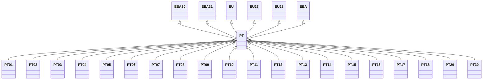

---
search:
  boost: 10.0
---

# Class: PT 


_Concept representing Country of Portugal_


<div data-search-exclude markdown="1">


URI: [loc:PT](https://w3id.org/lmodel/dpv/loc/PT)





## Inheritance
* [EEA](EEA.md)
    * **PT** [ [EEA30](EEA30.md) [EEA31](EEA31.md) [EU](EU.md) [EU27](EU27.md) [EU28](EU28.md)]
        * [PT01](PT01.md)
        * [PT02](PT02.md)
        * [PT03](PT03.md)
        * [PT04](PT04.md)
        * [PT05](PT05.md)
        * [PT06](PT06.md)
        * [PT07](PT07.md)
        * [PT08](PT08.md)
        * [PT09](PT09.md)
        * [PT10](PT10.md)
        * [PT11](PT11.md)
        * [PT12](PT12.md)
        * [PT13](PT13.md)
        * [PT14](PT14.md)
        * [PT15](PT15.md)
        * [PT16](PT16.md)
        * [PT17](PT17.md)
        * [PT18](PT18.md)
        * [PT20](PT20.md)
        * [PT30](PT30.md)


## Class Properties

| Property | Value |
| --- | --- |
| Class URI | [loc:PT](https://w3id.org/lmodel/dpv/loc/PT) |


## Slots

| Name | Cardinality and Range | Description | Inheritance |
| ---  | --- | --- | --- |


## In Subsets


* [LocSubset](LocSubset.md)


## Aliases


* Portugal


## Identifier and Mapping Information


### Annotations

| property | value |
| --- | --- |
| upstream_iri | https://w3id.org/dpv/loc/owl#PT |
| dpv_extension_slug | loc |


### Schema Source


* from schema: https://w3id.org/lmodel/dpv/loc


## Mappings

| Mapping Type | Mapped Value |
| ---  | ---  |
| self | loc:PT |
| native | loc:PT |
| exact | dpv_loc:PT, dpv_loc_owl:PT |


## LinkML Source

<!-- TODO: investigate https://stackoverflow.com/questions/37606292/how-to-create-tabbed-code-blocks-in-mkdocs-or-sphinx -->

### Direct

<details>
```yaml
name: PT
annotations:
  upstream_iri:
    tag: upstream_iri
    value: https://w3id.org/dpv/loc/owl#PT
  dpv_extension_slug:
    tag: dpv_extension_slug
    value: loc
description: Concept representing Country of Portugal
in_subset:
- loc_subset
from_schema: https://w3id.org/lmodel/dpv/loc
aliases:
- Portugal
exact_mappings:
- dpv_loc:PT
- dpv_loc_owl:PT
is_a: EEA
mixins:
- EEA30
- EEA31
- EU
- EU27
- EU28
class_uri: loc:PT

```
</details>

### Induced

<details>
```yaml
name: PT
annotations:
  upstream_iri:
    tag: upstream_iri
    value: https://w3id.org/dpv/loc/owl#PT
  dpv_extension_slug:
    tag: dpv_extension_slug
    value: loc
description: Concept representing Country of Portugal
in_subset:
- loc_subset
from_schema: https://w3id.org/lmodel/dpv/loc
aliases:
- Portugal
exact_mappings:
- dpv_loc:PT
- dpv_loc_owl:PT
is_a: EEA
mixins:
- EEA30
- EEA31
- EU
- EU27
- EU28
class_uri: loc:PT

```
</details></div>