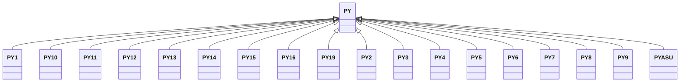

---
search:
  boost: 10.0
---

# Class: PY 


_Concept representing Country of Paraguay_


<div data-search-exclude markdown="1">


URI: [loc:PY](https://w3id.org/lmodel/dpv/loc/PY)





## Inheritance
* **PY**
    * [PY1](PY1.md)
    * [PY10](PY10.md)
    * [PY11](PY11.md)
    * [PY12](PY12.md)
    * [PY13](PY13.md)
    * [PY14](PY14.md)
    * [PY15](PY15.md)
    * [PY16](PY16.md)
    * [PY19](PY19.md)
    * [PY2](PY2.md)
    * [PY3](PY3.md)
    * [PY4](PY4.md)
    * [PY5](PY5.md)
    * [PY6](PY6.md)
    * [PY7](PY7.md)
    * [PY8](PY8.md)
    * [PY9](PY9.md)
    * [PYASU](PYASU.md)


## Class Properties

| Property | Value |
| --- | --- |
| Class URI | [loc:PY](https://w3id.org/lmodel/dpv/loc/PY) |


## Slots

| Name | Cardinality and Range | Description | Inheritance |
| ---  | --- | --- | --- |


## In Subsets


* [LocSubset](LocSubset.md)


## Aliases


* Paraguay


## Identifier and Mapping Information


### Annotations

| property | value |
| --- | --- |
| upstream_iri | https://w3id.org/dpv/loc/owl#PY |
| dpv_extension_slug | loc |


### Schema Source


* from schema: https://w3id.org/lmodel/dpv/loc


## Mappings

| Mapping Type | Mapped Value |
| ---  | ---  |
| self | loc:PY |
| native | loc:PY |
| exact | dpv_loc:PY, dpv_loc_owl:PY |


## LinkML Source

<!-- TODO: investigate https://stackoverflow.com/questions/37606292/how-to-create-tabbed-code-blocks-in-mkdocs-or-sphinx -->

### Direct

<details>
```yaml
name: PY
annotations:
  upstream_iri:
    tag: upstream_iri
    value: https://w3id.org/dpv/loc/owl#PY
  dpv_extension_slug:
    tag: dpv_extension_slug
    value: loc
description: Concept representing Country of Paraguay
in_subset:
- loc_subset
from_schema: https://w3id.org/lmodel/dpv/loc
aliases:
- Paraguay
exact_mappings:
- dpv_loc:PY
- dpv_loc_owl:PY
class_uri: loc:PY

```
</details>

### Induced

<details>
```yaml
name: PY
annotations:
  upstream_iri:
    tag: upstream_iri
    value: https://w3id.org/dpv/loc/owl#PY
  dpv_extension_slug:
    tag: dpv_extension_slug
    value: loc
description: Concept representing Country of Paraguay
in_subset:
- loc_subset
from_schema: https://w3id.org/lmodel/dpv/loc
aliases:
- Paraguay
exact_mappings:
- dpv_loc:PY
- dpv_loc_owl:PY
class_uri: loc:PY

```
</details></div>