---
search:
  boost: 10.0
---

# Class: RO 


_Concept representing Country of Romania_


<div data-search-exclude markdown="1">


URI: [loc:RO](https://w3id.org/lmodel/dpv/loc/RO)

```mermaid
 classDiagram
    class RO
    click RO href "../RO/"
      EEA30 <|-- RO
        click EEA30 href "../EEA30/"
      EEA31 <|-- RO
        click EEA31 href "../EEA31/"
      EU <|-- RO
        click EU href "../EU/"
      EU27 <|-- RO
        click EU27 href "../EU27/"
      EU28 <|-- RO
        click EU28 href "../EU28/"
      EEA <|-- RO
        click EEA href "../EEA/"
      

      RO <|-- ROAB
        click ROAB href "../ROAB/"
      RO <|-- ROAG
        click ROAG href "../ROAG/"
      RO <|-- ROAR
        click ROAR href "../ROAR/"
      RO <|-- ROB
        click ROB href "../ROB/"
      RO <|-- ROBC
        click ROBC href "../ROBC/"
      RO <|-- ROBH
        click ROBH href "../ROBH/"
      RO <|-- ROBN
        click ROBN href "../ROBN/"
      RO <|-- ROBR
        click ROBR href "../ROBR/"
      RO <|-- ROBT
        click ROBT href "../ROBT/"
      RO <|-- ROBV
        click ROBV href "../ROBV/"
      RO <|-- ROBZ
        click ROBZ href "../ROBZ/"
      RO <|-- ROCJ
        click ROCJ href "../ROCJ/"
      RO <|-- ROCL
        click ROCL href "../ROCL/"
      RO <|-- ROCS
        click ROCS href "../ROCS/"
      RO <|-- ROCT
        click ROCT href "../ROCT/"
      RO <|-- ROCV
        click ROCV href "../ROCV/"
      RO <|-- RODB
        click RODB href "../RODB/"
      RO <|-- RODJ
        click RODJ href "../RODJ/"
      RO <|-- ROGJ
        click ROGJ href "../ROGJ/"
      RO <|-- ROGL
        click ROGL href "../ROGL/"
      RO <|-- ROGR
        click ROGR href "../ROGR/"
      RO <|-- ROHD
        click ROHD href "../ROHD/"
      RO <|-- ROHR
        click ROHR href "../ROHR/"
      RO <|-- ROIF
        click ROIF href "../ROIF/"
      RO <|-- ROIL
        click ROIL href "../ROIL/"
      RO <|-- ROIS
        click ROIS href "../ROIS/"
      RO <|-- ROMH
        click ROMH href "../ROMH/"
      RO <|-- ROMM
        click ROMM href "../ROMM/"
      RO <|-- ROMS
        click ROMS href "../ROMS/"
      RO <|-- RONT
        click RONT href "../RONT/"
      RO <|-- ROOT
        click ROOT href "../ROOT/"
      RO <|-- ROPH
        click ROPH href "../ROPH/"
      RO <|-- ROSB
        click ROSB href "../ROSB/"
      RO <|-- ROSJ
        click ROSJ href "../ROSJ/"
      RO <|-- ROSM
        click ROSM href "../ROSM/"
      RO <|-- ROSV
        click ROSV href "../ROSV/"
      RO <|-- ROTL
        click ROTL href "../ROTL/"
      RO <|-- ROTM
        click ROTM href "../ROTM/"
      RO <|-- ROTR
        click ROTR href "../ROTR/"
      RO <|-- ROVL
        click ROVL href "../ROVL/"
      RO <|-- ROVN
        click ROVN href "../ROVN/"
      RO <|-- ROVS
        click ROVS href "../ROVS/"
      

      
```





## Inheritance
* [EEA](EEA.md)
    * **RO** [ [EEA30](EEA30.md) [EEA31](EEA31.md) [EU](EU.md) [EU27](EU27.md) [EU28](EU28.md)]
        * [ROAB](ROAB.md)
        * [ROAG](ROAG.md)
        * [ROAR](ROAR.md)
        * [ROB](ROB.md)
        * [ROBC](ROBC.md)
        * [ROBH](ROBH.md)
        * [ROBN](ROBN.md)
        * [ROBR](ROBR.md)
        * [ROBT](ROBT.md)
        * [ROBV](ROBV.md)
        * [ROBZ](ROBZ.md)
        * [ROCJ](ROCJ.md)
        * [ROCL](ROCL.md)
        * [ROCS](ROCS.md)
        * [ROCT](ROCT.md)
        * [ROCV](ROCV.md)
        * [RODB](RODB.md)
        * [RODJ](RODJ.md)
        * [ROGJ](ROGJ.md)
        * [ROGL](ROGL.md)
        * [ROGR](ROGR.md)
        * [ROHD](ROHD.md)
        * [ROHR](ROHR.md)
        * [ROIF](ROIF.md)
        * [ROIL](ROIL.md)
        * [ROIS](ROIS.md)
        * [ROMH](ROMH.md)
        * [ROMM](ROMM.md)
        * [ROMS](ROMS.md)
        * [RONT](RONT.md)
        * [ROOT](ROOT.md)
        * [ROPH](ROPH.md)
        * [ROSB](ROSB.md)
        * [ROSJ](ROSJ.md)
        * [ROSM](ROSM.md)
        * [ROSV](ROSV.md)
        * [ROTL](ROTL.md)
        * [ROTM](ROTM.md)
        * [ROTR](ROTR.md)
        * [ROVL](ROVL.md)
        * [ROVN](ROVN.md)
        * [ROVS](ROVS.md)


## Class Properties

| Property | Value |
| --- | --- |
| Class URI | [loc:RO](https://w3id.org/lmodel/dpv/loc/RO) |


## Slots

| Name | Cardinality and Range | Description | Inheritance |
| ---  | --- | --- | --- |


## In Subsets


* [LocSubset](LocSubset.md)


## Aliases


* Romania


## Identifier and Mapping Information


### Annotations

| property | value |
| --- | --- |
| upstream_iri | https://w3id.org/dpv/loc/owl#RO |
| dpv_extension_slug | loc |


### Schema Source


* from schema: https://w3id.org/lmodel/dpv/loc


## Mappings

| Mapping Type | Mapped Value |
| ---  | ---  |
| self | loc:RO |
| native | loc:RO |
| exact | dpv_loc:RO, dpv_loc_owl:RO |


## LinkML Source

<!-- TODO: investigate https://stackoverflow.com/questions/37606292/how-to-create-tabbed-code-blocks-in-mkdocs-or-sphinx -->

### Direct

<details>
```yaml
name: RO
annotations:
  upstream_iri:
    tag: upstream_iri
    value: https://w3id.org/dpv/loc/owl#RO
  dpv_extension_slug:
    tag: dpv_extension_slug
    value: loc
description: Concept representing Country of Romania
in_subset:
- loc_subset
from_schema: https://w3id.org/lmodel/dpv/loc
aliases:
- Romania
exact_mappings:
- dpv_loc:RO
- dpv_loc_owl:RO
is_a: EEA
mixins:
- EEA30
- EEA31
- EU
- EU27
- EU28
class_uri: loc:RO

```
</details>

### Induced

<details>
```yaml
name: RO
annotations:
  upstream_iri:
    tag: upstream_iri
    value: https://w3id.org/dpv/loc/owl#RO
  dpv_extension_slug:
    tag: dpv_extension_slug
    value: loc
description: Concept representing Country of Romania
in_subset:
- loc_subset
from_schema: https://w3id.org/lmodel/dpv/loc
aliases:
- Romania
exact_mappings:
- dpv_loc:RO
- dpv_loc_owl:RO
is_a: EEA
mixins:
- EEA30
- EEA31
- EU
- EU27
- EU28
class_uri: loc:RO

```
</details></div>